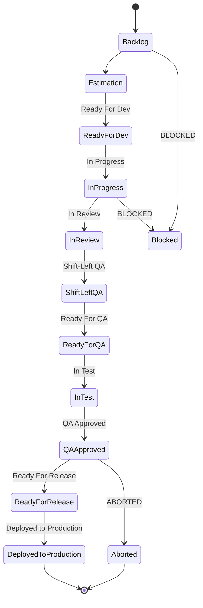

# PBI — Backlog Access Recipe

> Backlog location, access method, project structure, common queries. This file is the recipe, not a copy of the backlog — Jira is the source of truth. Per-ticket content is synced on demand by `/sprint-testing` via `bun run jira:sync-issues get <KEY> --include-comments` into `.context/PBI/epics/EPIC-<KEY>-<slug>/stories/STORY-<KEY>-<slug>/`, never authored here.

## 1. Header

| Field | Value |
|---|---|
| PM Tool | Jira Cloud |
| Site | `upexgalaxy71.atlassian.net` |
| Project Key | `BK` |
| Project Name | Bunkai TMS |
| Board | Bunkai Board (id `6`, type **Scrum**) |
| Access Method | `/acli` (primary) — Atlassian MCP is opt-in fallback, not enabled by default |
| Last Updated | 2026-08-13 |

## 2. Backlog Location

- URL: `https://upexgalaxy71.atlassian.net/jira/software/projects/BK/boards/6`
- Project key: `BK`
- Board: "Bunkai Board" — Scrum cadence confirmed (`acli jira board search --project BK` reports `type: scrum`). Sprint length/current sprint not read this session — Discovery Gap.

## 3. Access Configuration

**Primary method**: `/acli` skill (CLI, token auth). Verified this session:

```bash
acli jira auth status
# ✓ Authenticated — Site: upexgalaxy71.atlassian.net, oauth_global
```

**Setup steps** (for a fresh machine):

```bash
echo "$ATLASSIAN_API_TOKEN" | acli jira auth login \
  --site "upexgalaxy71.atlassian.net" \
  --email "$ATLASSIAN_EMAIL" \
  --token
acli jira auth status
```

**Fallback method**: Atlassian MCP (opt-in — not enabled by default in this repo; see `docs/mcp/`).

**Required env vars** (already present in this repo's `.env`, values not read this session):

```
ATLASSIAN_URL=
ATLASSIAN_EMAIL=
ATLASSIAN_API_TOKEN=
```

## 4. Project Structure

### Issue types in use (from `acli jira project view --key BK`)

| Issue Type | Subtask? | Maps to (this repo's convention) |
|---|---|---|
| Historia | No | Story |
| Test | No | Test case (Xray-flavored, native to this Jira instance) |
| Test Plan | No | ATP container |
| Test Execution | No | ATR container |
| Re-Test Execution | Yes (subtask) | ATR re-run |
| Precondition | No | Test precondition |
| Defect | No | Defect (pre-release quality issue) |
| Error | No | Distinct from Defect — not classified this session, Discovery Gap |
| Epic | No | Epic / QA-process bucket |
| Tech Story | No | Technical story |
| Tech Debt | No | Technical debt |
| Mejora | No | Improvement |
| Tarea | Yes (subtask) | Task/subtask |

**Note**: this project runs a **jira-native TMS modality** shape (Test / Test Plan / Test Execution / Precondition are native Jira work-item types, not Xray add-on entities) — confirm against `test-documentation/SKILL.md` §Phase 0 modality detection before assuming Modality A (Xray).

### Workflow states (from `.agents/jira-workflows.json`, bootstrapped from the UPEX standard reference — authoritative, not re-derived by sampling)

**Story** (`UPEX Feature (US) Workflow`):


*Transition arrows above are illustrative sequencing based on status `category` (new → indeterminate → done), not a confirmed transition graph — the catalog lists status names/categories, not the transition matrix. Discovery Gap: verify actual legal transitions via `acli jira workitem view <key> --json | jq '.transitions'` on a real Story, or a manual transition test, before relying on this diagram for automation.*

**Defect**: `Open` (new) → `In Progress` → `In Review` → `Ready For QA` → `Closed` (done); side-exits `Cannot Reproduce`, `Duplicated`, `Enhancement`, `REJECTED`, `Deferred` (indeterminate), `ABORTED` — all terminal/near-terminal `done`-category states. Multiple terminal states — do not assume `Closed` is the only "done".

**Epic**: `Backlog` (new) → `Planning` (indeterminate) → `In Progress` (indeterminate) → `Done` (done); `ABORTED` (done) as an alternate exit.

**Test** (`test_case` workflow — native Jira Test issue type, automation-status flavored): `Draft`/`Candidate` (new) → `In Design` → `In Automation` → `Pull Request` → `In Review` (indeterminate) → `READY`/`MANUAL`/`AUTOMATED` (done) → `DEPRECATED` (done, terminal). Confirmed via live sample: 90 of 100 recently-updated issues sit in `Candidate`.

### Custom fields required by this repo's methodology

Full manifest: `.agents/jira-required.yaml` (bootstrapped, not re-derived this session). Notable fields consumed by sync/skills: `acceptance_criteria`, `acceptance_test_results`, `business_rules_specification`, `severity` (options: `critica`/`mayor`/`menor`/`moderada`/`trivial` — Spanish-language option values), `qa_assignee`. Each declares a `fallback: { target: comment }` so a skill never blocks on a missing field.

### Sprint cadence

Scrum, board id `6`. **Confirmed 2026-08-13** via `GET /rest/agile/1.0/board/6/sprint?state=active,future,closed` (no `acli jira sprint list` subcommand exists — REST fallback used):

| Sprint | State | Start | End |
|---|---|---|---|
| Bunkai (67) Sprint 1 | closed | 2026-05-11 | 2026-06-08 |
| Bunkai (69) Sprint 2 | closed | 2026-06-09 | 2026-07-06 |
| Bunkai (70) Sprint 3 | **active** | 2026-07-07 | 2026-08-04 |

Cadence: ~4 weeks. Naming: `Bunkai (N) Sprint M` — `N` is a global incrementing counter unrelated to `M` (the per-project sprint ordinal).

⚠️ **Sprint 3 is marked `active` but its `endDate` (2026-08-04) is 9 days in the past** as of this check (2026-08-13), with no Sprint 4 created yet. Either the sprint is overdue for close-out or the team is running past the planned end date — worth a direct question to the Scrum Master/PO before scheduling any sprint-scoped QA work.

## 5. Common Queries

Verified live against `BK` this session (`acli jira workitem search --jql "..." --limit N --json`, note: response is a bare JSON array, not `{issues:[...]}`, on this acli version):

| Need | JQL |
|---|---|
| Current sprint ready for QA | `project = BK AND sprint in openSprints() AND status = "Ready For QA"` |
| All open Defects | `project = BK AND type = Defect AND resolution = Unresolved ORDER BY priority DESC` — **0 open** as of 2026-08-13 |
| My testing tasks | `project = BK AND status = "In Test" AND assignee = currentUser()` |
| Recently updated | `project = BK AND updated >= -1d ORDER BY updated DESC` |
| Epics (QA-process buckets) | `project = BK AND type = Epic ORDER BY key` — 18 found, incl. `BK-183 Backlog QA Defect Management` and `BK-70 Backlog QA Test Repository` |

`[ISSUE_TRACKER_TOOL]` pseudocode equivalents (for reuse by other skills):

```
[ISSUE_TRACKER_TOOL] Search Issues:
  project: BK
  query: sprint in openSprints() AND status = "{{jira.status.story.ready_for_qa}}"
```

## 6. Integration with KATA

- **When to fetch**: `/sprint-testing` syncs a ticket at session start (`bun run jira:sync-issues get <KEY> --include-comments`). `/shift-left-testing` pulls a batch during pre-sprint grooming. `/test-documentation` reads the synced ATP/ATR for ROI scoring.
- **Local storage rule**: only `README.md` (this file) and `templates/` are permanent, hand-authored. `epics/.../stories/.../` is a read-only Jira cache, regenerated by sync scripts — never hand-edited.

## 7. Credentials

`ATLASSIAN_URL`, `ATLASSIAN_EMAIL`, `ATLASSIAN_API_TOKEN` in `.env` (single source of truth, no `JIRA_*` aliases). Never paste token values in markdown.

## 8. Discovery Gaps

- Sprint length / current sprint identity / naming convention not read.
- Story workflow transition arrows are inferred from status category, not a confirmed transition matrix — verify via a live `transitions` check or manual test before automating.
- "Error" issue type's distinction from "Defect" not classified.
- Whether `sprint in openSprints()` returns results was not tested live (query is well-formed but 0-result sprints were not distinguished from an empty backlog this session).
- Prevalence of stories with "TBD"/empty ACs not sampled — only 2 Historia (Story) issues appeared in the 100-issue recent-activity window (`BK-267`, `BK-48`), too small a sample to estimate AC completeness project-wide.
