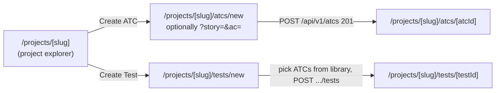
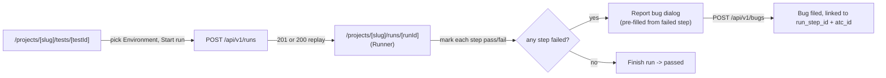
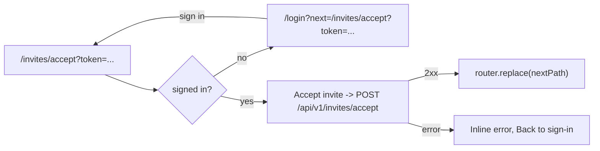
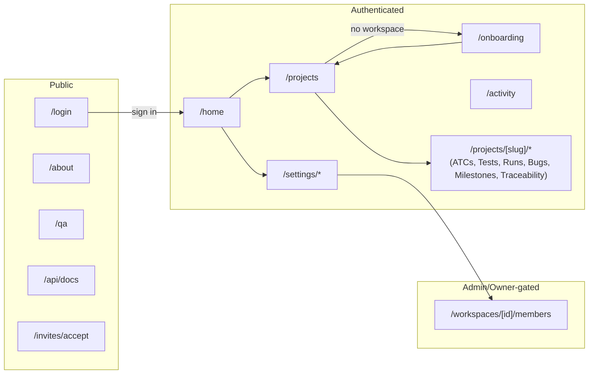

```mermaid
flowchart LR
    A["/ (root)"] -->|not signed in| B["/login"]
    B -->|check-email: not found| C["step=create<br/>enter password"]
    C -->|signup 202| D["step=verify<br/>enter OTP code"]
    D -->|confirm 200| E["router.push(next=/projects)"]
    E -->|no workspace| F["/onboarding"]
    F -->|POST /api/v1/workspaces 2xx| G["/projects<br/>(now has 1 workspace, 0 projects)"]
    G --> H["/projects/new"]
    H -->|POST .../projects 201| I["/projects/[slug]"]
```

# User Journeys — Bunkai

> Generated: 2026-08-12 · Discovery method: reverse-engineering from `upex-bunkai-tms` source code (read-only). Routes are journey steps; redirects are transitions; form submit handlers reveal the next step. Personas overlaid from `user-personas.md`. `upex-bunkai-tms/.context/` was not read this session.

---

## 1. Route Map

### Public Routes (Unauthenticated)

| Route | Page | Purpose |
|---|---|---|
| `/login` | `app/(auth)/login/page.tsx` | Email-first sign-in / sign-up / magic-link / OAuth entry point |
| `/about` | `app/about/page.tsx` | Public explainer surface — "no auth gate" (`app/about/page.tsx:20-22`) |
| `/qa` | `app/qa/page.tsx` | In-app "Software Testability Guide for QA" |
| `/api/docs` | `app/api/docs/page.tsx` | Scalar-rendered OpenAPI reference |
| `/design-tokens` | `app/design-tokens/page.tsx` | Internal design-token reference page |
| `/invites/accept` | `app/invites/accept/page.tsx` | Workspace invite acceptance (route is public; the client component gates on session internally — see Journey 4) |
| `/auth/callback` | `app/auth/callback/route.ts` | OAuth / magic-link / OTP exchange callback (route handler, no UI) |
| `/auth/oauth/[provider]` | `app/auth/oauth/[provider]/route.ts` | OAuth flow initiation (route handler, no UI) |

### Protected Routes (Authenticated)

| Route | Page | Requires (role) | Purpose |
|---|---|---|---|
| `/home` | `app/(app)/home/page.tsx` | Any active membership (redirects to `/onboarding` if none — `home/page.tsx:106`) | Dashboard — the post-BK-255 landing route for a signed-in user (`app/page.tsx:9-10` comment) |
| `/projects` | `app/(app)/projects/page.tsx` | Any active membership | Index of the active workspace's Projects |
| `/projects/new` | `app/(app)/projects/new/page.tsx` | Any active membership (`member`+ enforced at the API layer on submit) | Create-project form |
| `/onboarding` | `app/(app)/onboarding/page.tsx` | Authenticated, but explicitly requires **no** existing membership (redirects to `/projects` if one exists — `onboarding/page.tsx:23`) | Create-first-workspace form |
| `/settings`, `/settings/account`, `/settings/notifications`, `/settings/tokens`, `/settings/workspaces` | `app/(app)/settings/*/page.tsx` | Any active membership; `/settings` itself immediately redirects to `/settings/account` (`settings/page.tsx:6`) | Personal + workspace settings |
| `/activity` | `app/(app)/activity/page.tsx` | Any active membership | Cross-project activity feed |
| `/workspaces/[id]/members` | `app/(app)/workspaces/[id]/members/page.tsx` | `admin`/`owner` to invite (`members/page.tsx:33` redirects non-members to `/projects`) | Workspace member roster + invite management. **Note**: this route is NOT covered by `middleware.ts`'s `PROTECTED_PREFIXES` (`/home`,`/projects`,`/onboarding`,`/settings`,`/activity` — `middleware.ts:10`) — auth is enforced page-side instead (`redirect(`/login?next=/workspaces/${workspaceId}/members`)` at `members/page.tsx:15`), not by the shared middleware gate. Flagged in Discovery Gaps below. |

### Dynamic Routes

| Pattern | Example | Purpose |
|---|---|---|
| `/projects/[projectSlug]` | `/projects/checkout-web` | Project detail shell (module explorer + tabs) |
| `/projects/[projectSlug]/atcs/new` | `/projects/checkout-web/atcs/new` | ATC builder, optionally deep-linked with `?story=<id>&ac=<id>` (`atcs/new/page.tsx:11-12`) |
| `/projects/[projectSlug]/atcs/[atcId]` | `/projects/checkout-web/atcs/a1b2` | ATC detail/edit |
| `/projects/[projectSlug]/tests/new` | `/projects/checkout-web/tests/new` | Test chain builder |
| `/projects/[projectSlug]/tests/[testId]` | `/projects/checkout-web/tests/t1` | Test detail (Steps tab) |
| `/projects/[projectSlug]/tests/[testId]/runs` | `/projects/checkout-web/tests/t1/runs` | Run history for one Test |
| `/projects/[projectSlug]/runs` | `/projects/checkout-web/runs` | Project-wide Run history |
| `/projects/[projectSlug]/runs/[runId]` | `/projects/checkout-web/runs/r1` | Manual Runner — the live/completed Run view; accepts `?bugId=<id>` deep-link (`runs/[runId]/page.tsx:16-18`) |
| `/projects/[projectSlug]/bugs` | `/projects/checkout-web/bugs` | Bug list/filter view |
| `/projects/[projectSlug]/milestones` | `/projects/checkout-web/milestones` | Milestone list |
| `/projects/[projectSlug]/milestones/[milestoneId]` | `/projects/checkout-web/milestones/m1` | Milestone detail/edit |
| `/projects/[projectSlug]/metrics` | `/projects/checkout-web/metrics` | Project metrics (recovery cycles, etc.) |
| `/projects/[projectSlug]/traceability` | `/projects/checkout-web/traceability` | Story→AC→ATC→Test→Run→Bug traceability view |
| `/auth/oauth/[provider]` | `/auth/oauth/github` | OAuth provider initiation |

---

## 2. Journey 1 — New User Onboarding (Sign-up → Workspace → Project)

- **Persona**: A prospective user, becoming a Member persona's Admin/Owner variant once they create their own workspace (per `user-personas.md` Persona 3 — every workspace creator is seeded `owner`)
- **Goal**: Create an account, verify it, create a workspace, and create a first project
- **Discovered From**: `app/page.tsx`, `app/(auth)/login/email-first-form.tsx`, `app/(app)/onboarding/onboarding-form.tsx`, `app/(app)/projects/create-project-form.tsx`

### Flow Diagram

### Step-by-Step Flow

| Step | Page | Action | Next | Evidence (file:line) |
|---|---|---|---|---|
| 1 | `/` | Unauthenticated visit | Redirect to `/login` | `app/page.tsx:14` (`redirect(user ? '/home' : '/login')`) |
| 2 | `/login` | Enter email, click Continue → `POST /api/v1/auth/check-email` | Account does not exist → `step = 'create'` | `app/(auth)/login/email-first-form.tsx:88-91` |
| 3 | `/login` (create step) | Enter password ≥ 8 chars, submit → `POST /api/v1/auth/signup` | `202` → `step = 'verify'` | `email-first-form.tsx:137-141` |
| 4 | `/login` (verify step) | Enter 6-8 digit OTP → `POST /api/v1/auth/confirm` | `200` → `completeSignIn()`: `router.refresh(); router.push(next)` | `email-first-form.tsx:181-183`, `:60-62` |
| 5 | (redirect target) | `next` resolves via `safeInternalPath(searchParams.get('next'))`, fallback `/projects` | Lands on `/projects` | `lib/urls.ts:51` (`fallback = '/projects'`) |
| 6 | `/projects` | Server checks `workspaces` (RLS-scoped) — empty | Redirect to `/onboarding` | `app/(app)/projects/page.tsx:38-39` |
| 7 | `/onboarding` | Enter workspace name + slug, submit → `POST /api/v1/workspaces` | `2xx` → `toast.success('Workspace created'); router.replace('/projects')` | `app/(app)/onboarding/onboarding-form.tsx:95-107` |
| 8 | `/projects` | Now has 1 workspace, 0 projects — index renders empty state | User navigates to `/projects/new` | `app/(app)/projects/page.tsx` (list renders `FolderPlus`/`Plus` affordances) |
| 9 | `/projects/new` | Enter project name (≥ 3 chars) → `POST /api/v1/workspaces/{id}/projects` | `201` → `toast.success('Project created'); router.replace('/projects/${slug}')` | `app/(app)/projects/create-project-form.tsx:98-112` |
| 10 | `/projects/[slug]` | Lands inside the newly created Project | Journey complete | `create-project-form.tsx:113` |

### Error Paths

| Error | Handling | Evidence |
|---|---|---|
| Rate-limited email check | Inline banner: "Too many attempts. Please wait a moment and retry." | `email-first-form.tsx:75-78` |
| Account already exists (signup attempted for existing email) | `409` → "An account already exists for this email. Try signing in instead." | `email-first-form.tsx:154-157` |
| Wrong/expired OTP code | `401` → "That code is invalid or expired." | `email-first-form.tsx:187-190` |
| Sign-in attempted on unconfirmed account | `401` + `!accountConfirmed` → routed to `step='verify'` with "Verify your email with the code we sent before signing in." (not treated as a wrong-password error) | `email-first-form.tsx:127-131` |
| Workspace slug already taken | `code === 'conflict'` → `Slug "${finalSlug}" is taken — try another.` | `onboarding-form.tsx:97-99` |
| Workspace name/slug empty or invalid on client-side submit | Toast before any network call: `'Enter a workspace name.'` / `'Use at least 3 letters or digits — they become the URL slug.'` | `onboarding-form.tsx:80-88` |
| Project name too short/long/no alphanumeric | Server `details.reason` mapped to friendly copy (`name_too_short`, `name_too_long`, `name_no_alphanumeric`) | `create-project-form.tsx:38-46` |
| Project name reserved / duplicate slug in workspace | `slug_reserved` / `slug_duplicate_in_workspace` → friendly copy | `create-project-form.tsx:49-52` |
| Network error at any step | Generic inline error, submit re-enabled | e.g. `email-first-form.tsx:98-100`, `onboarding-form.tsx:110-113` |

### Success Criteria

- [ ] User can create an account, verify it via OTP, and land signed-in without a page reload glitch.
- [ ] A brand-new account with zero workspaces is routed to `/onboarding`, not left on a blank `/projects`.
- [ ] Workspace creation redirects into a `/projects` view that now shows the empty-project state, not stuck on a stale server render (`router.refresh()` call confirmed at `onboarding-form.tsx:106`).
- [ ] Project creation lands the user directly inside the new project's detail page, not back on the index (BK-266 per code comment, `create-project-form.tsx:104-107`).

---

## 3. Journey 2 — Author an ATC and Chain It Into a Test

- **Persona**: Member (QA Engineer) — see `user-personas.md` Persona 2
- **Goal**: Write a reusable Acceptance Test Case anchored to a real Acceptance Criterion, then assemble it into a Test chain
- **Discovered From**: `app/(app)/projects/[projectSlug]/atcs/new/page.tsx`, `app/(app)/projects/[projectSlug]/tests/new/page.tsx`, `supabase/migrations/0004_atcs.sql`, `0024_tests.sql`

### Flow Diagram

### Step-by-Step Flow

| Step | Page | Action | Next | Evidence (file:line) |
|---|---|---|---|---|
| 1 | `/projects/[slug]` | Member clicks "Create ATC" from the explorer, optionally pre-anchored to a Story/AC via deep-link | Navigates to `/projects/[slug]/atcs/new?story=<id>&ac=<id>` | `app/(app)/projects/[projectSlug]/project-explorer.tsx:237` (`router.push(...atcs/${result.atcId})` — post-create navigation target); `atcs/new/page.tsx:11-12` (deep-link params) |
| 2 | `/projects/[slug]/atcs/new` | Server pre-loads non-archived Modules, Stories, and their ACs for the picker | Form renders with `initialStoryId`/`initialAcIds` pre-filled if the deep-link params resolve to real, visible content | `atcs/new/page.tsx:79-88` |
| 3 | `/projects/[slug]/atcs/new` | Member fills title, steps, assertions, anchors ≥ 1 AC, submits | `POST /api/v1/atcs` — RLS requires `role in ('member','admin','owner')` | `supabase/migrations/0004_atcs.sql:110-123` (`atcs_insert_workspace_role_member_plus`) |
| 4 | (on success) | ATC created | `router.push` to the ATC's own detail page (same pattern as the explorer's own create-then-navigate at `project-explorer.tsx:237`) | `app/(app)/projects/[projectSlug]/atcs/[atcId]/page.tsx` |
| 5 | `/projects/[slug]/tests/new` | Member opens the Test builder — server loads every non-archived ATC across the **whole workspace** (Tests are workspace-scoped, ATCs are project-scoped — Decision 2) | ATC library populated for the chain picker | `app/(app)/projects/[projectSlug]/tests/new/page.tsx:41-59` |
| 6 | `/projects/[slug]/tests/new` | Member picks ≥ 1 ATC, orders the chain, submits | `POST /api/v1/tests` via `bunkai_create_test` RPC | `supabase/migrations/0024_tests.sql:203-225` |
| 7 | (on success) | Test created | Lands on `/projects/[slug]/tests/[testId]` | `app/(app)/projects/[projectSlug]/tests/[testId]/page.tsx` |

### Error Paths

| Error | Handling | Evidence |
|---|---|---|
| ATC created with zero linked Acceptance Criteria | Expected to be rejected, but enforcement is **application-layer only in MVP**, not a DB constraint — the exact HTTP-layer error shape was not read this session | `supabase/migrations/0004_atcs.sql:1-6`; flagged as a Discovery Gap in `domain-glossary.md` §8 |
| Test chain submitted empty | RPC raises `chain_empty` (SQLSTATE `45120`) | `0024_tests.sql:203-225` |
| Test chain references an ATC from a different workspace, or a nonexistent id | RPC raises `atc_not_in_workspace` (SQLSTATE `45122`) — same error for both cases, deliberate non-disclosure | `0024_tests.sql:203-225` |
| Viewer attempts to reach `/atcs/new` or `/tests/new` directly (no create button ever shown to them) | RLS blocks the underlying INSERT even if the route itself were reached | `0004_atcs.sql:110-123` |

### Success Criteria

- [ ] An ATC created via the deep-link (`?story=&ac=`) pre-anchors correctly to the passed Story/AC, and a stale/hand-edited URL never pre-anchors to foreign-project content (`atcs/new/page.tsx:80-83` comment).
- [ ] A Test chain can reference the same ATC at multiple positions (`test_steps` surrogate PK exists specifically for this — `domain-glossary.md` §1.8).
- [ ] Editing an already-chained ATC's steps propagates to every Test that references it (edit-propagation invariant — not exercised by this journey's happy path, but the design invariant this journey depends on).

---

## 4. Journey 3 — Execute a Manual Run and File a Bug from a Failed Step

- **Persona**: Member (QA Engineer)
- **Goal**: Start a Run of an existing Test, mark step verdicts, and file a Bug directly from a failed step
- **Discovered From**: `components/tests/StartRunButton.tsx`, `components/runs/RunnerView.tsx`, `lib/runs/report-bug-view.ts`, `app/api/v1/runs/route.ts`

### Flow Diagram

### Step-by-Step Flow

| Step | Page | Action | Next | Evidence (file:line) |
|---|---|---|---|---|
| 1 | `/projects/[slug]/tests/[testId]` | Member+ selects an Environment, clicks "Start run" | `POST /api/v1/runs` with `Idempotency-Key` header + `{test_id, environment_id}` | `components/tests/StartRunButton.tsx:57-73` |
| 2 | (server) | RPC validates: write-membership → `executor_mode` valid → Environment belongs to the Test's Project → chain resolves to ≥1 executable step | `201` (created) or `200` (idempotent replay within 24h) | `supabase/migrations/0031_runs.sql:299-408`; `app/api/v1/runs/route.ts:44-49` (executor_mode derivation) |
| 3 | (client) | On success, `toast.success('Run started')` | `router.push('/projects/${projectSlug}/runs/${runId}')` | `StartRunButton.tsx:96-98` |
| 4 | `/projects/[slug]/runs/[runId]` | Member views the Runner — each ATC/step rendered from the Run's frozen snapshot | Member marks a step's verdict (pass/fail/blocked/skipped) | `components/runs/RunnerView.tsx` (`canMark` prop gates the mark controls) |
| 5 | Runner, per step | If a step's status is `failed` AND the caller is `canReportBug` (member+) | "Report bug" button renders | `lib/runs/report-bug-view.ts:20-22` (`shouldShowReportBugButton`) |
| 6 | Report-bug dialog | Fields pre-filled from the failed step (ATC title, step content, evidence URL, default severity `P3`) | Member submits → `POST /api/v1/bugs` | `lib/runs/report-bug-view.ts:26-39` (`BUG_PREFILL_DEFAULT_SEVERITY`, `ReportBugPrefill`) |
| 7 | (server) | Bug filed with `run_id`/`run_step_id`/`atc_id` provenance, cross-checked for internal consistency | `201` — Bug created, all provenance frozen at filing time | `supabase/migrations/0046_bugs.sql:162-215` |
| 8 | Runner | Member+ clicks "Finish run" once all steps have a terminal verdict | Run header status → `passed`/`failed` | `RunnerView.tsx:319-320` (`showFinish = canFinish && view.status === 'running'`) |

### Error Paths

| Error | Handling | Evidence |
|---|---|---|
| Test's chain resolves to zero executable ATC steps | RPC raises `no_executable_steps` (`45202`); message rendered **verbatim**, frozen API copy: "Add at least one ATC step to this Test before starting a run." | `StartRunButton.tsx` comment (lines around `body.error?.message`); `0031_runs.sql` |
| Environment belongs to a different Project than the Test | RPC raises `environment_invalid` (`45201`) | `0031_runs.sql` |
| Double-submit of "Start run" | Same `Idempotency-Key` → server returns the already-created Run instead of a duplicate; key only rotates after a failed attempt | `StartRunButton.tsx:36-38`, `:82-86` |
| Report-bug attempted on a step that is not `failed` | Button structurally never renders (`shouldShowReportBugButton`); server independently re-enforces via `run_step_not_failed` (422 backstop) | `lib/runs/report-bug-view.ts:13-15` |
| Bug's provenance ids point to a different Project than the target | Rejected with one of five distinct SQLSTATEs (`45300`/`45304`-`45307`), no non-disclosure collapsing here (each is independently testable) | `supabase/migrations/0046_bugs.sql`, cross-referenced in `domain-glossary.md` BR-5 |
| Bug assigned to a Viewer-role member | Rejected, SQLSTATE `45313` (`bug_assignee_view_only`) | `supabase/migrations/0054_bug_assignment_status.sql:171` |
| Viewer reaches the Runner (read-only) | No mark/abort/finish/report-bug controls render (`canMark`/`canManageRun`/`canReportBug` all false) | `app/(app)/projects/[projectSlug]/runs/[runId]/page.tsx:95` |

### Success Criteria

- [ ] Starting a Run with the same `Idempotency-Key` twice never creates two Runs.
- [ ] A Bug filed from a failed step carries the exact `run_id`/`run_step_id`/`atc_id` of that step, not the Run's chain-position-1 snapshot (an acknowledged multi-module edge case per `runs/[runId]/page.tsx` comment on `atcModuleNames`).
- [ ] A Viewer can watch a Run live but has zero write controls rendered anywhere on the page.
- [ ] A Run already in progress reflects its frozen snapshot even if the source Test/ATC is edited concurrently (design invariant this journey depends on, not directly exercised here).

---

## 5. Journey 4 — Accept a Workspace Invite

- **Persona**: A prospective teammate, invited by an Admin/Owner at a chosen role (Viewer, Member, or Admin — `owner` excluded from the invite role enum)
- **Goal**: Follow an invite link, authenticate if needed, and join the workspace at the invited role
- **Discovered From**: `app/invites/accept/accept-client.tsx`, `app/api/v1/invites/accept/route.ts`, `supabase/migrations/0010_workspace_invites.sql`

### Flow Diagram

### Step-by-Step Flow

| Step | Page | Action | Next | Evidence (file:line) |
|---|---|---|---|---|
| 1 | `/invites/accept?token=<token>` | Page loads, client checks `supabase.auth.getUser()` | No user → `phase = 'needs-auth'`; user present → `phase = 'ready'` | `app/invites/accept/accept-client.tsx:29-32` |
| 2 | (needs-auth) | Member clicks "Sign in" | `router.push('/login?next=/invites/accept?token=<token>')` — round-trips back to this exact page after auth | `accept-client.tsx:62-65` |
| 3 | (ready) | Member clicks "Accept invite" | `POST /api/v1/invites/accept` with the token | `accept-client.tsx:38-44` |
| 4 | (on success) | `toast.success('Welcome — you have joined the workspace.')` | `router.replace(nextPath); router.refresh()` | `accept-client.tsx:47-51` |

### Error Paths

| Error | Handling | Evidence |
|---|---|---|
| Missing token in the URL | Immediate `phase = 'error'`, "Missing invite token." | `accept-client.tsx:27-30` |
| Invite expired, already accepted, or invalid token | Server error message surfaced inline; `phase = 'error'` with a "Back to sign-in" affordance | `accept-client.tsx:45-46` |
| Invite token issued for a different email than the signed-in session | Not confirmed this session — the client only checks *whether* a user is signed in, not that it matches the invite's target email; the actual mismatch-rejection behavior lives server-side in `app/api/v1/invites/accept/route.ts`, not read in full this session | **Discovery Gap** — see below |
| Network error during accept | Generic inline error message | `accept-client.tsx:55-57` |

### Success Criteria

- [ ] An unauthenticated visitor following an invite link is round-tripped back to the exact same invite-accept URL after signing in (not dropped on a generic landing page).
- [ ] Accepting an invite grants exactly the role the invite specified (`viewer`/`member`/`admin`), never silently escalated or downgraded.
- [ ] Workspace invites expire in 7 days (per `domain-glossary.md` §1.12) — an expired-token acceptance attempt should fail cleanly, not silently succeed.

---

## 6. Navigation Structure

Evidence: `middleware.ts:10` (`PROTECTED_PREFIXES`), `app/(app)/layout.tsx` (shell wrapping all Authenticated routes), `app/(app)/settings/layout.tsx` (Settings sub-nav).

---

## 7. Breadcrumb Patterns

No dedicated breadcrumb component was found (`find components -iname "*breadcrumb*"` returned nothing). Route nesting itself is the closest analog to a breadcrumb hierarchy, and it is shallow and consistent:

| Path | Implied Breadcrumb |
|---|---|
| `/projects/[slug]` | Projects → `[slug]` |
| `/projects/[slug]/atcs/[atcId]` | Projects → `[slug]` → ATCs → `[atcId]` |
| `/projects/[slug]/tests/[testId]/runs` | Projects → `[slug]` → Tests → `[testId]` → Runs |
| `/settings/account` | Settings → Account |

**Discovery Gap**: whether the UI actually renders these as clickable breadcrumb links, or relies solely on the persistent sidebar (`components/layout/AppSidebar.tsx`) plus a per-project sub-nav (`app/(app)/projects/[projectSlug]/project-sub-nav.tsx`) for wayfinding, was not confirmed by reading the rendered layout components in depth this session.

---

## 8. Critical Paths

### Happy Paths (Must Work)

| Journey | Start | End | Business Impact |
|---|---|---|---|
| New User Onboarding | `/` (unauthenticated) | `/projects/[slug]` (new project) | Activation — a user who cannot get through signup → workspace → project never becomes a customer |
| Author ATC → Test | `/projects/[slug]/atcs/new` | `/projects/[slug]/tests/[testId]` | Core value proposition #1 — the write-once ATC library is the product's primary differentiator |
| Run → File Bug | `/projects/[slug]/tests/[testId]` | Bug filed with full provenance | Core value proposition #3/#4 — traceability + in-context defect filing |
| Invite Acceptance | `/invites/accept?token=` | Joined workspace at invited role | Team growth — every additional seat after the workspace creator flows through this path |

### Unhappy Paths (Must Handle)

| Scenario | Expected Behavior | Evidence |
|---|---|---|
| Sign-in on an unconfirmed account | Routed to OTP verification, not a generic "wrong password" | `email-first-form.tsx:127-131` |
| Start a Run on a Test with no executable steps | Blocked with frozen, verbatim API copy | `0031_runs.sql` `no_executable_steps` (`45202`) |
| Report a bug on a non-failed step | Structurally impossible via UI; independently rejected server-side | `lib/runs/report-bug-view.ts:20-22` |
| Assign a bug to a Viewer | Rejected, SQLSTATE `45313` | `0054_bug_assignment_status.sql:171` |
| Sole owner attempts to leave their only workspace | Rejected, SQLSTATE `45213` | `0044_leave_workspace.sql:31-32` |
| Viewer attempts any write action | No UI affordance; RLS rejects even a direct API call | `0004_atcs.sql:110-123` |

---

## 9. Discovery Gaps

| Flow | Unknown | Question |
|---|---|---|
| `/workspaces/[id]/members` auth coverage | This route is not listed in `middleware.ts`'s `PROTECTED_PREFIXES` — auth is enforced only at the page component level (`redirect` call), not the shared middleware gate other Authenticated routes get | Ask the team: is this an intentional exception, or should `/workspaces` be added to `PROTECTED_PREFIXES` for defense-in-depth? |
| Invite email-match enforcement | `accept-client.tsx` only checks *whether* a session exists, not that it matches the invite's target email — the actual mismatch handling lives in `app/api/v1/invites/accept/route.ts`, not read in full this session | Read `app/api/v1/invites/accept/route.ts` in a follow-up pass, or ask the team directly |
| Breadcrumb rendering | Route nesting is shallow and consistent, but no dedicated breadcrumb component was found — unclear if wayfinding relies solely on the sidebar/sub-nav | Confirm with a live UI walkthrough |
| OTP / 2FA external dependency | Steps 4 (Journey 1) and the magic-link path both depend on an out-of-band code the user receives via email — this journey documents the code-entry step, not the email delivery itself, per doctrine (external-dependency step, not mapped further) | N/A — flagged, not a question |
| Milestone creation/edit journey | `milestones/[milestoneId]/page.tsx:54` confirms the `canEdit` gate exists, but the full create/edit step-by-step flow (form fields, validation) was not traced this session — Milestones is `próximo` on the product's own public roadmap despite the table/API already existing (see `executive-summary.md` §5) | Trace this journey in a follow-up pass if Milestones becomes a priority test area |

---

## 10. QA Relevance

### Critical E2E Test Scenarios

| Priority | Scenario | Journey Reference |
|---|---|---|
| P0 | Full signup → workspace → project happy path | Journey 1 |
| P0 | Full ATC-author → Test-chain → Run → Bug-file happy path | Journeys 2 + 3 |
| P0 | Viewer cannot perform any write action anywhere in the app (UI + direct API) | Journeys 2, 3 — Permission Matrix in `user-personas.md` §6 |
| P1 | Idempotent Run start under a double-submit (same Idempotency-Key) | Journey 3, step 2 |
| P1 | Bug assignment rejection when assignee is a Viewer | Journey 3, Error Paths |
| P1 | Sole-owner leave-workspace rejection vs. co-owner success | `user-personas.md` §8 Edge Cases |
| P2 | Invite acceptance round-trip through an unauthenticated visit | Journey 4 |
| P2 | Unconfirmed-account sign-in routes to OTP, not a generic auth error | Journey 1, Error Paths |

### Suggested Test Data

| Journey | Test User | Prerequisites |
|---|---|---|
| Journey 1 | A never-before-seen email address | None — this journey creates the account, workspace, and project from scratch |
| Journey 2 | `LOCAL_MEMBER_EMAIL` / `STAGING_MEMBER_EMAIL` *(flagged as needing creation — see `user-personas.md` §8)* | An existing Project with ≥1 Module, ≥1 Story with ≥1 AC |
| Journey 3 | Same Member account as Journey 2 | An existing Test with ≥1 executable ATC step; ≥1 Environment configured for the Project |
| Journey 4 | A separate never-before-seen email (the invitee) + an Admin/Owner account to issue the invite | An active workspace with invite-sending permission |

---

*Discovery method: read-only reverse-engineering of `upex-bunkai-tms` source (route tree, redirect/router.push call sites, RPC migrations). Every step cites a file. `upex-bunkai-tms/.context/` was not read.*
