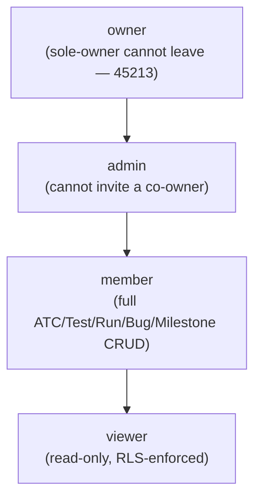

# User Personas — Bunkai

> Generated: 2026-08-12 · Discovery method: reverse-engineering from `upex-bunkai-tms` source code (read-only). Personas here are the system roles the authorization code (`MemberRole`) and RLS policies already recognize — not invented demographic archetypes. `upex-bunkai-tms/.context/` was not read this session.

**Mindset**: 2 clean personas beat 5 speculative ones. Bunkai's `workspace_members.role` enum has 4 values (`viewer`, `member`, `admin`, `owner`) — `lib/types.ts:13`. `admin` and `owner` were checked for behaviorally distinct permissions and found functionally identical everywhere except one Owner-only edge case (sole-owner leave guard), so they are documented as **one persona** with that nuance called out, per the "fewer is better" quality rule. This yields **3 personas**, not 4.

---

## 1. Persona Discovery Summary

| Persona | System Role | Access Level | Primary Goal |
|---|---|---|---|
| Viewer | `viewer` | Read-only across the workspace | Browse coverage, traceability, runs, and bugs without risk of accidental edits |
| Member (QA Engineer) | `member` | Read + write on ATCs, Tests, Runs, Bugs, Milestones within the workspace | Author test cases, execute runs, and file defects — the day-to-day individual contributor |
| Admin / Owner (Workspace Manager) | `admin`, `owner` | Everything a Member can do, plus invite/manage teammates and workspace-level settings | Grow and govern the team occupying the workspace |

---

## 2. Persona 1 — Viewer

### Identity

- **System Role**: `viewer` (`role_value`)
- **Evidence file**: `lib/types.ts:13` (`export type MemberRole = 'viewer' | 'member' | 'admin' | 'owner'`)
- **Access Level**: Read-only, enforced at the database layer (RLS `SELECT` policies), not just hidden UI
- **Estimated % of Users**: Unknown — no membership-count data was queried this session (would require a live DB read, out of scope for code-only discovery)

### Goals (Inferred from Features)

| Goal | Supporting Feature | Route/Component |
|---|---|---|
| Review requirements traceability without editing risk | Traceability report | `app/api/v1/projects/[id]/traceability/route.ts` |
| Watch a Run's live per-step verdicts | Run detail page (read-only for this role) | `app/(app)/projects/[projectSlug]/runs/[runId]/page.tsx` |
| Browse the Bug list/filters | Bugs list view | `app/(app)/projects/[projectSlug]/bugs/page.tsx:87` (`canCreateBug = ... role !== 'viewer'` — list itself still renders) |

### Pain Points (Inferred from Validation/Errors)

| Pain Point | Evidence |
|---|---|
| Cannot create a Milestone | `canEdit = ['member', 'admin', 'owner'].includes(memberRow?.role ?? '')` — `app/(app)/projects/[projectSlug]/milestones/[milestoneId]/page.tsx:54` |
| Cannot file a Bug | `canCreateBug = membership != null && membership.role !== 'viewer'` — `app/(app)/projects/[projectSlug]/bugs/page.tsx:87` |
| Cannot be assigned a Bug | RPC-level rejection, SQLSTATE `45313` (`bug_assignee_view_only`) — `supabase/migrations/0054_bug_assignment_status.sql:71,171` |
| Cannot write an ATC (blocked at the RLS layer, not just the UI) | `atcs_insert_workspace_role_member_plus` policy requires `wm.role in ('member','admin','owner')` — `supabase/migrations/0004_atcs.sql:110-123` |

### Feature Access

| Feature | Access | Evidence |
|---|---|---|
| ATC Library (read) | Full | RLS `atcs_select_workspace_member` — `0004_atcs.sql:93-94` (no role restriction on SELECT) |
| ATC Library (write) | None | `0004_atcs.sql:110-123` (INSERT/UPDATE/DELETE require member+) |
| Test Runner (view) | Full | `app/(app)/projects/[projectSlug]/runs/[runId]/page.tsx` |
| Test Runner (abort/finish/mark step/report bug) | None | `canManageRun = ['member','admin','owner'].includes(...)` — `runs/[runId]/page.tsx:95`; `shouldShowReportBugButton` requires `canReportBug` — `lib/runs/report-bug-view.ts:20-22` |
| Bugs (list) | Full | `app/(app)/projects/[projectSlug]/bugs/page.tsx` |
| Bugs (create) | None | `bugs/page.tsx:87` |
| Milestones (view) | Full | `app/(app)/projects/[projectSlug]/milestones/page.tsx` |
| Milestones (create/edit) | None | `milestones/page.tsx:66`, `milestones/[milestoneId]/page.tsx:54` |
| Workspace members (invite/manage) | None | `app/api/v1/workspaces/[id]/invites/route.ts:52` requires `admin`/`owner` |

### User Journey Summary

```
Sign in -> land on Project -> browse ATCs / Tests / Runs / Bugs (read-only) -> no create affordances rendered
```

### Profile Attributes

From `workspace_members` + `auth.users` (Supabase-managed, no dedicated Bunkai profile table): `role`, `joined_at` ("member since" — `app/(app)/settings/account/page.tsx:47`), `email` and `last_sign_in_at` (resolved from `auth.users` via admin lookup, not exposed via PostgREST directly — `settings/account/page.tsx:58-60`).

### Representative Quote (inferred)

*"I just need to see if this feature's coverage is green before the release — I'm not the one filing the bug."* — (inferred, illustrative only, not a captured quote)

---

## 3. Persona 2 — Member (QA Engineer)

### Identity

- **System Role**: `member` (`role_value`)
- **Evidence file**: `lib/types.ts:13`
- **Access Level**: Read + write on all project-level entities (ATCs, Tests, Runs, Bugs, Milestones) within workspaces they belong to; no workspace-administration rights
- **Estimated % of Users**: Unknown (no membership data queried)

### Goals (Inferred from Features)

| Goal | Supporting Feature | Route/Component |
|---|---|---|
| Author an ATC anchored to a real Acceptance Criterion | ATC builder | `app/(app)/projects/[projectSlug]/atcs/new/page.tsx`; anchoring enforced by `atc_acceptance_criteria` — `0004_atcs.sql` |
| Assemble ATCs into a reusable Test chain | Test builder | `app/(app)/projects/[projectSlug]/tests/new/page.tsx` |
| Start and execute a manual Run, verdict per step | Runner | `components/tests/StartRunButton.tsx`, `components/runs/RunnerView.tsx` |
| File a Bug directly from a failed Run step, pre-filled with context | Report-bug dialog | `lib/runs/report-bug-view.ts:20-22` (`shouldShowReportBugButton`), `buildReportBugPrefill` |

### Pain Points (Inferred from Validation/Errors)

| Pain Point | Evidence |
|---|---|
| Cannot invite teammates or manage workspace membership | `app/api/v1/workspaces/[id]/invites/route.ts:52` (`requires ['admin','owner']`) |
| Cannot assign a Bug to a Viewer teammate (assignee must be able to act on it) | SQLSTATE `45313` — `0054_bug_assignment_status.sql:171` |
| A Test's chain must resolve to ≥1 executable ATC step or the Run fails to start | `no_executable_steps` (`45202`) surfaced verbatim in the UI — `components/tests/StartRunButton.tsx` comment: *"the 422 no_executable_steps message ('Add at least one ATC step to this Test before starting a run.') is frozen API copy"* |
| Project name validation is strict (min 3 chars, must contain a letter/digit) | `friendlyError()` switch in `app/(app)/projects/create-project-form.tsx:38-58` (`name_too_short`, `name_too_long`, `name_no_alphanumeric`) |

### Feature Access

| Feature | Access | Evidence |
|---|---|---|
| ATC Library (read/write) | Full | `atcs_insert_workspace_role_member_plus` — `0004_atcs.sql:110-123` |
| Test builder / chain assembly | Full | `app/(app)/projects/[projectSlug]/tests/new/page.tsx` |
| Test Runner (start/abort/finish/mark/report bug) | Full | `canManageRun = ['member','admin','owner']` — `runs/[runId]/page.tsx:95` |
| Bugs (create/list) | Full | `bugs/page.tsx:87` |
| Milestones (create/edit) | Full | `milestones/[milestoneId]/page.tsx:54` |
| Workspace settings / member invites | None | `app/api/v1/workspaces/[id]/invites/route.ts:52` |
| Personal Access Token issuance (own tokens only) | Full (self-scoped) | `supabase/migrations/0008_access_tokens.sql:45-51` (RLS scoped to `auth.uid() = user_id`) — a Member can issue their own PAT but cannot request the `workspace:admin` scope: `lib/api/pat.ts:83` (`wantsAdmin` requires `['admin','owner']`) |

### User Journey Summary

```
Sign in -> Project -> author ATC (anchor to AC) -> chain into Test -> Start Run -> mark steps -> (on fail) file Bug
```

### Profile Attributes

Same shape as Viewer: `role`, `joined_at`, `email`, `last_sign_in_at` — `app/(app)/settings/account/page.tsx:41-60`.

### Representative Quote (inferred)

*"I write the ATC once, anchor it to the AC, and never have to remember which of the forty places also needs the fix."* — (inferred, illustrative only)

---

## 4. Persona 3 — Admin / Owner (Workspace Manager)

### Identity

- **System Role**: `admin`, `owner` (`role_value` — documented together; see note below on why they are one persona)
- **Evidence file**: `lib/types.ts:13`; invite-management gate at `app/api/v1/workspaces/[id]/invites/route.ts:52` (`if (!callerMembership || !['admin', 'owner'].includes(callerMembership.role))`)
- **Access Level**: Everything a Member can do, plus workspace membership management (invite/remove/change role) and the `workspace:admin` PAT scope
- **Estimated % of Users**: Unknown (no membership data queried); structurally, every workspace has exactly one creator seeded as `owner` at bootstrap (`supabase/migrations/0006_bootstrap_workspace.sql` — filename only, content not read this session) so Owners are structurally rarer than Members by design

**Why admin and owner are one persona, not two**: every permission check found in this codebase gates on `['admin', 'owner']` together (`app/api/v1/workspaces/[id]/invites/route.ts:52`, `lib/api/pat.ts:83`) — there is no code path where `admin` and `owner` diverge in what they can *do*, with exactly one exception: `workspace_invites.role` excludes `'owner'` (an admin cannot invite a co-owner) — `supabase/migrations/0010_workspace_invites.sql:18`, and only an `owner` is subject to the "sole owner cannot leave" guard, SQLSTATE `45213` (`sole_owner`) — `supabase/migrations/0044_leave_workspace.sql:31-32`. Both are edge cases of the same persona, documented under Edge Cases below, not separate personas.

### Goals (Inferred from Features)

| Goal | Supporting Feature | Route/Component |
|---|---|---|
| Invite a teammate at a chosen role (viewer/member/admin) | Workspace invite flow | `app/api/v1/workspaces/[id]/invites/route.ts`; `app/(app)/workspaces/[id]/members/members-client.tsx:40` (role picker) |
| See and manage all active members | Members page | `app/(app)/workspaces/[id]/members/page.tsx` |
| Issue a workspace-admin-scoped Personal Access Token (e.g. for an AI agent) | Tokens settings | `app/(app)/settings/tokens/page.tsx`; `lib/api/pat.ts:83` |
| Everything a Member can do (ATC/Test/Run/Bug/Milestone CRUD) | — | Same evidence as Persona 2 |

### Pain Points (Inferred from Validation/Errors)

| Pain Point | Evidence |
|---|---|
| Cannot invite someone directly as co-owner (must invite as admin, then a separate ownership-transfer step — not found in this codebase) | `workspace_invites.role` enum excludes `'owner'` — `0010_workspace_invites.sql:18` |
| The sole owner of a workspace cannot leave it (no ownership-transfer sub-flow exists in the leave RPC) | SQLSTATE `45213` `sole_owner` — `0044_leave_workspace.sql:31-32` |
| Workspace slug conflicts are surfaced as a friendly, not raw, error | `onboarding-form.tsx:97-99` — `code === 'conflict'` maps to `Slug "${finalSlug}" is taken — try another.` |

### Feature Access

| Feature | Access | Evidence |
|---|---|---|
| Everything Member has | Full | (see Persona 2) |
| Invite / remove / re-role workspace members | Full | `app/api/v1/workspaces/[id]/invites/route.ts:52`, `app/(app)/workspaces/[id]/members/members-client.tsx` |
| Issue `workspace:admin`-scoped PAT | Full | `lib/api/pat.ts:83` |
| Workspace settings (`/settings/workspaces`) | Full | `app/(app)/settings/workspaces/page.tsx` |

### User Journey Summary

```
Sign in -> create/select Workspace -> invite teammate (choose role) -> teammate accepts -> manage roster
```

### Profile Attributes

Same shape as Member, plus `isSoleOwner` (computed, not stored) — `lib/account/workspaces.ts:91` (`role === 'owner' && ownerCounts[...] === 1`).

### Representative Quote (inferred)

*"I onboard the team, set who can write vs. who just watches, and I'm the one who can't accidentally lock myself out of my own workspace."* — (inferred, illustrative only)

---

## 5. Role Hierarchy



*Ascending-permission enumeration confirmed by `domain-glossary.md` §2 (`workspace_members.role`) — `supabase/migrations/0001_tenancy.sql:44`: "Ascending permission levels within a workspace. Viewers are strictly read-only; `member`+ can write; `admin`/`owner` manage membership."*

---

## 6. Permission Matrix

| Permission | Viewer | Member | Admin | Owner |
|---|---|---|---|---|
| View ATCs / Tests / Runs / Bugs / Milestones | ✅ | ✅ | ✅ | ✅ |
| Create/edit ATCs, Tests | ❌ | ✅ | ✅ | ✅ |
| Start/abort/finish a Run, mark a step | ❌ | ✅ | ✅ | ✅ |
| File a Bug | ❌ | ✅ | ✅ | ✅ |
| Be assigned a Bug | ❌ (45313) | ✅ | ✅ | ✅ |
| Create/edit a Milestone | ❌ | ✅ | ✅ | ✅ |
| Invite / remove / re-role workspace members | ❌ | ❌ | ✅ | ✅ |
| Issue a `workspace:admin`-scoped PAT | ❌ | ❌ | ✅ | ✅ |
| Be invited as a co-owner | ❌ | ❌ | ❌ (excluded from invite role enum) | N/A |
| Leave the workspace if the sole owner | N/A | ✅ (member leave has no sole-owner guard) | ✅ | ❌ (45213, if sole owner) |

Evidence: `0004_atcs.sql:110-123` (ATC write), `runs/[runId]/page.tsx:95` (Run management), `bugs/page.tsx:87` (Bug create), `0054_bug_assignment_status.sql:171` (Bug assignee), `milestones/[milestoneId]/page.tsx:54` (Milestone edit), `workspaces/[id]/invites/route.ts:52` (member management), `lib/api/pat.ts:83` (PAT scope), `0010_workspace_invites.sql:18` (invite role enum), `0044_leave_workspace.sql:31-32` (sole-owner leave guard).

---

## 7. Discovery Gaps

| Gap | Why It Matters | Question to Ask |
|---|---|---|
| No ownership-transfer flow found in this codebase | If the sole owner needs to leave, the RPC hard-blocks it (`45213`) with no documented workaround in-app | Ask the team: is ownership transfer a manual DB operation today, or a planned feature? |
| Real per-role user counts (% of Users) | Cannot prioritize QA effort by persona weight without knowing how many real users hold each role | Query `workspace_members` grouped by `role` against a live environment (out of scope for code-only discovery) |
| Whether a Viewer's blocked write attempt (e.g. a direct API call) surfaces a specific, user-friendly error, or just the raw RLS/RPC rejection | Affects negative-path UX test design | Fire an authenticated `viewer`-role request against a write endpoint (e.g. `POST /api/v1/atcs`) in a QA session and record the actual response body |
| Whether an `admin` can demote/remove an `owner` | Not confirmed from the invite-role enum alone (that only governs *new* invites, not re-roling an existing member) | Read `app/(app)/workspaces/[id]/members/members-client.tsx`'s re-role handler + its backing route in a follow-up session, or ask the team |

---

## 8. QA Relevance

### Test Account Requirements

| Persona | Test Account | Permissions Needed |
|---|---|---|
| Viewer | `LOCAL_USER_EMAIL` / `STAGING_USER_EMAIL` (per `TEST_ENV`) seeded with a `viewer` membership row | Read-only across one workspace/project |
| Member (QA Engineer) | `LOCAL_USER_EMAIL` / `STAGING_USER_EMAIL` seeded with a `member` membership row | ATC/Test/Run/Bug/Milestone CRUD in one workspace/project |
| Admin / Owner | `LOCAL_USER_EMAIL` / `STAGING_USER_EMAIL` seeded with an `admin` or `owner` membership row | All Member permissions + invite/manage members + issue `workspace:admin` PAT |

**Note**: `.env.example` currently defines only one generic pair per environment — `LOCAL_USER_EMAIL`/`LOCAL_USER_PASSWORD` and `STAGING_USER_EMAIL`/`STAGING_USER_PASSWORD` (`.env.example:28-33`) — with **no role suffix**. This repo's KATA env-var convention (per `CLAUDE.md` §1 Critical Rule #1, e.g. `LOCAL_<ROLE>_EMAIL`) is **not yet instantiated for Bunkai's three roles**. **Flagged as needing creation**: `LOCAL_VIEWER_EMAIL`/`LOCAL_MEMBER_EMAIL`/`LOCAL_ADMIN_EMAIL` (and `STAGING_` equivalents) do not exist in `.env.example` today — a test-account seeding gap the team should close before role-differentiated QA can run against distinct accounts, rather than one shared account.

### Critical Persona Flows to Test

- **Viewer**: confirm every write affordance is both UI-hidden AND RLS-rejected if called directly (defense-in-depth — see Risk Areas in `executive-summary.md` §7).
- **Member**: full ATC → Test → Run → Bug lifecycle (see `user-journeys.md` Journey 2 and 3).
- **Admin/Owner**: invite a Viewer, then attempt to assign that Viewer a Bug — expect SQLSTATE `45313` rejection end-to-end (UI + API).
- **Owner-specific**: attempt to leave a workspace as the sole owner — expect `45213` rejection; attempt as a co-owner (≥2 active owners) — expect success.

### Edge Cases by Persona

- **Viewer**: direct API write attempt (bypassing the UI) against `POST /api/v1/atcs`, `POST /api/v1/bugs`, `POST /api/v1/milestones` — each should reject at the RLS/RPC layer even if a UI regression exposed the button.
- **Member**: attempt to issue a PAT with `workspace:admin` scope — expect rejection (`lib/api/pat.ts:83`).
- **Admin**: attempt to send an invite with `role: 'owner'` — expect schema-level rejection (`workspace_invites.role` enum has no `'owner'` value — `0010_workspace_invites.sql:18`).
- **Owner**: sole-owner leave attempt (`45213`) vs. co-owner leave attempt (success) — a clean BVA pair (1 owner vs. 2 owners).

---

*Discovery method: read-only reverse-engineering of `upex-bunkai-tms` source (migrations, RLS policies, route handlers, components). Every claim above cites a file. `upex-bunkai-tms/.context/` was not read.*
