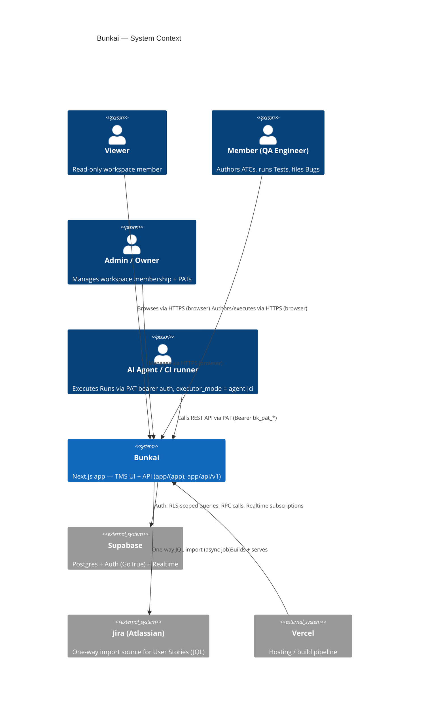
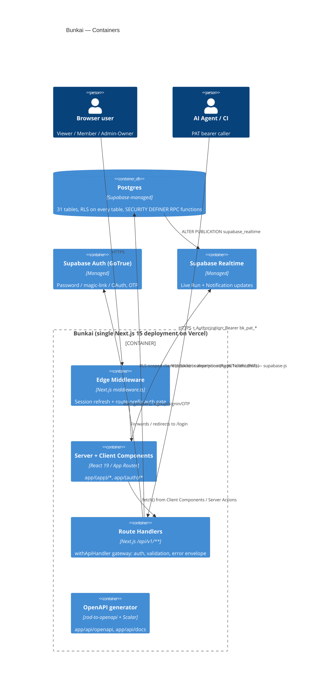
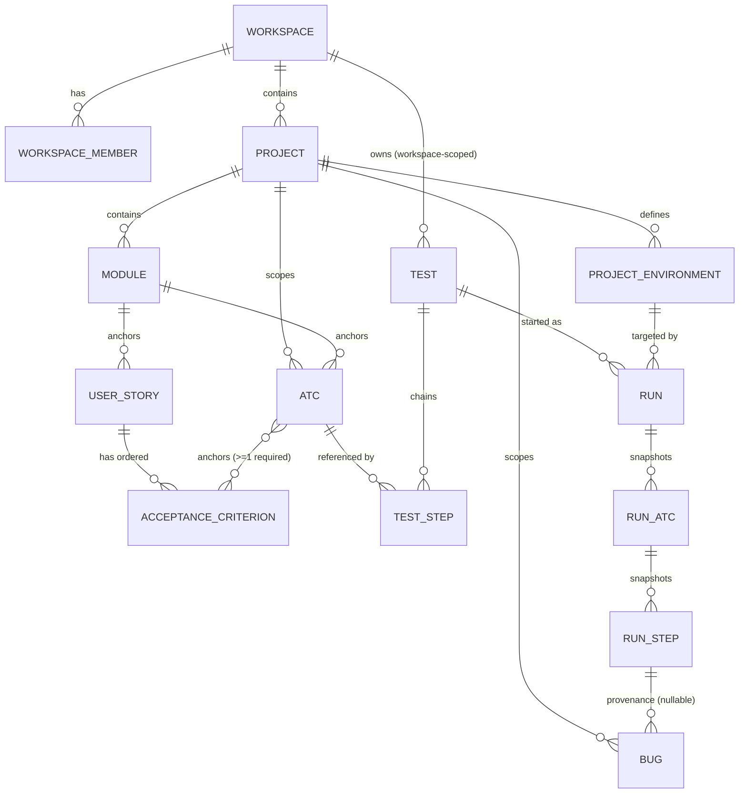
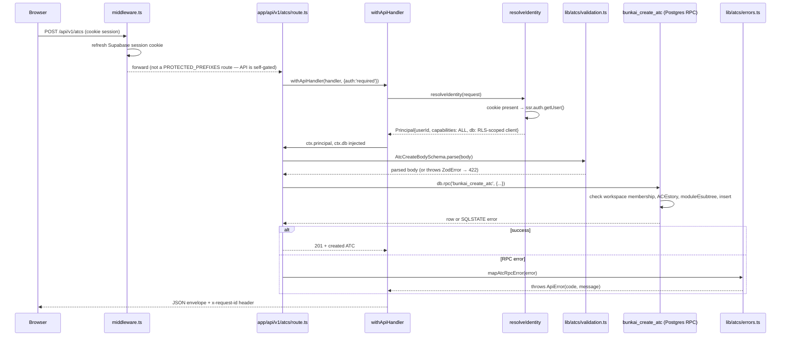
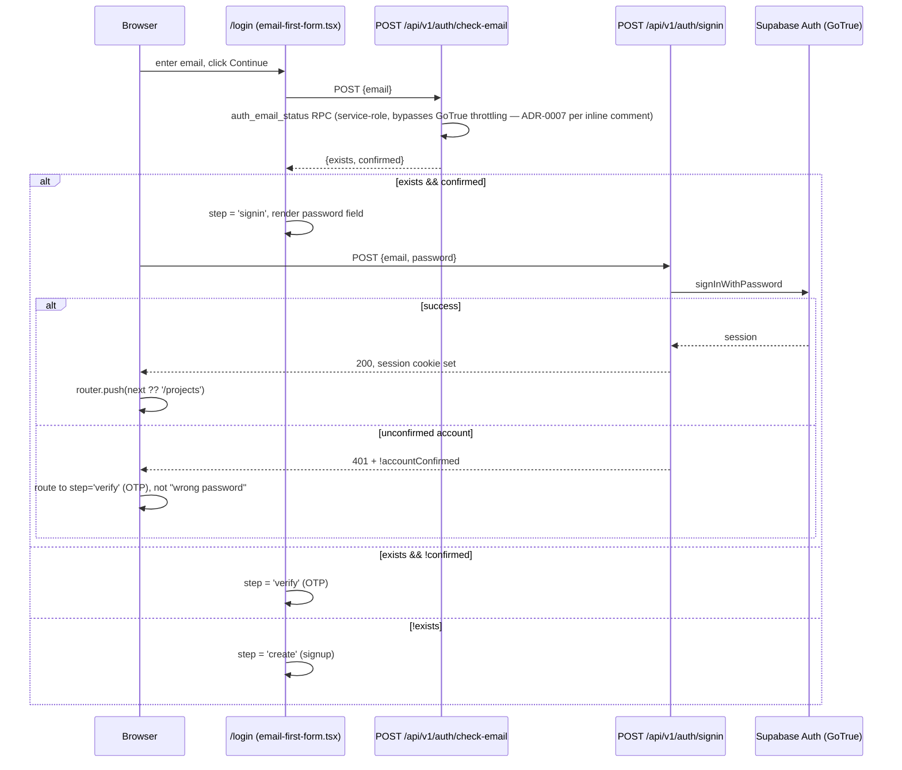

# Architecture — Bunkai

> Generated: 2026-08-12 · Discovery method: read-only reverse-engineering of `upex-bunkai-tms` source (App Router tree, `lib/`, `middleware.ts`, `supabase/migrations/*.sql`, `.env.example`, `package.json`). Extends Phase 1's `domain-glossary.md` (31-table ER survey) rather than re-deriving the schema from zero. `upex-bunkai-tms/.context/` was NOT read this session — every claim below cites a file this session opened directly.

---

## 1. System Overview

Bunkai is a **single Next.js 15 application** (App Router) that is simultaneously the web UI and the API backend — there is no separate frontend/backend repo or service (`project-config.md` §Repositories, confirmed via `git remote -v`). The architectural pattern is best described as a **modular monolith with a route-handler API layer and a Postgres-native business-rule layer**:

- **UI layer**: Next.js Server Components + Client Components under `app/(app)/*` and `app/(auth)/*`, styled with Tailwind + Radix primitives.
- **API layer**: Next.js Route Handlers under `app/api/v1/**/route.ts`, each wrapped by a single `withApiHandler` gateway (`lib/api/handler.ts`) — not a separate Express/NestJS server.
- **Business-rule layer**: complex multi-table writes are NOT done via ad-hoc client `.insert()`/`.update()` calls from TypeScript. They go through hand-written PL/pgSQL `SECURITY DEFINER` RPC functions (e.g. `bunkai_create_run`, `bunkai_create_bug`, `bunkai_create_test`, `bunkai_transition_bug_status`) that enforce the domain's business rules atomically inside Postgres, and raise custom `45xxx` SQLSTATE codes on violation. TypeScript service modules under `lib/<domain>/` (validation, error-mapping, view-shaping) sit in front of these RPCs as a thin, fail-fast layer — see §3 Component Structure.
- **Data layer**: Supabase-managed Postgres with Row-Level Security (RLS) enabled on every table — RLS is the authorization system of record, not a TypeScript access-control layer (see §7 Security Architecture).

There is no ORM (`project-config.md` confirms no Prisma/TypeORM/Drizzle artifacts) — direct `@supabase/supabase-js` / `@supabase/ssr` client calls plus the RPC layer above.

### Tech stack table

| Layer | Technology | Version | Evidence |
|---|---|---|---|
| Frontend framework | Next.js (App Router) | `^15` | `package.json` |
| UI runtime | React / react-dom | `^19` | `package.json` |
| Language | TypeScript (`strict: true`) | `^5.9.3` | `package.json`, `tsconfig.json` |
| Styling | Tailwind CSS + Radix UI primitives | `^3.4` / various | `package.json`, `tailwind.config.ts` |
| Validation | Zod | `^4.4.3` | `package.json`, `lib/*/validation.ts` |
| API-schema generation | `@asteasolutions/zod-to-openapi` | `^8.5.0` | `package.json`; `lib/openapi/registry.ts` |
| API docs UI | Scalar (`@scalar/api-reference-react`) | `^0.9.38` | `app/api/docs/page.tsx` |
| Database | PostgreSQL via Supabase | — | `.env.example`, `dbhub.toml` |
| DB client | `@supabase/ssr` + `@supabase/supabase-js` | `^0.10.3` / `^2.106.0` | `package.json` |
| ORM | None (raw SQL migrations + RPC functions) | — | `project-config.md` |
| Runtime / package manager | Bun | — | `bun.lock`, `package.json` scripts |
| Hosting | Vercel | — | `.agents/project.yaml` (`webapp_domain`), `.env.example` (`NEXT_PUBLIC_APP_URL`) |
| CI/CD | None found | — | no `.github/workflows/` (`project-config.md` Discovery Gap, carried forward) |

---

## 2. C4 Context Diagram



**Evidence**: `runs.executor_mode in ('human','agent','ci')` (`supabase/migrations/0031_runs.sql:81`) confirms the Agent/CI actor is a first-class caller, not UI-only; `import_jobs` table + `lib/jira/` confirm the one-way Jira import; `.agents/project.yaml` confirms the Vercel domain.

---

## 3. C4 Container Diagram



**Evidence**: `middleware.ts` (session refresh + `PROTECTED_PREFIXES` gate); `lib/api/handler.ts` (`withApiHandler` gateway); `lib/api/principal.ts` (`resolveIdentity` — cookie vs. bearer unification, ADR-0001 per inline comment); `lib/openapi/registry.ts` + `app/api/docs/page.tsx` (Scalar); `supabase/migrations/0043_run_realtime_replication.sql` (filename — realtime publication for `runs`; confirmed also for `notifications` per `domain-glossary.md` §8 Discovery Gaps, which flags other tables' realtime status as unconfirmed).

---

## 4. Component Structure

### Directory layout

```
upex-bunkai-tms/
├── app/
│   ├── (app)/          # Authenticated route group — projects, ATCs, tests, runs, bugs, milestones, settings
│   ├── (auth)/          # /login — email-first sign-in/up/verify + OAuth
│   ├── about/, qa/       # Public marketing/teaching pages
│   ├── api/
│   │   ├── v1/**/route.ts        # Route Handlers (business API)
│   │   ├── v1/**/route.openapi.ts # Sibling OpenAPI registration (zod-to-openapi)
│   │   ├── openapi/route.ts       # Serves the generated spec
│   │   └── docs/page.tsx          # Scalar API reference UI
│   ├── auth/callback, auth/oauth/[provider]   # OAuth/OTP exchange route handlers
│   └── invites/accept                          # Invite acceptance page
├── components/          # Presentational + feature components, grouped by domain (atcs/, bugs/, runs/, tests/, layout/, ui/)
├── lib/
│   ├── api/              # Cross-cutting API infra: handler.ts, error-envelope.ts, principal.ts, idempotency.ts, pat.ts, logging.ts
│   ├── <domain>/          # One folder per business domain (atcs/, bugs/, runs/, tests/, milestones/, workspaces/, ...): validation.ts, errors.ts, *-view.ts, *.test.ts co-located
│   ├── supabase/          # client.ts (browser), server.ts (SSR/cookie), admin.ts (service-role), rpc.ts (typed RPC wrappers)
│   ├── openapi/registry.ts # Central zod-to-openapi registry
│   ├── types.ts, types/    # Shared TS types (MemberRole, etc.) + generated Supabase DB types
│   └── env.ts              # Typed env var accessor
├── middleware.ts          # Root-level edge middleware (session refresh + auth gate)
├── supabase/migrations/    # 68 sequential .sql files — authoritative schema + RPCs + RLS policies
└── cli/, scripts/          # Boilerplate tooling (this target repo is itself built on a sibling agentic-dev framework — see its own CLAUDE.md/INSTALLER.md at repo root)
```

### Responsibility table

| Component | Responsibility | Evidence |
|---|---|---|
| `middleware.ts` | Refreshes the Supabase session cookie on every request; redirects unauthenticated visits to protected prefixes to `/login?next=...` | `middleware.ts:21-56` |
| `lib/api/handler.ts` (`withApiHandler`) | Single gateway for every route: resolves identity (unless `auth:'public'`), enforces `requires` capabilities, maps thrown errors (`ApiError`, `ZodError`, generic) to the canonical envelope, injects `x-request-id`, structured-logs every request | `lib/api/handler.ts:61-134` |
| `lib/api/principal.ts` (`resolveIdentity`) | Collapses cookie-session and Bearer-PAT auth into one `Principal` shape so handlers never branch on auth method (ADR-0001, per inline comment) | `lib/api/principal.ts:12-74` |
| `lib/<domain>/validation.ts` | Zod schemas mirroring the domain's RPC rulebook — fail fast (422) before any DB round-trip | e.g. `lib/atcs/validation.ts`, `lib/bugs/validation.ts`, `lib/runs/validation.ts` |
| `lib/<domain>/errors.ts` | Maps a Postgres SQLSTATE returned by the domain's RPC to the canonical `ApiError` envelope | e.g. `lib/atcs/errors.ts`, `lib/bugs/errors.ts`, `lib/runs/errors.ts` |
| `lib/<domain>/*-view.ts` | Shapes RPC/query results into the exact JSON the route/UI needs (e.g. `run-history-view.ts`, `report-bug-view.ts`) | e.g. `lib/runs/report-bug-view.ts` |
| `supabase/migrations/*.sql` | Schema DDL + `SECURITY DEFINER` RPC functions + RLS policies — the single source of enforced business rules | throughout, see `domain-glossary.md` §3 |
| `lib/api/idempotency.ts` | `Idempotency-Key` header middleware backed by the `idempotency_keys` table — replay-safe POSTs | `lib/api/idempotency.ts:1-40` |
| `lib/api/pat.ts` | Personal Access Token issuance/validation (`bk_pat_<prefix>.<secret>`), scope gating | `lib/api/pat.ts` (cited by `user-personas.md`) |
| `lib/openapi/registry.ts` + `*/route.openapi.ts` siblings | Central Zod→OpenAPI schema registry; every route pairs a `route.ts` (handler) with a `route.openapi.ts` (spec registration) | `app/api/v1/route.openapi.ts`, `lib/openapi/registry.ts` |

---

## 5. Database Schema

> Full entity catalog, JSON examples, and terminology mapping already live in `.context/business/domain-glossary.md` (31 tables, 10 core + 21 supporting, sourced from the same 68 migrations). This section does not repeat that survey — it summarizes the ER shape for architecture purposes and adds index/constraint detail spot-checked this session on `atcs`, `tests`, `runs`, and `bugs` (the four highest-traffic domains).

### ER diagram (core entities only — see `domain-glossary.md` §4 for the full 31-table diagram including supporting tables)



### Table detail — index/constraint spot-check (this session)

| Table | Primary indexes | Notable constraints | Evidence |
|---|---|---|---|
| `atcs` | `atcs_project_id_idx`, `atcs_module_id_idx`, `atcs_user_story_id_idx`, `atcs_tsv_gin_idx` (GIN full-text) | `layer` CHECK (`UI`/`API`/`Unit`), `status` CHECK (6 values) | `supabase/migrations/0004_atcs.sql:71-74` |
| `atc_steps`, `atc_assertions` | `atc_steps_atc_id_idx`, `atc_assertions_atc_id_idx` | ordered by `position` | `0004_atcs.sql:189,293` |
| `atc_acceptance_criteria` | `atc_acceptance_criteria_ac_id_idx` | M:N join; **no DB-level "≥1 AC" constraint** — app-layer only (BR-1, `domain-glossary.md`) | `0004_atcs.sql:395` |
| `tests` | `tests_workspace_id_idx` | workspace-scoped (not project-scoped) | `0024_tests.sql:51` |
| `test_steps` | `test_steps_atc_id_idx` | surrogate PK (same `atc_id` legal at multiple positions); FK to `atcs` is `on delete restrict` | `0024_tests.sql:72`, `domain-glossary.md` §1.8 |
| `project_environments` | `project_environments_project_name_idx` (unique) | one Environment name unique per Project | `0031_runs.sql:38` |
| `runs` | `runs_test_id_started_at_idx`, `runs_project_id_idx`, `runs_workspace_id_idx` | `status` CHECK (4 values), `executor_mode` CHECK (3 values) | `0031_runs.sql:80-94` |
| `run_atcs` / `run_steps` | `run_atcs_run_id_idx`, `run_steps_run_atc_id_idx` | frozen snapshot columns (title/content/expected duplicated from source at Run-start time) | `0031_runs.sql:131,181` |
| `bugs` | `bugs_project_id_created_at_idx`, `bugs_workspace_id_idx`, `bugs_module_id_idx`, `bugs_run_id_idx`, `bugs_assignee_user_id_idx` (added `0054`) | `severity` CHECK (P1-P4), `status` CHECK (4 values), `evidence_urls` array ≤10 | `0046_bugs.sql:118-121`, `0054_bug_assignment_status.sql:81-82` |
| `access_tokens` | `access_tokens_token_prefix_idx`, `access_tokens_user_active_idx` | `scopes` non-empty + allow-listed subset (CHECK) | `0008_access_tokens.sql:29-33` |

Full column-level detail for all 31 tables (including the 21 not re-verified this session) lives in `domain-glossary.md` §1 — this table adds only the index/constraint layer that document did not fully enumerate.

---

## 6. Data Flow

### Request sequence (a typical authenticated write — e.g. `POST /api/v1/atcs`)



**Evidence**: `middleware.ts`, `lib/api/handler.ts:61-110`, `lib/api/principal.ts:45-74`, `lib/atcs/validation.ts`, `lib/atcs/errors.ts:6-54`.

### Auth sequence (email-first login — password path)



**Evidence**: `app/(auth)/login/email-first-form.tsx` (per `user-journeys.md` Journey 1, steps 1-4); `app/api/v1/auth/check-email/route.ts` (ADR-0007 enumeration tradeoff, inline comment); `middleware.ts` refreshes the resulting session cookie on every subsequent request.

---

## 7. External Services

| Service | Purpose | Env vars (`.env.example`) | Integration point |
|---|---|---|---|
| Supabase (Postgres + Auth + Realtime) | Primary datastore, authentication, live updates | `NEXT_PUBLIC_SUPABASE_URL`, `SUPABASE_PUBLISHABLE_KEY`, `SUPABASE_SECRET_KEY`, `SUPABASE_JWT_SECRET`, `POSTGRES_*` | `lib/supabase/{client,server,admin,rpc}.ts`, `middleware.ts` |
| Supabase MCP control plane | Project management, migrations, advisors (AI-tooling only, not runtime) | `SUPABASE_ACCESS_TOKEN` | Not application code — dev/AI tooling |
| Atlassian (Jira) | One-way Story import by JQL | `ATLASSIAN_URL`, `ATLASSIAN_EMAIL`, `ATLASSIAN_API_TOKEN` | `lib/jira/`, `import_jobs` table (`supabase/migrations/0019_import_jobs.sql`) |
| Tavily | Web-search MCP (AI-tooling, not runtime) | `TAVILY_API_KEY` | Not application code |
| n8n | Workflow automation MCP (AI-tooling, not runtime — no `n8n` reference found in `app/`/`lib/` this session) | `N8N_API_URL`, `N8N_API_KEY` | **Discovery Gap** — declared in `.env.example` but no runtime call site found; likely dev-tooling only |
| Resend | Transactional email | `RESEND_API_KEY` | **Discovery Gap** — declared in `.env.example`; no `resend` SDK import found in `app/`/`lib/` this session (may be Supabase Auth's own email delivery instead — GoTrue can be configured with a custom SMTP/Resend provider outside app code, not verifiable from this repo alone) |
| Vercel | Hosting, build | `NEXT_PUBLIC_APP_URL` | Deployment platform (`.agents/project.yaml`) |

**Client instantiation evidence**: `createServerClient` (`lib/supabase/server.ts:10`, `middleware.ts:24`), `createClient` from `@supabase/supabase-js` (`lib/supabase/admin.ts:8`, `lib/api/principal.ts:115` for the PAT-impersonation client).

### API contract source (Phase 2 SRS §2 — not an SRS artifact, recorded here per doctrine)

- **No standalone OpenAPI spec file** (`openapi.yaml`/`.json`, `swagger.yaml`/`.json`) exists at the repo root or under `app/api/`. Confirmed via `find . -maxdepth 1 -iname "openapi*" -o -iname "swagger*"` (no matches).
- **Generator signal found**: `@asteasolutions/zod-to-openapi` (`package.json` dependency) + `bun run api:sync` / `bun run openapi:gen` / `bun run openapi:diff` scripts (`package.json` scripts block) + a live registry (`lib/openapi/registry.ts`) populated by every route's sibling `route.openapi.ts` file (e.g. `app/api/v1/route.openapi.ts`, `app/api/v1/health/route.openapi.ts`). The spec is generated at build/sync time, not committed as a static file, and served at runtime via `app/api/openapi/route.ts` + rendered at `app/api/docs/page.tsx` (Scalar UI).
- **Recommendation**: this QA-engineering repo's `bun run api:sync` (per `CLAUDE.md` §5 MCP/tool table) should point at the target's `/api/openapi` runtime endpoint (or the `openapi:gen` script's output, if run against the target repo directly) to produce `api/openapi-types.ts`. Until that sync runs, treat the technical API surface as **not yet materialized in this QA repo** — a Discovery Gap, not a missing capability in the target.
- Business-angle documentation (auth flows, critical endpoints) is deferred to `/business-api-map`, per doctrine — not duplicated here.

---

## 8. Security Architecture

### Authentication

- **Primary**: Supabase Auth (GoTrue) — password, magic-link, and OAuth (GitHub, Google) sign-in, confirmed via `project-config.md` and `user-journeys.md` Journey 1 (`app/(auth)/login/email-first-form.tsx`, `app/auth/oauth/[provider]/route.ts`).
- **Session transport**: HTTP-only cookies managed by `@supabase/ssr`, refreshed on every request by `middleware.ts` (`createServerClient` + `getUser()` before any route logic — the file's own comment warns against reordering this: `middleware.ts:44-45`).
- **Secondary (machine/agent)**: Personal Access Tokens, format `bk_pat_<prefix>.<secret>`. Server stores only `SHA-256(secret)` in `access_tokens.hash` plus a 12-char `token_prefix` for O(1) prefix lookup before the constant-time hash compare (`supabase/migrations/0008_access_tokens.sql:1-11`). No bcrypt/argon2 anywhere in this codebase — password hashing itself is delegated entirely to Supabase Auth (GoTrue), which this repo does not implement; PAT secrets use SHA-256 (`pgcrypto`), appropriate for a high-entropy generated secret (not a user-chosen password).
- **Unification (ADR-0001, per inline comment)**: `lib/api/principal.ts`'s `resolveIdentity()` collapses both auth methods into one `Principal` shape before any handler runs — a cookie session gets `capabilities: ALL_CAPABILITIES` and an RLS-scoped SSR client; a Bearer PAT gets its explicit `access_tokens.scopes[]` and an "impersonating" anon client carrying a short-lived user-scoped JWT (`mintUserJwt`, `lib/api/principal.ts:110-123`) — so RLS applies identically regardless of auth method, and no handler re-implements access logic in TypeScript (`lib/api/principal.ts:20-25` comment).

### Authorization

- **RLS is the system of record**, not a TypeScript permission layer. Every table has RLS enabled (`domain-glossary.md`, confirmed on `access_tokens`, `atcs` this session: `supabase/migrations/0008_access_tokens.sql:41`, `0004_atcs.sql:110-123`).
- **Role model**: `workspace_members.role` ∈ `viewer < member < admin/owner` (ascending permissions) — `supabase/migrations/0001_tenancy.sql:44`. Full permission matrix in `.context/PRD/user-personas.md` §6.
- **PAT scope model**: `access_tokens.scopes[]` ⊆ `{atc:read, atc:write, run:execute, workspace:admin}`, DB-enforced non-empty + allow-listed subset (`supabase/migrations/0008_access_tokens.sql:29-33`); a PAT with no workspace binding cannot perform workspace-admin operations at all (`assertWorkspaceContext`, `lib/api/principal.ts:91-104`, citing ADR-0005/ADR-0006 per inline comment).
- **Defense in depth**: viewer write-blocking is enforced at BOTH the UI (no create affordance rendered) and RLS/RPC layer independently (`user-personas.md` §Risk Areas) — a UI regression alone would still be caught server-side.
- **RPC-layer non-disclosure pattern**: several RPCs deliberately collapse "resource doesn't exist" and "resource exists but you can't see it" into the identical error code (e.g. `atc_not_in_workspace` `45122` for both a foreign-workspace ATC id and a nonexistent one — BR-2, `domain-glossary.md`), preventing existence-enumeration via error messages.

### Data protection

- **Multi-tenancy isolation**: every entity's RLS policy resolves membership back through `workspace_members` (`domain-glossary.md` §QA Usage Guide) — the dominant cross-cutting security risk this architecture exists to prevent is cross-tenant data leakage.
- **Secrets split from parent tables**: `access_token_secrets`, `workspace_invite_secrets`, `magic_link_token_secrets` (added by `0011_split_token_secrets.sql`) hold the actual secret hash separately from the parent table's now-nullable `hash`/`token_hash` column, so reading the parent table alone cannot yield a usable secret (`domain-glossary.md` §1.12).
- **Input sanitization**: Markdown-bearing fields (ATC step/assertion `content`, likely also Story/AC descriptions) are passed through `sanitizeMarkdown` (`lib/markdown/sanitize.ts`, used by `lib/atcs/sanitize.ts:11,15`) before persistence; the rendering side additionally uses `rehype-sanitize` (`package.json` dependency) when rendering Markdown back to HTML. Literal test-data fields (`input_data`, `expected`) are deliberately left unsanitized (documented rationale: they are literal values under test, not rendered prose — `lib/atcs/sanitize.ts:6-8`).
- **Content-length budgets**: e.g. ATC step/assertion content capped at 2048 UTF-8 bytes, measured via `byteLength` (not Zod's UTF-16-based `.max()`) so multibyte input is measured consistently (`lib/atcs/validation.ts:12-20`).
- **Enumeration tradeoff, explicitly accepted**: `POST /api/v1/auth/check-email` intentionally reveals whether an email is registered, to support email-first login routing; this is a documented, deliberate deviation from the "no enumeration" norm the rest of the auth surface follows (ADR-0007, per inline comment at `app/api/v1/auth/check-email/route.ts:14-25`), with its real mitigation (an app-level rate limiter) flagged in that same comment as **not yet shipped**.
- **TLS / transport**: not independently verifiable from source (Vercel terminates TLS at the edge by platform default) — not asserted further, per doctrine (no numeric/posture claim without evidence).

### Idempotency (security-adjacent reliability control)

- `Idempotency-Key` header, backed by `idempotency_keys` table, SHA-256 of the request payload, 24h effective window via the domain-level `start_token` pattern for Runs specifically (BR-4, `domain-glossary.md`) — full state machine documented in `lib/api/idempotency.ts:1-40`.

---

## 9. Performance Hooks

- **Caching**: no `revalidate`/`unstable_cache`/Redis usage found in `app/` or `lib/` except two incidental non-HTTP-cache hits (`app/(app)/projects/[projectSlug]/atcs/[atcId]/actions.ts`, `lib/home/coverage.ts` — both matched on the string "cache" but were not confirmed as an actual caching layer this session). **No application-level caching layer (Redis, Next.js `revalidate`, in-memory memo) was found.**
- **Rate limiting**: `rate_limited` is a first-class `ApiErrorCode` (`lib/api/error-envelope.ts:27`) and is actually thrown by 5 auth routes (`check-email`, `magic-link`, `signup`, `confirm`, `resend` — confirmed via grep), but the throttling itself is delegated to Supabase Auth's (GoTrue's) built-in rate limits for those routes; `check-email` specifically bypasses GoTrue (it reads `auth.users` via a service-role RPC) and its own comment states the real app-level rate limiter for that route is "a documented follow-up in ADR-0007, not yet shipped" (`app/api/v1/auth/check-email/route.ts:22-25`). **No general-purpose API rate limiter (e.g. Upstash, in-memory token bucket) covers the rest of `/api/v1/*`.**
- **Pagination**: keyset (cursor-based, not offset) pagination is used for Bugs list and Run history — `lib/pagination/keyset-cursor.ts` implements a generic `(timestamp, id)` base64url cursor codec, opaque (does not leak raw values in the token — `lib/pagination/keyset-cursor.test.ts:26-28`), extracted from Runs-history-specific code into a field-neutral shared module (inline comment, BK-49/Decision 4).
- **DB indexing**: every high-traffic FK column spot-checked this session (`atcs`, `test_steps`, `runs`, `bugs`) has a dedicated index; `atcs.tsv` has a GIN index backing full-text search (§5 above).
- **Connection pooling**: `.env.example` exposes both `POSTGRES_URL` (pooled, port 6543) and `POSTGRES_URL_NON_POOLING` (direct, port 5432) — standard Supabase pgbouncer pattern — but no application code in `lib/` connects via raw `POSTGRES_URL` (all access is via the Supabase client libraries, which manage their own connection handling). Pool size is not independently configured in app code.

---

## 10. Discovery Gaps

| Gap | Why it matters | Suggested next step |
|---|---|---|
| No general-purpose API rate limiter | `rate_limited` (429) is a declared error code but only 5 auth routes throw it (via GoTrue's own limits); the rest of `/api/v1/*` has no rate-limiting layer found | Ask the team whether Vercel Edge/WAF-level rate limiting exists outside this repo, or if it's a genuine gap |
| No caching layer (Redis/`revalidate`) | Every read appears to hit Postgres directly; under load this is a scalability question, not just performance | Confirm with the team whether this is intentional (RLS makes shared caching hard) or a future optimization |
| `N8N_*` / `RESEND_API_KEY` env vars declared but no runtime call site found in `app/`/`lib/` | Either dev-tooling-only (n8n) or delegated to GoTrue's own email config (Resend) — cannot confirm from source alone | Ask the team to confirm whether these integrate at runtime or only at the AI-tooling layer |
| No OpenAPI spec file committed; spec is generator-produced at sync time | `bun run api:sync` in THIS QA repo has nothing to consume yet until run against the target | Run `bun run api:sync` (or `openapi:gen` in the target repo) before writing any schema-dependent API tests |
| Numeric NFR values (response time, rate-limit thresholds, cache TTLs) | None found in code — GoTrue's actual throttling numbers are not configurable/visible from this repo | See `non-functional-specs.md` — every such claim there is either evidenced with a file or explicitly flagged absent |
| CI/CD pipeline | No `.github/workflows/` exists (carried from `project-config.md`) — Vercel's build-on-push is the only automated gate; it does not run `bun run repo:check` or the test suite | Confirm with the team whether tests run anywhere before merge |
| Full RLS policy enumeration | This session spot-checked `atcs`/`access_tokens`/`workspace_members` policies; the remaining ~28 tables' policies were not individually re-read (relying on the consistent multi-tenancy pattern documented in `domain-glossary.md`) | A future pass could enumerate every table's policy set via `pg_policies` through `[DB_TOOL]` for a complete authZ matrix |
| Realtime replication scope beyond `runs`/`notifications` | Carried from `domain-glossary.md` §8 — whether `bugs`/`activity_log` are also realtime-enabled was not re-checked this session | Query `pg_publication_tables` via `[DB_TOOL]` |

---

## 11. QA Relevance

### Components to test

| Component | Test angle | Why |
|---|---|---|
| `middleware.ts` `isProtected()` | Route-gate coverage — confirm every intended-protected route (`/home`, `/projects`, `/onboarding`, `/settings`, `/activity`) redirects unauthenticated visits; confirm `/workspaces/[id]/members` is NOT covered by the shared gate (page-level `redirect()` instead — flagged as a Discovery Gap in `user-journeys.md` §9) | Repo ships its own `middleware.test.ts` already exercising this — a good precedent for E2E-level confirmation too |
| `lib/api/principal.ts` cookie/PAT parity | Every capability-gated route should behave identically whether called via cookie session or a correctly-scoped PAT | ADR-0001's whole premise is "no second code path to forget" — a regression here is a security-relevant parity bug |
| RPC error-mapping modules (`lib/*/errors.ts`) | Each `45xxx`/`42501`/`P0002` case is an independently testable negative-path scenario with a frozen message/error-code contract | These are the richest, most precise Discovery source for FR Edge Cases (see `functional-specs.md`) |
| Idempotency (`lib/api/idempotency.ts`, Run `start_token`) | Double-submit safety on POSTs carrying `Idempotency-Key` and on Run start's domain-level `start_token` (24h window, BR-4) | High business-impact: a double-run or double-write bug is a data-integrity defect |
| RLS multi-tenant isolation | Cross-workspace / cross-project data leakage attempts against every entity | Highest-severity failure class per `executive-summary.md` §7 |

### Environment requirements

- Local: `bun run dev` against a Supabase project (local or cloud) with all 68 migrations applied.
- Credentials: `NEXT_PUBLIC_SUPABASE_URL`, `SUPABASE_PUBLISHABLE_KEY`/`SUPABASE_SECRET_KEY`, `SUPABASE_JWT_SECRET` (required for PAT impersonation to work — `lib/api/principal.ts:111-113` throws `internal_error` if absent).
- No CI/CD exists in the target — any automated QA suite this repo builds will need its own trigger (manual `bun run` or a workflow added to the target repo, out of this discovery's scope).
