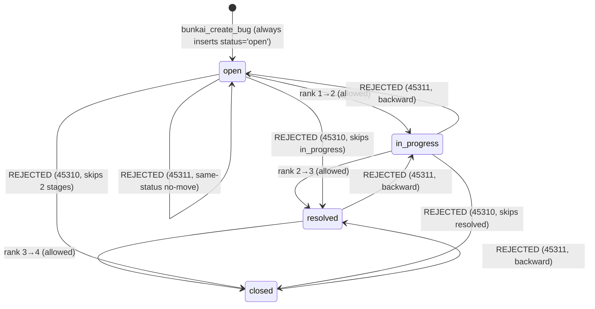
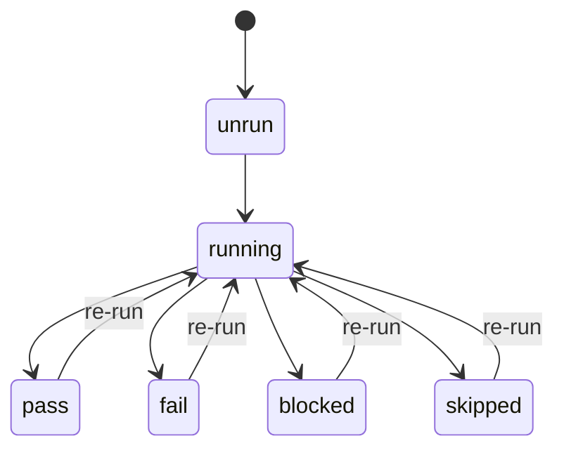
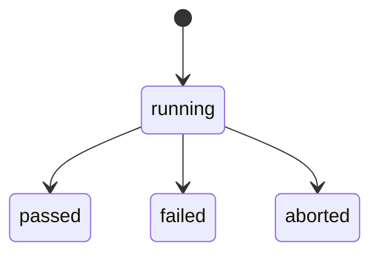

# Functional Specifications — Bunkai

> Generated: 2026-08-12 · Discovery method: read-only reverse-engineering of `upex-bunkai-tms` source (`lib/<domain>/validation.ts`, `lib/<domain>/errors.ts`, `supabase/migrations/*.sql` RPC bodies, `app/api/v1/**/route.ts`). Builds on `.context/PRD/user-journeys.md` (route-level flow) and `.context/business/domain-glossary.md` (schema + BR-1..BR-8). Where this session read an RPC's actual enforcement logic (not just its filename), it supersedes a Phase-1 "Discovery Gap" with confirmed behavior — noted inline. `upex-bunkai-tms/.context/` was NOT read this session.

---

## Specification Index

| FR ID | Feature | Category | Priority | PRD Journey |
|---|---|---|---|---|
| FR-001 | Email-first sign-up and OTP verification | Auth | P0 | Journey 1 |
| FR-002 | Workspace creation (onboarding) | Team & Access | P0 | Journey 1 |
| FR-003 | Project creation | Product Structure | P0 | Journey 1 |
| FR-004 | Author an ATC anchored to ≥1 Acceptance Criterion | ATC Library | P0 | Journey 2 |
| FR-005 | Assemble ATCs into a Test chain | Test Assembly | P0 | Journey 2 |
| FR-006 | Start a manual Run | Test Execution | P0 | Journey 3 |
| FR-007 | Mark a Run step verdict / finish / abort a Run | Test Execution | P0 | Journey 3 |
| FR-008 | File a Bug from a failed Run step | Defect Management | P0 | Journey 3 |
| FR-009 | Transition a Bug's status | Defect Management | P1 | Journey 3 (extension) |
| FR-010 | Assign a Bug to a workspace member | Defect Management | P1 | Journey 3 (extension) |

*(10 FRs — covers the PRD's top-5 core capabilities via journeys 1-3, the doctrine-required floor of "top-5 critical flows," plus two closely-coupled Bug-lifecycle extensions (FR-009, FR-010) that this session found fully evidenced at the RPC level and which directly resolve two Discovery Gaps `domain-glossary.md` had left open. Coverage & Traceability Reporting — PRD capability #5 — is read-only reporting with no state-changing business rules of its own; it is noted under QA Relevance rather than given a dedicated FR.)*

---

## FR-001: Email-First Sign-Up and OTP Verification

### Overview

| Field | Value |
|---|---|
| Feature | Account creation via email + password, confirmed by a 6-8 digit OTP code |
| Related PRD section | `user-journeys.md` Journey 1, steps 2-4 |
| Service/method | `POST /api/v1/auth/check-email`, `POST /api/v1/auth/signup`, `POST /api/v1/auth/confirm` |
| Evidence path | `app/(auth)/login/email-first-form.tsx:88-190`, `app/api/v1/auth/check-email/route.ts` |

### Functional Requirement

The system shall route a user entering an email address to sign-in (existing + confirmed), OTP verification (existing + unconfirmed), or account creation (unknown), then create the account and require OTP confirmation before granting a session.

### Input Specification

| Field | Type | Required | Source |
|---|---|---|---|
| `email` | string, RFC email format, ≤254 chars | Yes | `app/api/v1/auth/check-email/route.ts:29` (`z.string().email().max(254)`) |
| `password` | string, ≥8 chars | Yes (create step) | `email-first-form.tsx:137-141` |
| OTP code | 6-8 digit string | Yes (verify step) | `email-first-form.tsx:181-183` |

### Validation Rules

```ts
// app/api/v1/auth/check-email/route.ts:29
const BodySchema = z.object({
  email: z.string().email().max(254),
});
```
Email is normalized (`trim().toLowerCase()`) before the lookup because GoTrue stores/authenticates case-insensitively (`check-email/route.ts:41-44`).

### Processing Logic

1. Client submits email → `check-email` calls the `auth_email_status` `SECURITY DEFINER` RPC (service-role only; bypasses PostgREST's `auth` schema restriction) — returns `{email_exists, email_confirmed}`.
2. UI branches: unknown → `step='create'`; exists+unconfirmed → `step='verify'`; exists+confirmed → `step='signin'` (password prompt).
3. `signup` (`202`) issues the OTP; `confirm` (`200`) validates it and completes sign-in (`router.refresh(); router.push(next)`).

### Output Specification

- Success: `202` (signup), `200` (confirm) → session cookie set by GoTrue via `@supabase/ssr`.
- Errors: see Edge Cases below.

### Business Rules

- **BR-001** (enumeration tradeoff, ADR-0007 per inline comment): `check-email` intentionally reveals account existence — an accepted, documented exception to the rest of the auth surface's non-disclosure norm, because email-first UX requires knowing which step to render. See `architecture.md` §8.

### Edge Cases

| Scenario | Expected Behavior | Evidence |
|---|---|---|
| Signup for an already-existing email | `409` → "An account already exists for this email. Try signing in instead." | `email-first-form.tsx:154-157` |
| Wrong/expired OTP | `401` → "That code is invalid or expired." | `email-first-form.tsx:187-190` |
| Sign-in attempted on an unconfirmed account | `401` + `!accountConfirmed` → routed to `step='verify'`, NOT a generic wrong-password message | `email-first-form.tsx:127-131` |
| `check-email` rate-limited by GoTrue | `429 rate_limited` | `check-email/route.ts:68` |
| `signup`/`confirm`/`magic-link`/`resend` rate-limited | `429 rate_limited` | grep confirms all 5 auth routes throw this code |

---

## FR-002: Workspace Creation (Onboarding)

### Overview

| Field | Value |
|---|---|
| Feature | First-workspace creation, gating a brand-new account into the app |
| Related PRD section | `user-journeys.md` Journey 1, steps 6-7 |
| Service/method | `POST /api/v1/workspaces` |
| Evidence path | `app/(app)/onboarding/onboarding-form.tsx:80-107` |

### Functional Requirement

The system shall let an authenticated user with zero existing workspace memberships create exactly one workspace (name + slug), and shall redirect a user with ≥1 membership away from onboarding.

### Input Specification

| Field | Type | Required | Rule |
|---|---|---|---|
| `name` | string | Yes | Non-empty (client pre-check) |
| `slug` | string | Yes | ≥3 letters/digits (client pre-check: "Use at least 3 letters or digits") |

### Validation Rules

Client-side pre-checks (`onboarding-form.tsx:80-88`) before any network call: empty name → `'Enter a workspace name.'`; invalid slug → `'Use at least 3 letters or digits — they become the URL slug.'`. Server-side slug-uniqueness is enforced too (see Edge Cases).

### Processing Logic

1. `/projects` server-checks `workspaces` (RLS-scoped) — if empty, redirect to `/onboarding` (`app/(app)/projects/page.tsx:38-39`).
2. `/onboarding` itself redirects AWAY (to `/projects`) if the user already has ≥1 membership (`onboarding/page.tsx:23`) — the inverse gate.
3. On submit, `POST /api/v1/workspaces` creates the workspace and seeds the creator as `owner` (per `supabase/migrations/0006_bootstrap_workspace.sql` — filename-only evidence, RPC body not read this session).
4. On `2xx`: `toast.success('Workspace created'); router.replace('/projects')`.

### Output Specification

- Success: `2xx`, workspace created, creator's `workspace_members.role = 'owner'`.
- Error: `code === 'conflict'` on slug collision.

### Business Rules

- **BR-002**: every workspace creator is seeded as `owner` (structural — `bootstrap_workspace.sql`, filename-only evidence this session).

### Edge Cases

| Scenario | Expected Behavior | Evidence |
|---|---|---|
| Slug already taken | `Slug "${finalSlug}" is taken — try another.` | `onboarding-form.tsx:97-99` |
| Network error | Generic inline error, submit re-enabled | `onboarding-form.tsx:110-113` |
| User with an existing membership visits `/onboarding` | Redirected to `/projects`, form never shown | `onboarding/page.tsx:23` |

---

## FR-003: Project Creation

### Overview

| Field | Value |
|---|---|
| Feature | Create a Project (Application Under Test) inside the active Workspace |
| Related PRD section | `user-journeys.md` Journey 1, steps 8-10 |
| Service/method | `POST /api/v1/workspaces/{id}/projects` |
| Evidence path | `app/(app)/projects/create-project-form.tsx:38-113` |

### Functional Requirement

The system shall create a Project with a name that is 3-200 characters, contains at least one alphanumeric character, and has a slug unique within the workspace and not on a reserved list — then navigate the user directly into the new Project's detail page.

### Input Specification

| Field | Type | Required | Rule |
|---|---|---|---|
| `name` | string | Yes | ≥3 chars (client + server) |

### Validation Rules

Server `details.reason` values mapped to friendly copy client-side (`create-project-form.tsx:38-52`): `name_too_short`, `name_too_long`, `name_no_alphanumeric`, `slug_reserved`, `slug_duplicate_in_workspace`.

### Processing Logic

1. User submits name → `POST /api/v1/workspaces/{id}/projects`.
2. `201` → `toast.success('Project created'); router.replace('/projects/${slug}')` — lands the user INSIDE the project, not back on the index (explicit fix, code comment references BK-266: `create-project-form.tsx:104-107`).

### Output Specification

- Success: `201`, lands on `/projects/[slug]`.
- Error: `422`-class friendly-mapped reasons (see Validation Rules).

### Business Rules

- **BR-003**: Project name must be 3-200 chars, contain ≥1 alphanumeric character, and the derived slug must be unique within the workspace and not on a reserved list.

### Edge Cases

| Scenario | Expected Behavior | Evidence |
|---|---|---|
| Name < 3 chars | `name_too_short` friendly message | `create-project-form.tsx:38-46` |
| Name has no letter/digit (e.g. all punctuation) | `name_no_alphanumeric` | `create-project-form.tsx:38-46` |
| Slug collides with an existing Project in the workspace | `slug_duplicate_in_workspace` | `create-project-form.tsx:49-52` |
| Slug collides with a reserved word | `slug_reserved` | `create-project-form.tsx:49-52` |

---

## FR-004: Author an ATC Anchored to ≥1 Acceptance Criterion

### Overview

| Field | Value |
|---|---|
| Feature | Create/update an Acceptance Test Case, anchored to at least one Acceptance Criterion |
| Related PRD section | `executive-summary.md` Core Capability #1; `user-journeys.md` Journey 2, steps 1-4 |
| Service/method | `POST /api/v1/atcs` → `bunkai_create_atc` RPC |
| Evidence path | `lib/atcs/validation.ts`, `lib/atcs/errors.ts`, `supabase/migrations/0004_atcs.sql` |

### Functional Requirement

The system shall let a workspace `member`+ create an ATC with a title (3-200 chars), a `layer` (`UI`/`API`/`Unit`), ≥1 ordered step, optional assertions, and ≥1 linked Acceptance Criterion belonging to the specified User Story — rejecting the write if the Module is outside the Story's Project subtree or any AC does not belong to the Story.

### Input Specification

| Field | Type | Required | Rule | Evidence |
|---|---|---|---|---|
| `title` | string | Yes | 3-200 chars | `lib/atcs/validation.ts:16-17,36` |
| `layer` | enum | Yes | `UI`\|`API`\|`Unit` | `validation.ts:9,37` |
| `tags` | string[] | No | max 10 | `validation.ts:15,38` |
| `steps` | array | Yes | min 1 item; `content` ≤2048 UTF-8 bytes; `position` strictly increasing from 1 | `validation.ts:22-27,39,73-93` |
| `assertions` | array | No | `content` ≤2048 UTF-8 bytes | `validation.ts:29-31,40` |
| `acceptance_criterion_ids` | uuid[] | Yes | min 1 | `validation.ts:41` |
| `module_id`, `user_story_id` | uuid | Yes (create only) | must resolve inside the same Project | `validation.ts:45-47` |

### Validation Rules

```ts
// lib/atcs/validation.ts
export const MAX_ATC_CONTENT_BYTES = 2048;
export const MAX_ATC_TAGS = 10;
export const ATC_TITLE_MIN = 3;
export const ATC_TITLE_MAX = 200;

export const AtcWriteBodySchema = z.object({
  title: z.string().min(ATC_TITLE_MIN).max(ATC_TITLE_MAX),
  layer: z.enum(ATC_LAYERS),
  tags: z.array(z.string()).max(MAX_ATC_TAGS).optional().default([]),
  steps: z.array(AtcStepInputSchema).min(1),
  assertions: z.array(AtcAssertionInputSchema).optional().default([]),
  acceptance_criterion_ids: z.array(z.string().uuid()).min(1),
});
```
Step `position` must be strictly increasing starting at 1 (`stepPositionsError`, `validation.ts:81-93`) — gaps allowed (`[1,2,5]` valid), but out-of-order or non-integer positions are rejected with the offending list returned.

### Processing Logic

1. Zod-validates body shape (fail-fast 422 before any DB round-trip).
2. Content is sanitized: `sanitizeAtcSteps`/`sanitizeAtcAssertions` run `content` through `sanitizeMarkdown` (`input_data`/`expected` left untouched — literal test data, not prose) — `lib/atcs/sanitize.ts`.
3. `bunkai_create_atc` RPC re-validates at the DB layer: membership+write role, AC∈UserStory, Module∈Project-subtree, generates a unique slug.
4. On success: `201`, ATC row returned; client navigates to the ATC's own detail page.

### Output Specification

- Success: `201` with the created ATC (id, slug, version=1, status='unrun').
- Error: see Edge Cases — each RPC SQLSTATE maps to a specific `ApiErrorCode`.

### Business Rules

- **BR-004** (= domain-glossary BR-1, "ATC anchoring moat"): an ATC must reference ≥1 Acceptance Criterion. **Enforcement is application/RPC-layer only in MVP — no DB CHECK constraint exists on the join table** (`0004_atcs.sql:5-6`). Confirmed this session: the Zod schema's `.min(1)` on `acceptance_criterion_ids` (`validation.ts:41`) is the first gate. ~~a direct RPC/REST caller bypassing the Zod layer would still be caught by the RPC's own logic (not independently re-read this session — the RPC body's exact zero-AC rejection code was not located; still a partial Discovery Gap, narrower than domain-glossary's original one).~~ **RESOLVED 2026-08-13**: yes, `bunkai_create_atc`'s own body independently re-enforces the rule — defense in depth confirmed. `0021_atc_create_update.sql:158-160`: `if coalesce(array_length(p_ac_ids, 1), 0) = 0 then raise exception 'ac_outside_user_story' using errcode = '45020'; end if;` runs before any insert. The same guard is repeated on edit in `bunkai_update_atc` (`0021_atc_create_update.sql:295-297`). A direct RPC/REST caller bypassing the Zod `.min(1)` gate would still be rejected with `45020` at the RPC layer.
- **BR-005**: every `acceptance_criterion_id` must belong to the ATC's `user_story_id` (SQLSTATE `45020`, `ac_outside_user_story`).
- **BR-006**: `module_id` must be the User Story's own module or a descendant in the same Project (SQLSTATE `45021`, `module_outside_project_subtree`).
- **BR-007** (optimistic locking on edit): PATCH carries a `version`; a concurrent conflicting edit raises SQLSTATE `45022`, mapped to `409 conflict` with `details.current_version` (`lib/atcs/errors.ts:24-32`).

### Edge Cases

| Scenario | HTTP / Code | SQLSTATE | Evidence |
|---|---|---|---|
| Caller not a workspace member with write access | `403 forbidden` (`reason: not_a_member`) | `42501` | `lib/atcs/errors.ts:8-11` |
| ATC/story/module not found | `404 not_found` | `P0002` | `errors.ts:12-15` |
| AC not in the given User Story | `422 ac_outside_user_story` | `45020` | `errors.ts:16-19` |
| Module outside Project subtree | `422 module_outside_project_subtree` | `45021` | `errors.ts:20-23` |
| Concurrent edit (version conflict) | `409 conflict` + `current_version` | `45022` | `errors.ts:24-32` |
| Duplicate's computed title > 200 chars | `422 validation_failed` (`title_too_long`) | `45023` | `errors.ts:33-38` |
| Slug collision | `409 slug_collision` | `23505` | `errors.ts:39-42` |
| >10 tags via a direct RPC caller (Zod already blocks it via the API) | `422 validation_failed` (`tags_limit_exceeded`) | `45024` | `errors.ts:43-50` |
| Step positions not strictly increasing from 1 | `422 steps_position_invalid` with offending positions list | (route-level, pre-RPC) | `validation.ts:73-93` |

---

## FR-005: Assemble ATCs into a Test Chain

### Overview

| Field | Value |
|---|---|
| Feature | Create a workspace-scoped Test — an ordered chain of ATC references, the same ATC reusable at multiple positions |
| Related PRD section | `executive-summary.md` Core Capability #2; `user-journeys.md` Journey 2, steps 5-7 |
| Service/method | `POST /api/v1/tests` → `bunkai_create_test` RPC |
| Evidence path | `supabase/migrations/0024_tests.sql:203-225` |

### Functional Requirement

The system shall create a Test with a non-empty, ordered chain of ATC ids, where every referenced ATC must be a non-archived ATC belonging to the SAME workspace as the Test — rejecting an empty chain or any cross-workspace/nonexistent ATC reference with a single non-disclosing error.

### Input Specification

| Field | Type | Required | Rule |
|---|---|---|---|
| `title` | string | Yes | 1-200 chars (per `domain-glossary.md` §9 boundary-value note) |
| `atc_ids` | uuid[] (ordered) | Yes | min 1; every id must resolve to a non-archived ATC in the same workspace |

### Validation Rules

RPC-layer only this session (no dedicated `lib/tests/validation.ts` create-body schema was located distinct from the RPC call itself — route delegates directly to `bunkai_create_test`).

### Processing Logic

1. Member+ picks ≥1 ATC from the workspace-wide (not project-scoped) library and orders the chain.
2. `bunkai_create_test` RPC validates, in order: (a) chain is non-empty → else `chain_empty`; (b) every `atc_id` resolves to a non-archived ATC in this workspace → else `atc_not_in_workspace`.
3. On success: Test + ordered `test_steps` rows created (surrogate PK allows the same `atc_id` at multiple positions).

### Output Specification

- Success: `201`, Test with its ordered chain.
- Error: `chain_empty` / `atc_not_in_workspace`.

### Business Rules

- **BR-008** (= domain-glossary BR-2): Test chain must be non-empty and every ATC id must resolve inside the same workspace as the Test. Foreign-workspace, nonexistent, and NULL ids all collapse into the identical `atc_not_in_workspace` error (non-disclosure — no hint which id was invalid).

### Edge Cases

| Scenario | Error code | SQLSTATE | Evidence |
|---|---|---|---|
| Empty `atc_ids` array | `chain_empty` | `45120` | `0024_tests.sql:203-225` |
| An `atc_id` belongs to a different workspace | `atc_not_in_workspace` | `45122` | same |
| An `atc_id` does not exist at all | `atc_not_in_workspace` (identical — non-disclosure) | `45122` | same |
| Same ATC referenced at two chain positions | Legal — `test_steps` uses a surrogate PK specifically to allow this | `domain-glossary.md` §1.8 | — |

---

## FR-006: Start a Manual Run

### Overview

| Field | Value |
|---|---|
| Feature | Start a Run of an existing Test against a Project Environment — a frozen, point-in-time snapshot of the chain |
| Related PRD section | `executive-summary.md` Core Capability #3; `user-journeys.md` Journey 3, steps 1-3 |
| Service/method | `POST /api/v1/runs` → `bunkai_create_run` RPC |
| Evidence path | `lib/runs/validation.ts:16-26`, `lib/runs/errors.ts:8-36`, `supabase/migrations/0031_runs.sql:299-408` |

### Functional Requirement

The system shall start a Run given a `test_id` and `environment_id`, deriving `executor_mode` from the auth method (cookie session → `human` implicitly; PAT → caller may declare `human`/`agent`/`ci`), validating write-membership, mode validity, that the Environment belongs to the Test's own Project, and that the Test resolves to ≥1 executable ATC step — and shall treat a repeated `(test_id, start_token)` pair within 24 hours as an idempotent replay of the original Run rather than a new one.

### Input Specification

```ts
// lib/runs/validation.ts:16-26
export const RunCreateBodySchema = z.object({
  test_id: z.string().uuid(),
  environment_id: z.string().uuid(),
  executor_mode: z.enum(['human', 'agent', 'ci']).optional(),
  start_token: z.string().trim().min(1).max(200).optional(),
});
```

### Validation Rules

- `executor_mode`: optional in the body; cookie sessions are unambiguously `human`, a PAT caller may declare `agent`/`ci` — the route derives the effective mode (`app/api/v1/runs/route.ts:44-49`, "PO-pending §4" per `executive-summary.md` §5 — an internal decision doc referenced but not present in this repo).
- `start_token`: 1-200 chars, mirrors the `runs.start_token` DB CHECK.

### Processing Logic (RPC's own validated order — load-bearing)

1. Actor can write the workspace.
2. `executor_mode` is one of the 3 valid values.
3. `environment_id` belongs to the Test's own Project.
4. The Test resolves to ≥1 executable ATC step.
5. `(test_id, start_token)` idempotency check — if an identical pair was used within 24h, the Project row is locked (`for update`) and the ORIGINAL Run is returned tagged `"replayed": true` instead of creating a duplicate.

### Output Specification

- Success: `201` (new Run) or `200` (idempotent replay).
- Errors: see Edge Cases.

### Business Rules

- **BR-009** (= domain-glossary BR-3): Run requires a valid Environment belonging to the Test's Project and ≥1 executable step, validated in the load-bearing order above.
- **BR-010** (= domain-glossary BR-4): Run start is idempotent within a 24-hour `(test_id, start_token)` window; a retry after 25h creates a genuinely new Run.

### Edge Cases

| Scenario | Error code | SQLSTATE | Evidence |
|---|---|---|---|
| Caller not a workspace member with write access, OR Test doesn't exist (non-disclosure — same code for both) | `403 forbidden` | `42501` | `lib/runs/errors.ts:10-16` |
| `executor_mode` outside the 3 valid values (RPC backstop; Zod already blocks this at the API edge) | `422 validation_failed` | `45200` | `errors.ts:23-28` |
| Environment belongs to a different Project than the Test | `422 environment_invalid` | `45201` | `errors.ts:29-32` |
| Test's chain resolves to 0 executable ATC steps | `422 no_executable_steps` — frozen, verbatim UI copy: "Add at least one ATC step to this Test before starting a run." | `45202` | `errors.ts:33-36`; `StartRunButton.tsx` comment |
| Double-submit with same `Idempotency-Key` HTTP header | Server returns the already-created Run (HTTP-layer idempotency, distinct from the domain `start_token`) | — | `StartRunButton.tsx:36-38,82-86` |
| Same `(test_id, start_token)` retried within 24h | `200`, original Run returned, `"replayed": true` | — | `0031_runs.sql:380-408` |
| Same pair retried after 24h | New Run created | — | same |

---

## FR-007: Mark a Run Step Verdict / Finish or Abort a Run

### Overview

| Field | Value |
|---|---|
| Feature | Record a per-step verdict during a Run, then finish (pass/fail) or abort the Run |
| Related PRD section | `user-journeys.md` Journey 3, steps 4, 8 |
| Service/method | `PATCH .../run-steps/{id}` (mark), `POST .../runs/{id}/finish`, `POST .../runs/{id}/abort` — all via dedicated RPCs |
| Evidence path | `lib/runs/validation.ts:30-104`, `lib/runs/errors.ts:37-105` |

### Functional Requirement

The system shall let a `member`+ mark each Run Step's verdict as `passed`/`failed`/`blocked` (never back to `pending`), finish a Run with a final verdict of `passed`/`failed`, or abort it with a 3-500 character reason — and shall reject any of these three actions once the Run's header status is already terminal (`passed`/`failed`/`aborted`), returning a uniform "already closed" `409 conflict` for each action's own resource type.

### Input Specification

| Action | Field | Rule | Evidence |
|---|---|---|---|
| Mark step | `status` | enum `passed`\|`failed`\|`blocked` (never `pending`) | `validation.ts:75,92-93` |
| Mark step | `note` | ≤2000 chars, empty string → null | `validation.ts:80-90` |
| Mark step | `evidence_url` | valid URL, ≤2000 chars, empty string → null | `validation.ts:81,98-101` |
| Abort | `reason` | trimmed, 3-500 chars | `validation.ts:32-45` |
| Finish | `verdict` | enum `passed`\|`failed` only (`aborted` is its own action) | `validation.ts:49-67` |

### Validation Rules

```ts
// lib/runs/validation.ts — abort
export const RUN_ABORT_REASON_MIN = 3;
export const RUN_ABORT_REASON_MAX = 500;
export const RunAbortBodySchema = z.object({
  reason: z.string().trim().min(RUN_ABORT_REASON_MIN).max(RUN_ABORT_REASON_MAX),
});

// finish
export const RUN_FINISH_VERDICTS = ['passed', 'failed'] as const;

// mark-step
export const RUN_STEP_STATUSES = ['passed', 'failed', 'blocked'] as const;
```
Abort/finish surface their bounds messages VERBATIM (frozen, AC-exact copy) rather than through the generic ZodError envelope — a deliberate UX contract (`validation.ts:35-37,56-58`).

### Processing Logic

1. Each action's Zod schema validates the body shape and rejects out-of-enum/out-of-bounds values BEFORE any RPC call.
2. The corresponding RPC (`bunkai_mark_run_step`, `bunkai_finish_run`, `bunkai_abort_run`) re-checks the SAME rules as an RPC-layer backstop (reachable only by a direct/non-HTTP caller), AND independently checks the Run's own header status is still `running` — otherwise rejects with a 409.

### Output Specification

- Success: `200`, updated Run/Run Step state.
- Error: see Edge Cases.

### Business Rules

- **BR-011**: a Run Step's status can only move to `passed`/`failed`/`blocked` — never back to `pending` (re-mark-to-pending is rejected).
- **BR-012**: abort/finish/mark-step are each rejected with `409 conflict` once the Run's header status is `passed`/`failed`/`aborted` — a Run is a one-way door once closed. "First-wins" for concurrent finish/abort attempts — the loser re-reads the now-terminal status and lands on this same rejection (`lib/runs/errors.ts:52-59` comment).

### Edge Cases

| Scenario | Error code | SQLSTATE | Evidence |
|---|---|---|---|
| Abort a Run that's already closed | `409 conflict` (`run_not_abortable`) | `45204` | `lib/runs/errors.ts:37-42` |
| Abort reason RPC backstop out of 3-500 bounds (direct RPC caller only) | `422 validation_failed` | `45205` | `errors.ts:43-51` |
| Finish a Run that's already closed | `409 conflict` (`run_not_finishable`) | `45206` | `errors.ts:52-59` |
| Finish verdict RPC backstop invalid (direct RPC caller only) | `422 validation_failed` | `45207` | `errors.ts:60-67` |
| Mark a step on a Run that's already closed | `409 conflict` (`run_step_marking_closed`) | `45212` | `errors.ts:89-96` |
| Mark-step status RPC backstop invalid, incl. re-mark-to-`pending` (direct RPC caller only) | `422 validation_failed` | `45213`\* | `errors.ts:97-105` |

\* Note: this `45213` is in the **runs (452xx) SQLSTATE block** and is unrelated in meaning to the also-`45213`-coded `sole_owner` guard in the workspaces domain (`0044_leave_workspace.sql`) — the two happen to share a numeric suffix but live in different `4xxxx` block families used by different RPC groups; confirmed as two distinct, independently-legitimate allocations, not a collision bug.

---

## FR-008: File a Bug from a Failed Run Step

### Overview

| Field | Value |
|---|---|
| Feature | File a Bug carrying full provenance (`run_id`/`run_step_id`/`atc_id`) directly from a failed Run Step, or standalone against a Project/Module |
| Related PRD section | `executive-summary.md` Core Capability #4; `user-journeys.md` Journey 3, steps 5-7 |
| Service/method | `POST /api/v1/bugs` → `bunkai_create_bug` RPC |
| Evidence path | `lib/bugs/validation.ts`, `lib/bugs/errors.ts:87-119`, `supabase/migrations/0046_bugs.sql:162-215` |

### Functional Requirement

The system shall let a `member`+ file a Bug either run-linked (carrying `run_step_id`, with `project_id`/`module_id`/`run_id`/`atc_id` ALWAYS derived server-side, never client-supplied) or standalone (`project_id` + `module_id` explicit) — with a title of 5-200 characters, a severity of `P1`-`P4`, and at most 10 evidence URLs — and shall verify, at TWO independent layers (the RPC and a table-level trigger), that any supplied provenance ids are mutually consistent within the same Project.

### Input Specification

| Field | Type | Required | Rule | Evidence |
|---|---|---|---|---|
| `title` | string | Yes | 5-200 chars, trimmed | `lib/bugs/validation.ts:24-30` |
| `severity` | enum | Yes | `P1`\|`P2`\|`P3`\|`P4` | `validation.ts:32` |
| `description`, `steps_to_reproduce` | string | No | trimmed | `validation.ts:42-43` |
| `evidence_urls` | url[] | No | max 10 | `validation.ts:34-37` |
| `run_step_id` (run-linked variant) | uuid | Yes (this variant) | — | `validation.ts:47-50` |
| `project_id` + `module_id` (standalone variant) | uuid | Yes (this variant) | — | `validation.ts:52-56` |

### Validation Rules

```ts
// lib/bugs/validation.ts
const titleSchema = z.string().trim().min(5).max(200);
const severitySchema = z.enum(['P1', 'P2', 'P3', 'P4']);
const evidenceUrlsSchema = z.array(z.string().url()).max(10).optional();

export const BugCreateBodySchema = z.union([
  BugRunLinkedCreateBodySchema,   // { run_step_id, ...shared }
  BugStandaloneCreateBodySchema,  // { project_id, module_id, ...shared }
]);
```
The two variants are distinguished structurally (`'run_step_id' in body`), not by a literal discriminant tag — Zod's default "strip unknown keys" behavior means a run-linked body can never leak a client-supplied `project_id`/`module_id`/`run_id`/`atc_id` through to the RPC even if a caller sent them (`validation.ts:18-22`).

### Processing Logic

1. Zod validates the union shape; run-linked bodies never carry provenance ids (Technical Decision 7, per inline comment).
2. `bunkai_create_bug` RPC: for run-linked bodies, derives `project_id`/`module_id`/`run_id`/`atc_id` server-side FROM `run_step_id`; for both variants, sets `status='open'` unconditionally on insert.
3. `bunkai_bugs_check_consistency` trigger (BEFORE INSERT/UPDATE, fires regardless of write path — RPC or a direct REST write) independently re-verifies: Project's workspace matches; Module belongs to Project; if present, Run belongs to Project; Run Step belongs to Run; ATC belongs to Project.

### Output Specification

- Success: `201`, Bug created with `status='open'`, provenance frozen at filing time.
- Error: see Edge Cases.

### Business Rules

- **BR-013** (= domain-glossary BR-5): Bug provenance must stay internally consistent — every supplied id must belong to the same Project being written into. Enforced at TWO independent layers (RPC + trigger) as defense against a direct, RPC-bypassing write.
- **BR-014**: A Bug is always created with `status='open'` — there is no "file directly as resolved/closed" path.

### Edge Cases

| Scenario | Error code | SQLSTATE | Evidence |
|---|---|---|---|
| Caller not a workspace member with write access | `403 forbidden` | `42501` | `lib/bugs/errors.ts:25-28` |
| Project/module (create) not found | `404 not_found` | `P0002` | `errors.ts:29-42` |
| Module not in the given Project | `422 validation_failed` (`module_outside_project`) | `45300` | `errors.ts:87-90` |
| Run not in the given Project (non-disclosure — never confirms if `run_id` exists at all) | `422 validation_failed` (`run_outside_project`) | `45305` | `errors.ts:91-96` |
| Run Step not in the given Run | `422 validation_failed` (`run_step_outside_run`) | `45306` | `errors.ts:97-100` |
| ATC not in the given Project | `422 validation_failed` (`atc_outside_project`) | `45307` | `errors.ts:101-104` |
| Title RPC backstop out of 5-200 bounds (direct RPC caller only — Zod is the primary guard) | `422 validation_failed` | `45301` | `errors.ts:105-111` |
| Severity RPC backstop invalid | `422 validation_failed` | `45302` | `errors.ts:112-115` |
| >10 evidence URLs (RPC backstop) | `422 validation_failed` | `45303` | `errors.ts:116-119` |
| Reported on a Run Step that is NOT `failed` | UI: "Report bug" button structurally never renders (`shouldShowReportBugButton`); Server: independently rejected, `422 run_step_not_failed` backstop | — | `lib/runs/report-bug-view.ts:13-15,20-22` |

---

## FR-009: Transition a Bug's Status

### Overview

| Field | Value |
|---|---|
| Feature | Move a Bug forward exactly one lifecycle stage at a time: `open → in_progress → resolved → closed` |
| Related PRD section | Not explicitly journeyed in `user-journeys.md`; extends Journey 3's Bug-filing flow into the Bug's own lifecycle |
| Service/method | `POST /api/v1/bugs/{id}/status` → `bunkai_transition_bug_status` RPC |
| Evidence path | `lib/bugs/validation.ts:81-89`, `lib/bugs/errors.ts:43-74`, `supabase/migrations/0054_bug_assignment_status.sql:60-72,140-156` |

### Functional Requirement

The system shall only allow a Bug's `status` to move forward exactly one stage at a time along the fixed rank `open(1) < in_progress(2) < resolved(3) < closed(4)` — rejecting any attempt to skip a stage or move backward (including a same-status no-move) — enforced identically whether the write reaches the database via the dedicated RPC or any other path, via a shared BEFORE-trigger backstop.

**This FR directly resolves a Discovery Gap that `domain-glossary.md` §8 had left open** ("ATC/Run/Bug status transition guards ... no state-machine-enforcing trigger or RPC was read this session" for Bug specifically) — this session read the actual enforcement code.

### Input Specification

| Field | Type | Required | Rule |
|---|---|---|---|
| `status` | enum | Yes | `open`\|`in_progress`\|`resolved`\|`closed` |

### Validation Rules

```ts
// lib/bugs/validation.ts:81-89
export const BugStatusTransitionBodySchema = z.object({
  status: z.enum(BUG_STATUS_VALUES),
});
```
The Zod layer only backstops the VALUE itself; adjacency (which transitions are legal) is enforced exclusively at the RPC/trigger layer — by design, per the schema's own comment.

### Processing Logic

1. Route parses `{status}`, calls `bunkai_transition_bug_status(bug_id, status)`.
2. RPC computes `v_old_rank`/`v_new_rank` from a fixed CASE mapping (`open=1, in_progress=2, resolved=3, closed=4`).
3. If `v_new_rank > v_old_rank + 1` → reject (`bug_status_transition_skipped`, `45310`).
4. If `v_new_rank <= v_old_rank` → reject (`bug_status_transition_backward`, `45311` — this single check ALSO catches a same-status no-move and any value that maps to rank 0, i.e. an unrecognized status).
5. `bunkai_bugs_check_consistency` trigger (extended in migration `0054`, same file) re-runs the IDENTICAL rank comparison as a backstop for any UPDATE that bypasses the RPC entirely, using the exact same CASE table — the two layers structurally cannot disagree (`0054_bug_assignment_status.sql:141-142` comment).

### State Machine



**Confirmed, not speculative** — every arrow above is read directly from `bunkai_bugs_check_consistency`'s rank-comparison logic (`0054_bug_assignment_status.sql:140-156`), superseding the "illustrative, not confirmed" caveat `domain-glossary.md` §6 placed on its own Bug status diagram (which additionally showed `open ↔ in_progress ↔ resolved` bidirectional arrows and a direct `open → closed` shortcut — **both of those are actually rejected**, per this session's evidence).

### Transition Table

| From | To | Trigger | Guard | Side Effects |
|---|---|---|---|---|
| (none) | `open` | `bunkai_create_bug` | none — always the initial value | — |
| `open` | `in_progress` | `bunkai_transition_bug_status` | rank(new) = rank(old)+1 | — |
| `in_progress` | `resolved` | `bunkai_transition_bug_status` | rank(new) = rank(old)+1 | — |
| `resolved` | `closed` | `bunkai_transition_bug_status` | rank(new) = rank(old)+1 | — |
| any | any (skip ≥2 stages forward) | `bunkai_transition_bug_status` | rank(new) > rank(old)+1 | rejected, `45310` |
| any | any (same or backward) | `bunkai_transition_bug_status` | rank(new) ≤ rank(old) | rejected, `45311` |

### Output Specification

- Success: `200`, updated Bug with new `status`.
- Error: `422 validation_failed` with `reason: status_transition_skipped` (naming the actual required next stage in the message, re-derived client-side from `BUG_STATUS_VALUES`'s array order — `lib/bugs/errors.ts:58-61`) or `reason: status_transition_backward`.

### Business Rules

- **BR-015**: Bug status may only advance exactly one rank at a time, forward only. No skip, no backward move, no same-status no-move.

### Edge Cases

| Scenario | Error code | SQLSTATE | Evidence |
|---|---|---|---|
| `open` → `resolved` (skips `in_progress`) | `422` (`status_transition_skipped`), message names `'in_progress'` as the required next stage | `45310` | `lib/bugs/errors.ts:43-67` |
| `resolved` → `in_progress` (backward) | `422` (`status_transition_backward`) | `45311` | `errors.ts:68-74` |
| `open` → `open` (no-op resubmit) | `422` (`status_transition_backward`) — same-status collapses into this code | `45311` | `0054_bug_assignment_status.sql:153-155` |
| Bug not found / caller not a member of its workspace (non-disclosure) | `404 not_found` (`reason: bug`, via `notFoundEntity` option) | `P0002` | `errors.ts:29-39` |

---

## FR-010: Assign a Bug to a Workspace Member

### Overview

| Field | Value |
|---|---|
| Feature | Assign (or unassign) a Bug to an active, non-`viewer` member of the Bug's own workspace |
| Related PRD section | `user-personas.md` §8 ("Admin/Owner: invite a Viewer, then attempt to assign that Viewer a Bug — expect 45313 rejection") |
| Service/method | `POST /api/v1/bugs/{id}/assign` → `bunkai_assign_bug` RPC |
| Evidence path | `lib/bugs/validation.ts:71-79`, `lib/bugs/errors.ts:75-86`, `0054_bug_assignment_status.sql:158-174` |

### Functional Requirement

The system shall only allow assigning a Bug to a user with an ACTIVE `workspace_members` row in that Bug's workspace, AND whose role is NOT `viewer` — `assignee_user_id: null` explicitly unassigns.

### Input Specification

```ts
// lib/bugs/validation.ts:75-77
export const BugAssignBodySchema = z.object({
  assignee_user_id: z.string().uuid().nullable(),
});
```

### Processing Logic

1. `bunkai_assign_bug` (and, as a backstop, `bunkai_bugs_check_consistency` on ANY insert/update touching `assignee_user_id`) looks up the target user's `workspace_members.status`/`role` in THIS bug's workspace.
2. If no active row exists → reject.
3. If the role is `viewer` → reject.
4. Otherwise → set `assignee_user_id`.

### Output Specification

- Success: `200`, updated Bug.
- Error: see Edge Cases.

### Business Rules

- **BR-016**: a Bug's assignee must hold an ACTIVE membership in the Bug's own workspace and must NOT be a `viewer` (viewers are read-only by design; assigning them a Bug would be structurally meaningless — they cannot act on it, per `user-personas.md` §Pain Points).

### Edge Cases

| Scenario | Error code | SQLSTATE | Evidence |
|---|---|---|---|
| Target user has no active `workspace_members` row in this workspace | `422 validation_failed` (`assignee_not_workspace_member`) | `45312` | `lib/bugs/errors.ts:75-80` |
| Target user is an active member but role = `viewer` | `422 validation_failed` (`assignee_view_only`) | `45313` | `errors.ts:81-86` |
| `assignee_user_id: null` | Unassigns successfully — this is the documented default, not an error | — | `validation.ts:73-74` comment |

---

## State Machines

### Bug status (fully confirmed this session — see FR-009)

See the `stateDiagram-v2` under FR-009. This is the ONE state machine this session confirmed at the enforcement-code level (not just the CHECK-constrained value set) — it supersedes `domain-glossary.md`'s speculative Bug diagram.

### ATC status — NOT independently re-confirmed this session


~~Carried forward, unchanged, from `domain-glossary.md` §6 — this session did not read an ATC-status-transition-enforcing RPC/trigger. `atcs.status` remains only CHECK-constrained to the value set; the arrows are the plausible/conventional shape, not confirmed enforcement. Still a Discovery Gap.~~ **RESOLVED 2026-08-13**: confirmed — no transition-enforcing trigger or RPC exists for `atcs.status`, only value-domain enforcement via the CHECK constraint (`0004_atcs.sql:62-63`, `check (status in ('pass','fail','blocked','skipped','running','unrun'))`). The only two triggers on `atcs` are `atcs_set_updated_at` and `atcs_refresh_tsv` (`0004_atcs.sql:78,85`) — neither touches `status`. Going further: no RPC body across any of the 69 migrations (including `bunkai_update_atc`) was found to write `atcs.status` at all — the arrows in the diagram above remain unconfirmed as a *live* transition shape, not just unenforced.

### Run header status — NOT independently re-confirmed this session (but see FR-007 for the CLOSED-state backstop, which IS confirmed)


*The value set is CHECK-constrained (`0031_runs.sql:80`) and this session DID confirm that abort/finish/mark-step all reject once the Run is in any of the three terminal states (SQLSTATEs `45204`/`45206`/`45212` — FR-007). ~~What remains unconfirmed is whether `passed`/`failed` can only be reached via `bunkai_finish_run` (i.e., no other write path can set them) — the RPC bodies for `0037_run_finish.sql`/`0036_run_abort.sql` beyond the error-mapping layer were not read in full.~~ **RESOLVED 2026-08-13**: `bunkai_finish_run` is the only path to `passed`/`failed` (`bunkai_abort_run` is the only path to `aborted`) — both are the current live bodies as of `0067_run_finish_abort_via.sql` (which `create or replace`s the `0037_run_finish.sql`/`0036_run_abort.sql` definitions, adding only a `p_via` audit param; the status-write logic is byte-identical). Neither RPC can be bypassed by a raw client UPDATE: `public.runs` has RLS enabled with ONLY a `select` and an `insert` policy defined (`0031_runs.sql:100-114`) — no `update` policy exists for `authenticated`, so Postgres RLS default-deny blocks any direct client-side `UPDATE ... SET status = ...` outright, regardless of value. Only the two SECURITY DEFINER RPCs (which bypass RLS and guard `v_status <> 'running'` before writing) or the backend-only `service_role` key (never client-exposed) could set the column.*

---

## Business Rules Summary

| BR ID | Rule | Entities | Source |
|---|---|---|---|
| BR-001 | `check-email` intentionally reveals account existence (enumeration tradeoff, ADR-0007) | Auth | FR-001 |
| BR-002 | Every workspace creator is seeded `owner` | Workspace | FR-002 |
| BR-003 | Project name 3-200 chars, ≥1 alphanumeric char, workspace-unique non-reserved slug | Project | FR-003 |
| BR-004 | ATC anchoring moat — ≥1 AC required, app/RPC-layer only (no DB CHECK) | ATC, AC | FR-004 |
| BR-005 | Every AC linked to an ATC must belong to the ATC's User Story | ATC, AC, User Story | FR-004 |
| BR-006 | ATC's Module must be the Story's own module or a descendant in the same Project | ATC, Module | FR-004 |
| BR-007 | ATC edits are optimistically locked via `version` | ATC | FR-004 |
| BR-008 | Test chain non-empty, every ATC id in the same workspace (non-disclosure on violation) | Test, ATC | FR-005 |
| BR-009 | Run requires a valid same-Project Environment and ≥1 executable step | Run, Environment, Test | FR-006 |
| BR-010 | Run start idempotent within a 24h `(test_id, start_token)` window | Run | FR-006 |
| BR-011 | Run Step status never moves back to `pending` | Run Step | FR-007 |
| BR-012 | Abort/finish/mark-step all rejected once Run is terminal (409, one-way door) | Run | FR-007 |
| BR-013 | Bug provenance internally consistent, checked at RPC AND trigger layer | Bug, Run, Run Step, ATC, Module, Project | FR-008 |
| BR-014 | A Bug is always created `status='open'` | Bug | FR-008 |
| BR-015 | Bug status: forward-only, exactly one rank per transition | Bug | FR-009 |
| BR-016 | Bug assignee must be active + non-`viewer` in the Bug's own workspace | Bug, Workspace Member | FR-010 |

*(Cross-references `domain-glossary.md` §3 BR-1..BR-8, which remain the schema-level source for BR-6 Milestone bounds and BR-7 Module depth — not re-derived here since neither surfaced in this session's top-10 FR set.)*

---

## Validation Rules Catalog

| Entity | Field | Rules | Error message (if custom) |
|---|---|---|---|
| Auth | `email` | RFC email, ≤254 chars | Zod default |
| Auth | `password` (signup) | ≥8 chars | client-side helper: "Use at least 8 characters." |
| Workspace | `name` | non-empty | "Enter a workspace name." |
| Workspace | `slug` | ≥3 letters/digits | "Use at least 3 letters or digits — they become the URL slug." |
| Project | `name` | 3-200 chars, ≥1 alphanumeric | mapped from `name_too_short`/`name_too_long`/`name_no_alphanumeric` |
| ATC | `title` | 3-200 chars | Zod default |
| ATC | `steps[].content`, `assertions[].content` | ≤2048 UTF-8 bytes | "Content must be at most 2048 bytes." |
| ATC | `tags` | max 10 | "An ATC can have at most 10 tags." (RPC backstop) |
| ATC | `steps[].position` | strictly increasing integers from 1 | offending positions returned in `422` body |
| ATC | `acceptance_criterion_ids` | min 1 | Zod default (`.min(1)`) |
| Test | `atc_ids` | min 1, all same-workspace | `chain_empty` / `atc_not_in_workspace` |
| Run | `executor_mode` | `human`\|`agent`\|`ci` | "Executor mode must be one of human, agent, or ci." |
| Run | `start_token` | 1-200 chars | Zod default |
| Run | abort `reason` | 3-500 chars (trimmed) | "Please give a reason of at least 3 characters" / "The reason must be at most 500 characters" |
| Run | finish `verdict` | `passed`\|`failed` | "Select a final verdict of passed or failed to finish the run." |
| Run Step | `status` | `passed`\|`failed`\|`blocked` (never `pending`) | "Status must be one of passed, failed, or blocked." (RPC backstop) |
| Run Step | `note` | ≤2000 chars | — |
| Run Step | `evidence_url` | valid URL, ≤2000 chars | — |
| Bug | `title` | 5-200 chars (trimmed) | "Title must be between 5 and 200 characters" |
| Bug | `severity` | `P1`\|`P2`\|`P3`\|`P4` | "Severity must be one of P1, P2, P3, or P4." |
| Bug | `evidence_urls` | max 10, each a valid URL | "Evidence links cannot exceed 10." |
| Bug | `status` (transition) | forward-only, one rank at a time | "A bug must move to '\<next\>' first." / "A bug's status cannot move backward." |
| Bug | `assignee_user_id` | active + non-`viewer` member of the same workspace, or `null` | "The assignee must be an active member of this workspace." / "A view-only workspace member cannot be assigned bugs." |

---

## Discovery Gaps

- ~~**BR-004 (ATC anchoring moat) enforcement location** — narrowed but not fully closed: the Zod `.min(1)` on `acceptance_criterion_ids` is confirmed as the API-edge gate; whether `bunkai_create_atc`'s own RPC body independently re-enforces "≥1 AC" (as its sibling domains' RPCs do for their own analogous rules) was not confirmed — the RPC's zero-AC rejection code specifically was not located in the portion of `0004_atcs.sql` read this session.~~ **RESOLVED 2026-08-13**: `bunkai_create_atc` (`0021_atc_create_update.sql:158-160`) independently guards with `if coalesce(array_length(p_ac_ids, 1), 0) = 0 then raise exception 'ac_outside_user_story' using errcode = '45020'; end if;` before insert; the same guard is repeated in `bunkai_update_atc` (`0021_atc_create_update.sql:295-297`). Defense in depth confirmed.
- ~~**ATC status transition enforcement** — still unconfirmed (carried from `domain-glossary.md`). The value set is CHECK-constrained; no transition-guarding RPC/trigger was read.~~ **RESOLVED 2026-08-13**: confirmed — no transition-guarding RPC or trigger exists anywhere in the 69 migrations. Only triggers on `atcs` are `atcs_set_updated_at`/`atcs_refresh_tsv` (`0004_atcs.sql:78,85`, neither status-related); the value set stays CHECK-constrained (`0004_atcs.sql:62-63`). No RPC body was found that ever writes `atcs.status` at all.
- ~~**Run header status transition enforcement beyond the "already closed" backstop** — this session confirmed abort/finish/mark-step all reject once terminal, but did NOT confirm whether `bunkai_finish_run` is the ONLY path that can set `passed`/`failed` (i.e., whether a direct table UPDATE could bypass it) — the RPC bodies for `0036_run_abort.sql`/`0037_run_finish.sql` were read only through their error-mapping surface (`lib/runs/errors.ts`), not their full migration source.~~ **RESOLVED 2026-08-13**: `bunkai_finish_run`/`bunkai_abort_run` (current live bodies in `0067_run_finish_abort_via.sql`) are the ONLY paths that set `passed`/`failed`/`aborted`. `public.runs` RLS defines only `select`/`insert` policies (`0031_runs.sql:100-114`) — no `update` policy for `authenticated`, so a raw client UPDATE is blocked entirely by RLS default-deny; no bypass exists for a client caller.
- **Milestone (BR-6 in `domain-glossary.md`) and Module-depth (BR-7) rules** were not re-derived into a dedicated FR this session — Milestones did not surface in the PRD's top-5-journey-driven FR set, and Module depth is a structural constraint with no distinct user-facing flow. Both remain fully documented in `domain-glossary.md` §3 and are not duplicated here.
- **PO-pending decision** — `executor_mode` derivation for Run start references an internal "PO-pending §4" decision doc (per code comment at `app/api/v1/runs/route.ts`) whose content is not present in this repo; the exact default/precedence rule when a PAT caller omits `executor_mode` was not independently confirmed beyond "cookie session → human implicitly."
- **Coverage & Traceability Reporting** (PRD Core Capability #5) has no FR here — it is read-only (`GET /api/v1/projects/{id}/coverage`, `.../traceability`) with no state-changing business rule surfaced this session. A future pass reading those route handlers could add FR-011 if reporting-specific validation (e.g. date-range params) is discovered.

---

## QA Relevance

### Test case derivation from each FR

Every Edge Cases table above is directly a negative-path test-case list — one test per SQLSTATE/error-code row, asserting BOTH the HTTP status/error code AND (where frozen) the exact message copy. The doctrine's 1:N principle applies literally here: each FR's Edge Cases table already IS the boundary/negative decomposition, not a single "verify the AC" pass.

### Boundary Value Analysis candidates surfaced by this document

| Field | Boundaries to test |
|---|---|
| ATC `title` | 2 (fail) / 3 (pass) / 200 (pass) / 201 (fail) chars |
| ATC step/assertion `content` | 2048 bytes (pass) / 2049 bytes (fail) — test with multibyte (emoji/CJK) input to catch a UTF-16-vs-UTF-8 counting bug |
| ATC `tags` | 10 (pass) / 11 (fail, RPC backstop only — API already blocks at Zod) |
| Project `name` | 2 (fail) / 3 (pass) chars |
| Run abort `reason` | 2 (fail) / 3 (pass) / 500 (pass) / 501 (fail) chars |
| Bug `title` | 4 (fail) / 5 (pass) / 200 (pass) / 201 (fail) chars |
| Bug `evidence_urls` | 10 (pass) / 11 (fail) URLs |
| Run idempotency window | 23h59m (replay) vs. 24h01m (new Run) since original start — BR-010 |
| Bug status transition | exactly +1 rank (pass) vs. +2 (fail, `45310`) vs. +0/-1 (fail, `45311`) — a clean pairwise-adjacent set across all 4 statuses |

### State-flow testing priority

1. **Bug status** (FR-009) — fully confirmed, highest test-design confidence; write the full forward-chain + every illegal-skip + every backward-move as a Decision-Table-style matrix (4×4 = 16 cells, most already enumerated above).
2. **Run terminal-state lockout** (FR-007) — confirmed for all 3 write actions; test each of abort/finish/mark-step against each of the 3 terminal Run statuses (`passed`/`failed`/`aborted`) = 9 combinations.
3. **ATC status** — **RESOLVED 2026-08-13**: confirmed no transition-enforcing RPC/trigger exists, and no code path was found that writes `atcs.status` at all beyond its `'unrun'` default (§Discovery Gaps). Still do NOT write a negative-path test asserting a specific rejected transition — there is nothing to reject, since no write path was located to test against. **Run header status full transition graph** — **RESOLVED 2026-08-13**: `bunkai_finish_run`/`bunkai_abort_run` are the only paths to a terminal status, and RLS blocks any raw client UPDATE (§Discovery Gaps); a negative-path test asserting a direct-UPDATE bypass attempt is now safe to write and should assert RLS rejection (`42501`/empty-result, not a domain SQLSTATE).
