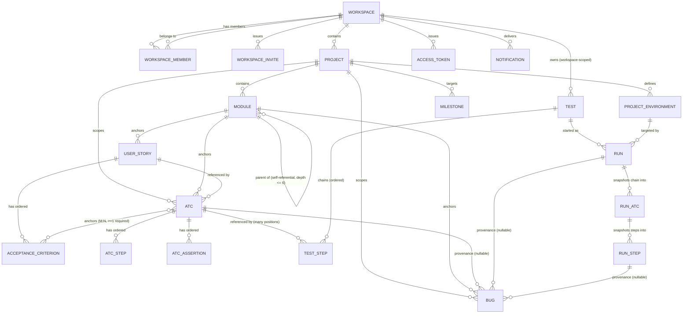
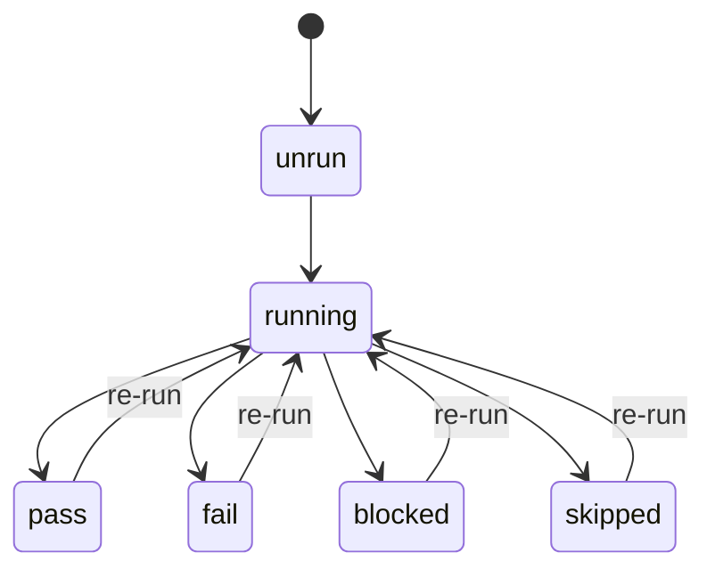
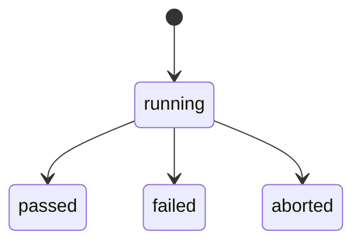
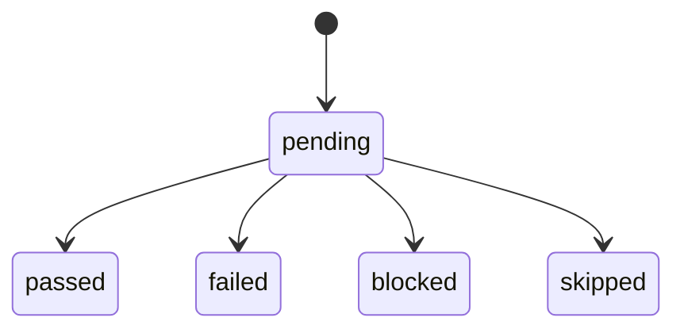
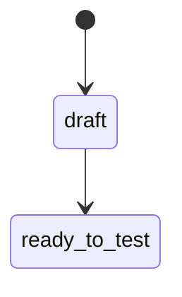
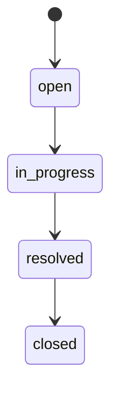
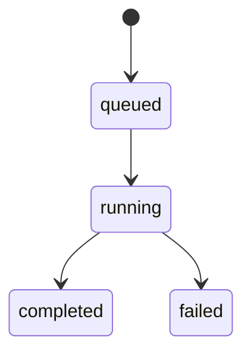

# Domain Glossary — Bunkai

> Generated: 2026-08-12 · Source of truth: `supabase/migrations/*.sql` (69 files, `0001_tenancy.sql` → `0068_story_traceability_report.sql`) in `upex-bunkai-tms`, per the discovery doctrine "prefer schema over ORM models" — no ORM model files exist in this codebase, so the migrations ARE the schema. Every JSON example below is **illustrative** (structurally accurate to the schema, values are placeholders) — none of it is real captured data.

---

## 1. Core Entities

The schema defines 31 tables. Ten are the primary business nouns a QA engineer authors or executes against; the rest are cross-cutting/support tables, documented in §1.11 without full JSON treatment (nothing is silently skipped — see completion note there).

### 1.1 Workspace

| Technical Name | Business Name | Description | Table/Collection | Key Attributes | Found In |
|---|---|---|---|---|---|
| `workspace` | Workspace (tenant / organization) | The multi-tenant root. Every other row resolves its tenant by walking back to a `workspace_id`. | `public.workspaces` | `id`, `slug`, `name`, `owner_user_id`, `plan` (`community`\|`cloud`\|`enterprise`), `created_at` | `supabase/migrations/0001_tenancy.sql:27-35` |

**Relationships**
- Has many `workspace_members` (RBAC join to `auth.users`)
- Has many `projects`
- Has many `tests` (Tests are workspace-scoped, not project-scoped)
- Has many `runs`, `bugs`, `milestones`, `notifications`, `access_tokens`

**JSON example** (illustrative)
```json
{
  "id": "b1a2c3d4-0000-4000-8000-000000000001",
  "slug": "acme-qa",
  "name": "Acme QA",
  "owner_user_id": "b1a2c3d4-0000-4000-8000-0000000000aa",
  "plan": "community",
  "created_at": "2026-05-19T10:00:00Z"
}
```

**Found In**: `supabase/migrations/0001_tenancy.sql`

---

### 1.2 Workspace Member (RBAC join)

| Technical Name | Business Name | Description | Table/Collection | Key Attributes | Found In |
|---|---|---|---|---|---|
| `workspace_member` | Team membership / seat | Join row granting a user access to a workspace at a given role. | `public.workspace_members` | `workspace_id`, `user_id`, `role` (`viewer`\|`member`\|`admin`\|`owner`), `status` (`active`\|`invited`\|`suspended`), `joined_at` | `supabase/migrations/0001_tenancy.sql:40-49` |

**Relationships**: Belongs to `Workspace`; belongs to `auth.users` (Supabase-managed, not a Bunkai table).

**JSON example** (illustrative)
```json
{
  "workspace_id": "b1a2c3d4-0000-4000-8000-000000000001",
  "user_id": "b1a2c3d4-0000-4000-8000-0000000000bb",
  "role": "member",
  "status": "active",
  "joined_at": "2026-05-20T09:00:00Z"
}
```

**Found In**: `supabase/migrations/0001_tenancy.sql`

---

### 1.3 Project

| Technical Name | Business Name | Description | Table/Collection | Key Attributes | Found In |
|---|---|---|---|---|---|
| `project` | Project (Application Under Test) | A workspace-scoped container for everything being tested — one project per app/product under test. | `public.projects` | `id`, `workspace_id`, `slug`, `name`, `description`, `created_at` | `supabase/migrations/0002_projects_modules.sql:17-25` |

**Relationships**
- Belongs to `Workspace`
- Has many `modules`, `atcs`, `project_environments`, `milestones`, `bugs`

**JSON example** (illustrative)
```json
{
  "id": "b1a2c3d4-0000-4000-8000-000000000010",
  "workspace_id": "b1a2c3d4-0000-4000-8000-000000000001",
  "slug": "checkout-web",
  "name": "Checkout Web",
  "description": "Public checkout flow",
  "created_at": "2026-05-19T10:05:00Z"
}
```

**Found In**: `supabase/migrations/0002_projects_modules.sql`

---

### 1.4 Module

| Technical Name | Business Name | Description | Table/Collection | Key Attributes | Found In |
|---|---|---|---|---|---|
| `module` | Module (test suite / feature area) | A self-referential tree node (max depth 6, enforced by CHECK on a slash-separated `path`) organizing Stories and ATCs into a folder hierarchy. | `public.modules` | `id`, `project_id`, `parent_module_id`, `path`, `name`, `position`, `created_at` | `supabase/migrations/0002_projects_modules.sql:109-121` |

**Relationships**
- Belongs to `Project`
- Belongs to (optional) parent `Module` — self-referential tree
- Has many `user_stories`, `atcs`, `bugs`

**JSON example** (illustrative)
```json
{
  "id": "b1a2c3d4-0000-4000-8000-000000000020",
  "project_id": "b1a2c3d4-0000-4000-8000-000000000010",
  "parent_module_id": null,
  "path": "checkout",
  "name": "Checkout",
  "position": 0,
  "created_at": "2026-05-19T10:06:00Z"
}
```

**Found In**: `supabase/migrations/0002_projects_modules.sql`

---

### 1.5 User Story

| Technical Name | Business Name | Description | Table/Collection | Key Attributes | Found In |
|---|---|---|---|---|---|
| `user_story` | User Story / Requirement | The unit of business intent, anchored to exactly one Module. Optionally links to an external tracker (Jira) via `external_id`/`external_url`. | `public.user_stories` | `id`, `module_id`, `title`, `description`, `external_id`, `external_url`, `status` (`draft`\|`ready_to_test`, added `0017`), `created_at` | `supabase/migrations/0003_authoring.sql:15-23`; status column `0017_acceptance_criteria_ordering.sql:19-24` |

**Relationships**
- Belongs to `Module`
- Has many `acceptance_criteria` (ordered)
- Has many `atcs` (an ATC references exactly one User Story)

**JSON example** (illustrative)
```json
{
  "id": "b1a2c3d4-0000-4000-8000-000000000030",
  "module_id": "b1a2c3d4-0000-4000-8000-000000000020",
  "title": "As a shopper, I can pay with a saved card",
  "description": "…",
  "external_id": "BK-88",
  "external_url": "https://upexgalaxy71.atlassian.net/browse/BK-88",
  "status": "ready_to_test",
  "created_at": "2026-05-19T10:10:00Z"
}
```

**Found In**: `supabase/migrations/0003_authoring.sql`, `0017_acceptance_criteria_ordering.sql`

---

### 1.6 Acceptance Criterion

| Technical Name | Business Name | Description | Table/Collection | Key Attributes | Found In |
|---|---|---|---|---|---|
| `acceptance_criterion` | Acceptance Criterion (AC) | An ordered, individually testable condition of a User Story. Soft-delete aware (`archived_at`) as of `0017`. | `public.acceptance_criteria` | `id`, `user_story_id`, `title`, `description`, `position`, `created_at` (+ `archived_at`, added `0017`) | `supabase/migrations/0003_authoring.sql:122-130`; archival `0017_acceptance_criteria_ordering.sql` |

**Relationships**
- Belongs to `User Story`
- Has many `atcs` via the `atc_acceptance_criteria` M:N join (the "anchoring moat" — an ATC must reference ≥1 AC)

**JSON example** (illustrative)
```json
{
  "id": "b1a2c3d4-0000-4000-8000-000000000040",
  "user_story_id": "b1a2c3d4-0000-4000-8000-000000000030",
  "title": "Payment fails gracefully on a declined card",
  "description": "…",
  "position": 1,
  "created_at": "2026-05-19T10:11:00Z"
}
```

**Found In**: `supabase/migrations/0003_authoring.sql`, `0017_acceptance_criteria_ordering.sql`

---

### 1.7 ATC (Acceptance Test Case)

| Technical Name | Business Name | Description | Table/Collection | Key Attributes | Found In |
|---|---|---|---|---|---|
| `atc` | ATC / Acceptance Test Case | "One observable behaviour, executable by humans or agents" (Source: `app/(auth)/login/page.tsx:12`). The atomic, reusable, versioned test-case building block. Full-text searchable via a maintained `tsv` column. | `public.atcs` | `id`, `project_id`, `module_id`, `user_story_id`, `slug`, `title`, `layer` (`UI`\|`API`\|`Unit`), `version`, `status` (`pass`\|`fail`\|`blocked`\|`skipped`\|`running`\|`unrun`), `tags[]`, `created_at`, `updated_at` | `supabase/migrations/0004_atcs.sql:53-69` |
| `atc_step` | ATC Step | One ordered step inside an ATC (action + optional input data + expected result). | `public.atc_steps` | `id`, `atc_id`, `position`, `content`, `input_data`, `expected` | `0004_atcs.sql:179-187` |
| `atc_assertion` | ATC Assertion | One ordered assertion (a standalone verifiable claim) inside an ATC. | `public.atc_assertions` | `id`, `atc_id`, `position`, `content` | `0004_atcs.sql:285-291` |
| `atc_acceptance_criteria` | ATC ↔ AC anchor link | M:N join. **Anchoring moat**: an ATC must reference ≥1 AC (enforced application-layer in MVP per the migration's own header comment; the FK table exists but there is no DB-level "at least one" constraint). | `public.atc_acceptance_criteria` | `atc_id`, `acceptance_criterion_id` | `0004_atcs.sql:389-393` |

**Relationships**
- Belongs to `Project`, `Module`, and `User Story`
- Has many `atc_steps` (ordered), `atc_assertions` (ordered)
- Has many `acceptance_criteria` via `atc_acceptance_criteria` (M:N — the anchoring moat)
- Referenced (not copied) by `test_steps.atc_id` — one ATC can appear in many Tests, and at multiple positions within the same Test

**JSON example** (illustrative)
```json
{
  "id": "b1a2c3d4-0000-4000-8000-000000000050",
  "project_id": "b1a2c3d4-0000-4000-8000-000000000010",
  "module_id": "b1a2c3d4-0000-4000-8000-000000000020",
  "user_story_id": "b1a2c3d4-0000-4000-8000-000000000030",
  "slug": "checkout-declined-card",
  "title": "Payment declined shows retry prompt",
  "layer": "UI",
  "version": 1,
  "status": "unrun",
  "tags": ["payments", "negative"],
  "steps": [
    { "position": 0, "content": "Enter a card known to decline", "input_data": "4000000000000002", "expected": null },
    { "position": 1, "content": "Submit payment", "input_data": null, "expected": "Retry prompt is shown" }
  ],
  "assertions": [
    { "position": 0, "content": "Order status remains 'pending_payment'" }
  ]
}
```

**Found In**: `supabase/migrations/0004_atcs.sql`, `0021_atc_create_update.sql`, `0027_atc_search.sql`, `0028_atc_duplicate.sql`, `0029_atc_usage.sql`, `0035_atc_update_propagation.sql`, `0058_atc_title_min_length.sql`, `0065_atc_tags_cap_guard.sql` (filenames — content of the latter migrations was not read this session, see Discovery Gaps)

---

### 1.8 Test

| Technical Name | Business Name | Description | Table/Collection | Key Attributes | Found In |
|---|---|---|---|---|---|
| `test` | Test (ATC chain) | A named, **workspace-scoped** (not project-scoped) ordered chain of ATC *references*. The same ATC may appear at multiple positions in one chain. | `public.tests` | `id`, `workspace_id`, `title`, `created_by`, `created_at`, `updated_at` | `supabase/migrations/0024_tests.sql:40-49` |
| `test_step` | Test Step (chain link) | One position in a Test's chain, pointing at an ATC. Surrogate PK because duplicates of the same `atc_id` at different positions are legal. | `public.test_steps` | `id`, `test_id`, `atc_id`, `position` (unique per `test_id`) | `0024_tests.sql:60-68` |

**Relationships**
- Belongs to `Workspace` (workspace-scoped, unlike `atcs` which are project-scoped)
- Has many `test_steps`, each referencing one `ATC` (`on delete restrict` — deleting a chained ATC fails loudly rather than silently breaking the chain)
- Has many `runs` (a Test is "started" to produce a Run)

**JSON example** (illustrative, from the `bunkai_create_test` RPC's own return shape)
```json
{
  "id": "b1a2c3d4-0000-4000-8000-000000000060",
  "workspace_id": "b1a2c3d4-0000-4000-8000-000000000001",
  "title": "Checkout — declined + retry + success",
  "created_by": "b1a2c3d4-0000-4000-8000-0000000000bb",
  "created_at": "2026-06-12T12:00:00Z",
  "steps": [
    { "position": 1, "atc_id": "b1a2c3d4-0000-4000-8000-000000000050" },
    { "position": 2, "atc_id": "b1a2c3d4-0000-4000-8000-000000000051" }
  ]
}
```

**Found In**: `supabase/migrations/0024_tests.sql`, `0025_test_read.sql`, `0026_tests_reorder.sql`, `0030_test_tags.sql` (last two: filenames only, content not read this session)

---

### 1.9 Run (Test Execution)

| Technical Name | Business Name | Description | Table/Collection | Key Attributes | Found In |
|---|---|---|---|---|---|
| `run` | Run (Test Execution) | Starting a Test produces a Run: a frozen, point-in-time **snapshot** of the chain at that moment (so later edits/deletes to the source Test/ATCs never retroactively alter history). | `public.runs` | `id`, `workspace_id`, `project_id`, `test_id`, `environment_id`, `status` (`running`\|`passed`\|`failed`\|`aborted`), `executor_mode` (`human`\|`agent`\|`ci`), `executor_user_id`, `start_token`, `test_title` (snapshot), `version` (optimistic lock), `started_at`, `finished_at` | `supabase/migrations/0031_runs.sql:72-90` |
| `run_atc` | Run ATC (chain-position snapshot) | Snapshot of one chain position's title/status at Run start. `atc_id` is provenance-only (`on delete set null`). | `public.run_atcs` | `id`, `run_id`, `atc_id`, `position`, `atc_title` (snapshot), `status` (`pending`\|`passed`\|`failed`\|`blocked`\|`skipped`) | `0031_runs.sql:120-129` |
| `run_step` | Run Step (executable-step snapshot) | Snapshot of one ATC step's content/input/expected at Run start, plus execution evidence written during the Run. | `public.run_steps` | `id`, `run_atc_id`, `atc_step_id`, `position`, `content`, `input_data`, `expected` (all snapshots), `status`, `note`, `evidence_url`, `executed_at` | `0031_runs.sql:163-179` |
| `project_environment` | Environment | A named target (e.g. "Staging", "Production") a Run executes against; one per Project. Seeded with Staging + Production for all pre-existing projects; no client-write policy for new environments in MVP (default-deny). | `public.project_environments` | `id`, `project_id`, `name`, `created_at` | `0031_runs.sql:30-39` |

**Relationships**
- Belongs to `Workspace`, `Project`, `Test`, and `Environment`
- Has many `run_atcs` (ordered, snapshot of the chain)
- Each `run_atc` has many `run_steps` (ordered, snapshot of executable steps)
- Referenced by `Bug` as provenance (`bugs.run_id`, `bugs.run_step_id`)

**JSON example** (illustrative, from `bunkai_run_json`'s own composed shape)
```json
{
  "id": "b1a2c3d4-0000-4000-8000-000000000070",
  "workspace_id": "b1a2c3d4-0000-4000-8000-000000000001",
  "project_id": "b1a2c3d4-0000-4000-8000-000000000010",
  "test_id": "b1a2c3d4-0000-4000-8000-000000000060",
  "environment_id": "b1a2c3d4-0000-4000-8000-000000000080",
  "environment_name": "Staging",
  "status": "running",
  "executor_mode": "human",
  "test_title": "Checkout — declined + retry + success",
  "started_at": "2026-08-01T14:00:00Z",
  "atc_count": 2,
  "step_count": 4,
  "atcs": [
    {
      "id": "b1a2c3d4-0000-4000-8000-000000000090",
      "atc_id": "b1a2c3d4-0000-4000-8000-000000000050",
      "position": 1,
      "atc_title": "Payment declined shows retry prompt",
      "status": "pending",
      "steps": [
        { "position": 0, "content": "Enter a card known to decline", "status": "pending" }
      ]
    }
  ]
}
```

**Found In**: `supabase/migrations/0031_runs.sql`, `0032_project_environments_crud.sql`, `0036_run_abort.sql`, `0037_run_finish.sql`, `0038_run_history.sql`, `0039_run_history_actor_guard.sql`, `0040_run_module_snapshot.sql`, `0041_run_project_report.sql`, `0042_run_step_mark.sql`, `0043_run_realtime_replication.sql`, `0067_run_finish_abort_via.sql` (later migrations: filenames only, content not read this session)

---

### 1.10 Bug (Defect)

| Technical Name | Business Name | Description | Table/Collection | Key Attributes | Found In |
|---|---|---|---|---|---|
| `bug` | Bug / Defect | The TMS-native defect record. Filed either from a failed Run step (provenance-linked) or standalone. Provenance columns (`run_id`, `run_step_id`, `atc_id`) are nullable and frozen at filing time. | `public.bugs` | `id`, `workspace_id`, `project_id`, `module_id`, `run_id`, `run_step_id`, `atc_id`, `title`, `severity` (`P1`\|`P2`\|`P3`\|`P4`), `status` (`open`\|`in_progress`\|`resolved`\|`closed`), `description`, `steps_to_reproduce`, `evidence_urls[]` (max 10), `created_by`, `created_at`, `updated_at` | `supabase/migrations/0046_bugs.sql:93-116` |

Note on naming: the migration's own header flags a deliberate terminology split — "the domain-glossary term" is **bug**, while "Jira prose keeps saying **defect**" (Source: `0046_bugs.sql:2-3`). This glossary uses "Bug (Defect)" to carry both.

**Relationships**
- Belongs to `Workspace`, `Project`, `Module` (all mandatory)
- Optionally provenance-linked to `Run`, `Run Step`, `ATC` (all three nullable, and when present, must all belong to the same Project — enforced by a dedicated consistency trigger, see §3 Business Rules)

**JSON example** (illustrative, from `bunkai_bug_json`'s own composed shape)
```json
{
  "id": "b1a2c3d4-0000-4000-8000-0000000000a0",
  "workspace_id": "b1a2c3d4-0000-4000-8000-000000000001",
  "project_id": "b1a2c3d4-0000-4000-8000-000000000010",
  "module_id": "b1a2c3d4-0000-4000-8000-000000000020",
  "module": { "id": "b1a2c3d4-0000-4000-8000-000000000020", "name": "Checkout", "path": "checkout" },
  "run_id": "b1a2c3d4-0000-4000-8000-000000000070",
  "run_step_id": "b1a2c3d4-0000-4000-8000-0000000000c0",
  "atc_id": "b1a2c3d4-0000-4000-8000-000000000050",
  "title": "Retry prompt does not appear on declined card",
  "severity": "P2",
  "status": "open",
  "description": "…",
  "steps_to_reproduce": "1. Use test card …",
  "evidence_urls": [],
  "created_at": "2026-08-01T14:05:00Z"
}
```

**Found In**: `supabase/migrations/0046_bugs.sql`, `0047_activity_actor_resolve_scope.sql`, `0051_bugs_list.sql`, `0052_defect_heatmap_report.sql`, `0054_bug_assignment_status.sql`, `0055_activity_bug_events.sql`, `0056_bug_event_notifications.sql`, `0057_bug_notification_deep_link.sql`, `0061_home_open_bugs_index.sql` (later migrations: filenames only, content not read this session)

---

### 1.11 Milestone

| Technical Name | Business Name | Description | Table/Collection | Key Attributes | Found In |
|---|---|---|---|---|---|
| `milestone` | Milestone (release target) | A project-scoped named date target. Editable after creation; date bounds (today-or-later, ≤5 years out) are re-checked only when the date actually changes, so a past-dated milestone stays description-editable. No delete path exists — deletion is explicitly out of scope. | `public.milestones` | `id`, `workspace_id`, `project_id`, `name` (whitespace-normalized, unique per project, case-insensitive), `target_date`, `description` (≤500 chars), `created_by`, `created_at`, `updated_at` | `supabase/migrations/0064_milestones.sql:44-56` |

**Relationships**: Belongs to `Workspace` and `Project`.

**JSON example** (illustrative)
```json
{
  "id": "b1a2c3d4-0000-4000-8000-0000000000d0",
  "project_id": "b1a2c3d4-0000-4000-8000-000000000010",
  "name": "v2.4 release",
  "target_date": "2026-09-15",
  "description": "Checkout redesign ships",
  "created_by": "b1a2c3d4-0000-4000-8000-0000000000bb",
  "created_at": "2026-08-05T09:00:00Z"
}
```

**Found In**: `supabase/migrations/0064_milestones.sql`

---

### 1.12 Supporting / Cross-Cutting Entities (documented, not exploded to full JSON)

Every remaining table found in the schema, so nothing is silently skipped:

| Table | Purpose | Found In |
|---|---|---|
| `workspace_invites` | Email + role invite issued by an admin/owner; token is hashed at rest, redeemed via `/api/v1/invites/accept`. Expires in 7 days. | `0010_workspace_invites.sql` |
| `access_tokens` | Personal Access Tokens (`bk_pat_<prefix>.<secret>`) for CLI/agent bearer auth. Scoped to an allow-list: `atc:read`, `atc:write`, `run:execute`, `workspace:admin`. Soft-revoked (`revoked_at`), never hard-deleted (audit trail). | `0008_access_tokens.sql`, `0011_split_token_secrets.sql`, `0012_drop_legacy_token_hashes.sql` |
| `import_jobs` | Async one-way Jira import job (by JQL), processed by a service-role worker. | `0019_import_jobs.sql`, `0020_import_jobs_one_active.sql` |
| `activity_log` | Audit-light event stream (`entity_type`, `action`, `payload`), workspace-member-readable, service-role-write-only. Backs the in-app activity feed. | `0009_cross_cutting.sql`, `0023_module_activity_log.sql`, `0045_activity_stream.sql` |
| `notifications` | Per-recipient personal notification inbox, 90-day visibility retention, realtime-replicated. | `0053_notifications.sql`, `0056_bug_event_notifications.sql`, `0057_bug_notification_deep_link.sql`, `0059-0061_*` (home indexes), `0066_run_event_notifications.sql` |
| `notification_preferences` | Personal, cross-workspace opt-out grid: 2 editable event types (`run_lifecycle`, `bug_lifecycle`) × 2 channels (`in_app`, `email`), plus a structurally-locked `mentions` row reserved for a future Team Chat epic. | `0062_notification_preferences.sql` |
| `idempotency_keys` | POST replay protection, 24h TTL, per-user. | `0009_cross_cutting.sql` |
| `feature_flags` | Global or per-workspace boolean gates for gradual rollout. | `0009_cross_cutting.sql` |
| `user_view_state` | Per-user, per-project, per-view persisted UI state (owner-only). | `0009_cross_cutting.sql` |
| `magic_link_tokens` | Server-side audit trail of magic-link issuance/consumption, for replay detection — separate from Supabase Auth's own OTP handling. | `0009_cross_cutting.sql` |

Three additional tables exist purely as a security hardening split, added by `0011_split_token_secrets.sql`: `access_token_secrets`, `workspace_invite_secrets`, `magic_link_token_secrets` — each holds the actual secret hash separately from its parent table's now-nullable `hash`/`token_hash` column, so a read of the parent table alone cannot yield a usable secret. No independent business meaning beyond what `access_tokens` / `workspace_invites` / `magic_link_tokens` already describe above.

---

## 2. Enumerations and Constants

| Enum / column | Values | Business Meaning | Found In |
|---|---|---|---|
| `workspaces.plan` | `community`, `cloud`, `enterprise` | Tenant tier — see `business-model.md` §Revenue Streams for the open-core reading of this column. | `0001_tenancy.sql:32-33` |
| `workspace_members.role` | `viewer`, `member`, `admin`, `owner` | Ascending permission levels within a workspace. Viewers are strictly read-only; `member`+ can write; `admin`/`owner` manage membership. | `0001_tenancy.sql:44` |
| `workspace_members.status` | `active`, `invited`, `suspended` | Membership lifecycle state; only `active` rows grant access under RLS. | `0001_tenancy.sql:46` |
| `workspace_invites.role` | `viewer`, `member`, `admin` | Role an invite will grant on acceptance (note: `owner` is excluded — cannot invite a co-owner). | `0010_workspace_invites.sql:18` |
| `atcs.layer` | `UI`, `API`, `Unit` | The technical layer an ATC exercises — mirrors this repo's own KATA taxonomy. | `0004_atcs.sql:60` |
| `atcs.status` | `pass`, `fail`, `blocked`, `skipped`, `running`, `unrun` | Last-known verdict of the ATC (defaults `unrun`). | `0004_atcs.sql:63` |
| `user_stories.status` | `draft`, `ready_to_test` | The "ready to test" gate (BK-15) — a story cannot proceed to testing until explicitly promoted. | `0017_acceptance_criteria_ordering.sql:24` |
| `runs.status` | `running`, `passed`, `failed`, `aborted` | Run header status. | `0031_runs.sql:80` |
| `runs.executor_mode` | `human`, `agent`, `ci` | Who/what is driving the Run. | `0031_runs.sql:81` |
| `run_atcs.status` / `run_steps.status` | `pending`, `passed`, `failed`, `blocked`, `skipped` | Per-position / per-step verdict during a Run. | `0031_runs.sql:127`, `:174` |
| `bugs.severity` | `P1`, `P2`, `P3`, `P4` | Priority/severity ranking, P1 = most severe. | `0046_bugs.sql:106` |
| `bugs.status` | `open`, `in_progress`, `resolved`, `closed` | Defect lifecycle. | `0046_bugs.sql:108` |
| `import_jobs.status` | `queued`, `running`, `completed`, `failed` | Async Jira import job lifecycle. | `0019_import_jobs.sql:15` |
| `idempotency_keys.status` | `pending`, `succeeded`, `failed` | Replay-protection record lifecycle. | `0009_cross_cutting.sql:36` |
| `feature_flags.scope` | `global`, `workspace` | Flag applies app-wide or to one workspace only. | `0009_cross_cutting.sql:120` |
| `notification_preferences.event_type` | `run_lifecycle`, `bug_lifecycle`, `mentions` | The 3rd (`mentions`) is structurally locked — no row may exist with this value yet (enforced by INSERT/UPDATE policy, not just the app layer). | `0062_notification_preferences.sql:45` |
| `notification_preferences.channel` | `in_app`, `email` | Delivery channel for a notification preference. | `0062_notification_preferences.sql:46` |
| `access_tokens.scopes` | `atc:read`, `atc:write`, `run:execute`, `workspace:admin` | Allow-list of PAT capabilities; a token's `scopes[]` must be a non-empty subset of this list. | `0008_access_tokens.sql:31-33` |

---

## 3. Business Rules

### BR-1 — ATC anchoring moat
**Description**: An ATC should reference at least one Acceptance Criterion. **Enforcement note**: the `atc_acceptance_criteria` join table exists and is FK-backed, but the migration's own comment states the "at least one" cardinality is enforced at the **application layer in MVP**, not by a DB constraint (`0004_atcs.sql:5-6`). This is a real gap worth testing directly.
**Entities Affected**: ATC, Acceptance Criterion
**Validation**: Application-layer only (not DB-level) — Given/When/Then below describes intended behavior, which QA should verify actually holds.
**Error Message**: Not confirmed this session (application-layer code not read).
**Given/When/Then**:
```
Given an authenticated member with write access to a Project
When they attempt to create an ATC with zero linked Acceptance Criteria
Then the create request is expected to be rejected
  (but this is enforced by application code, not a DB constraint —
   confirm the actual HTTP-layer behavior before relying on it)
```
**Found In**: `supabase/migrations/0004_atcs.sql:1-6`

### BR-2 — Test chain must be non-empty and workspace-contained
**Description**: A Test's chain must reference at least one ATC, and every distinct ATC id must resolve to a non-archived ATC inside the *same workspace* as the Test. Foreign-workspace, nonexistent, and NULL ids all collapse into one identical error (non-disclosure — no hint about which id was invalid).
**Entities Affected**: Test, Test Step, ATC
**Validation**: `bunkai_create_test` RPC, steps 3-4 (`supabase/migrations/0024_tests.sql:203-225`)
**Error Message**: `chain_empty` (SQLSTATE `45120`) if zero ATCs supplied; `atc_not_in_workspace` (SQLSTATE `45122`) if any id fails to resolve inside the workspace.
**Given/When/Then**:
```
Given a workspace member with write access
When they call bunkai_create_test with an empty atc_ids array
Then the call raises chain_empty (45120)

Given the same member
When they supply an atc_id that belongs to a DIFFERENT workspace's project
Then the call raises atc_not_in_workspace (45122) —
  identical to the error raised for a nonexistent id (non-disclosure)
```
**Found In**: `supabase/migrations/0024_tests.sql:203-225`

### BR-3 — Run requires a valid Environment and ≥1 executable step
**Description**: Starting a Run validates, in this load-bearing order: (1) actor can write the workspace, (2) `executor_mode` is one of the three valid values, (3) the target Environment belongs to the Test's own Project, (4) the Test resolves to at least one executable ATC step.
**Entities Affected**: Run, Test, Project Environment
**Validation**: `bunkai_create_run` RPC (`supabase/migrations/0031_runs.sql:299-378`)
**Error Message**: `executor_mode_invalid` (`45200`), `environment_invalid` (`45201`), `no_executable_steps` (`45202`)
**Given/When/Then**:
```
Given a Test whose chain resolves to zero atc_steps
When a member starts a Run against any valid environment
Then the call raises no_executable_steps (45202)

Given a Test that belongs to Project A
When a member starts a Run passing an environment_id that belongs to Project B
Then the call raises environment_invalid (45201)
```
**Found In**: `supabase/migrations/0031_runs.sql`

### BR-4 — Run start is idempotent within a 24-hour window
**Description**: A repeated `bunkai_create_run` call with the identical `(test_id, start_token)` pair within 24 hours returns the **existing** Run (tagged `"replayed": true`) instead of creating a duplicate. The Project row is locked (`for update`) first so concurrent identical-token starts serialize correctly.
**Entities Affected**: Run
**Validation**: `bunkai_create_run` RPC, step 5 (`0031_runs.sql:380-397`)
**Error Message**: N/A — this is a success-path replay, not an error.
**Given/When/Then**:
```
Given a Run was started 10 minutes ago with start_token "abc123"
When the same client retries the exact same (test_id, start_token) pair
Then the RPC returns the ORIGINAL run's data with "replayed": true,
  and no second run is created

Given the same Run was started 25 hours ago
When the client retries with the same start_token
Then a NEW run is created (outside the 24h window)
```
**Found In**: `supabase/migrations/0031_runs.sql:380-408`

### BR-5 — Bug provenance must stay internally consistent
**Description**: When a Bug carries provenance (`run_id`/`run_step_id`/`atc_id`), each supplied id must belong to the SAME Project/Run being written into. This is enforced at TWO layers independently: inside the `bunkai_create_bug` RPC, and again by a table-level `bunkai_bugs_check_consistency` trigger that fires on any insert/update regardless of write path (defense against a direct, RPC-bypassing REST write).
**Entities Affected**: Bug, Run, Run Step, ATC, Module, Project
**Validation**: `bunkai_create_bug` RPC + `bunkai_bugs_check_consistency` trigger (`supabase/migrations/0046_bugs.sql:162-215`, `:356-385`)
**Error Message**: `bugs_project_outside_workspace` (`45304`), `bugs_module_outside_project` (`45300`), `bugs_run_outside_project` (`45305`), `bugs_run_step_outside_run` (`45306`), `bugs_atc_outside_project` (`45307`)
**Given/When/Then**:
```
Given Project A and Project B both exist in the same workspace
When a member of Project A's workspace files a bug against Project A
  but supplies an atc_id that belongs to Project B
Then the call raises bugs_atc_outside_project (45307)
```
**Found In**: `supabase/migrations/0046_bugs.sql`

### BR-6 — Milestone target_date bounds, re-checked only on change
**Description**: A Milestone's `target_date` must be today-or-later and no more than 5 years out — but ONLY when the date is actually being changed. A description-only edit of an already-past-dated milestone must succeed without tripping the date bound (explicit design decision, documented inline: a CHECK constraint would have made this impossible since it re-evaluates on every UPDATE).
**Entities Affected**: Milestone
**Validation**: `bunkai_create_milestone` / `bunkai_update_milestone` RPCs (`supabase/migrations/0064_milestones.sql:112-274`)
**Error Message**: `milestone_target_date_past` (`45502`), `milestone_target_date_too_far` (`45503`)
**Given/When/Then**:
```
Given a milestone already exists with target_date = yesterday
  (created when that date was still valid)
When a user updates only its description, leaving target_date unchanged
Then the update succeeds — the past-date bound is NOT re-evaluated

Given the same milestone
When a user explicitly changes target_date to another past date
Then the update raises milestone_target_date_past (45502)
```
**Found In**: `supabase/migrations/0064_milestones.sql:228-237`

### BR-7 — Module tree depth capped at 6
**Description**: A Module's materialized `path` (slash-separated) must split into 1–6 segments — the tree cannot nest deeper than 6 levels.
**Entities Affected**: Module
**Validation**: CHECK constraint `modules_path_depth_max_6` (`supabase/migrations/0002_projects_modules.sql:118-120`)
**Error Message**: Native Postgres CHECK violation (`23514`), no custom SQLSTATE.
**Given/When/Then**:
```
Given a module chain 6 levels deep already exists
When a user attempts to create a 7th nested level under it
Then the insert raises a CHECK constraint violation
```
**Found In**: `supabase/migrations/0002_projects_modules.sql:119-120`

### BR-8 — Access Token scopes are an allow-listed subset
**Description**: A Personal Access Token's `scopes[]` must be non-empty and every value must be one of `atc:read`, `atc:write`, `run:execute`, `workspace:admin`.
**Entities Affected**: Access Token
**Validation**: CHECK constraints `access_tokens_scopes_nonempty`, `access_tokens_scopes_allowed` (`supabase/migrations/0008_access_tokens.sql:29-33`)
**Error Message**: Native Postgres CHECK violation (`23514`).
**Given/When/Then**:
```
Given a user issues a new Personal Access Token
When they request a scope value outside the allow-list (e.g. "atc:delete")
Then the insert raises a CHECK constraint violation
```
**Found In**: `supabase/migrations/0008_access_tokens.sql:29-33`

---

## 4. Entity Relationships Diagram



---

## 5. Terminology Mapping

### Technical → Business terms

| Technical (code / DB) | Business term |
|---|---|
| `workspace` | Tenant / Organization / Team |
| `project` | Application Under Test (AUT) |
| `module` | Test Suite / Folder / Feature Area |
| `user_story` | Requirement / Story |
| `acceptance_criterion` | Acceptance Criterion (AC) |
| `atc` | Acceptance Test Case (ATC) |
| `atc_step` | Test Step |
| `atc_assertion` | Assertion / Expected Result |
| `test` | Test (ATC chain) |
| `test_step` | Chain Position |
| `run` | Test Execution |
| `run_atc` / `run_step` | Execution snapshot (position / step) |
| `project_environment` | Environment (e.g. Staging, Production) |
| `bug` | Defect (the migrations explicitly note Jira-facing prose says "defect" while the DB/domain term is "bug" — `0046_bugs.sql:2-3`) |
| `milestone` | Release target / Deadline |
| `executor_mode` | Execution mode (Manual / Agentic / CI) |
| `access_token` | Personal Access Token (PAT) |

### Abbreviations and acronyms

| Abbreviation | Meaning | Found In |
|---|---|---|
| ATC | Acceptance Test Case | `app/(auth)/login/page.tsx:12` |
| IQL | Integrated Quality Lifecycle — the methodology spanning story → case → run → bug | `app/(auth)/login/page.tsx:11` |
| KATA | Komponent Action Test Architecture — how ATCs assemble into an automated test | `app/(auth)/login/page.tsx:13` |
| AC | Acceptance Criterion | `supabase/migrations/0003_authoring.sql` |
| TMS | Test Management System | `app/about/page.tsx:137` |
| PAT | Personal Access Token | `supabase/migrations/0008_access_tokens.sql` |
| RLS | Row-Level Security (Postgres/Supabase access-control mechanism) | throughout `supabase/migrations/*.sql` |
| RPC | Remote Procedure Call (a `SECURITY DEFINER` Postgres function invoked via `supabase.rpc()`) | throughout `supabase/migrations/*.sql` |
| JQL | Jira Query Language (used to scope the one-way import) | `supabase/migrations/0019_import_jobs.sql` |
| P1–P4 | Bug severity levels, P1 = most severe | `supabase/migrations/0046_bugs.sql:106` |

---

## 6. Status / State Flows

### ATC status

*Note: `atcs.status` is a single column with a CHECK over `('pass','fail','blocked','skipped','running','unrun')` (`0004_atcs.sql:63`) — the transition arrows above are the plausible flow implied by the enum values and general TMS convention; the actual state-machine enforcement (which transitions are permitted) was not read in this session's migrations. Confirm before relying on this shape for negative-path testing.*

### Run status

*Source: `runs.status` CHECK (`running`,`passed`,`failed`,`aborted`) — `0031_runs.sql:80`. `finished_at` is set by a later migration (`0037_run_finish.sql`, filename only) and `aborted` by `0036_run_abort.sql` (filename only) — the exact allowed-transition guard was not read this session.*

### Run ATC / Run Step status

*Source: `run_atcs.status` / `run_steps.status` CHECK (`pending`,`passed`,`failed`,`blocked`,`skipped`) — `0031_runs.sql:127,174`.*

### User Story status (ready-to-test gate)

*Source: `0017_acceptance_criteria_ordering.sql:19-24` ("BK-15 gate"). Only a forward transition was found in this migration; whether a story can move back to `draft` was not confirmed.*

### Bug (Defect) status

*Source: `bugs.status` CHECK (`open`,`in_progress`,`resolved`,`closed`) — `0046_bugs.sql:108`. `bunkai_create_bug` always inserts `status = 'open'` (`0046_bugs.sql:291-293` comment). Corrected in Phase 2 (SRS `functional-specs.md` FR-009): forward-only, exactly one rank at a time along `open(1) < in_progress(2) < resolved(3) < closed(4)` — skipping a stage rejected (`45310`), same-status or backward move rejected (`45311`). Enforced identically at two independent layers — `bunkai_transition_bug_status` RPC and the `bunkai_bugs_check_consistency` BEFORE-trigger backstop (`0054_bug_assignment_status.sql:140-156`) — so a direct write bypassing the RPC cannot diverge. This diagram previously (Phase 1) showed bidirectional arrows and a direct `open → closed` shortcut as an unconfirmed illustrative guess; both are actually rejected by the code.*

### Import Job status

*Source: `import_jobs.status` CHECK (`queued`,`running`,`completed`,`failed`) — `0019_import_jobs.sql:15`.*

---

## 7. UI Labels Reference

No i18n/locale bundle exists in the target repo (`find … -iname "en.json" -o -iname "es.json"` returned nothing) — labels below are pulled directly from component JSX, which per doctrine may include hardcoded fallback text rather than a maintained translation source. Confirmed from the login flow only this session; other forms (Project/Module/Story/ATC creation) were not read.

### Form fields (login flow — `app/(auth)/login/email-first-form.tsx`)

| Field label | `data-testid` | Placeholder / helper text |
|---|---|---|
| Email | `login-email` | `qa@your-org.dev` |
| Password | `login-password` (sign-in step) | `Your password` |
| Create a password | `login-password` (create-account step) | `At least 8 characters` / helper: "Use at least 8 characters." |
| (magic link) Verification code | — | `Verification code` |

### Action buttons (login flow)

| Button label (idle → submitting) | `data-testid` |
|---|---|
| Continue → "Checking…" | `login-continue` |
| Sign in → "Signing in…" | `login-signin` |
| Create account → "Creating…" | `login-create` |
| "Use a different email" (link-style) | — |

### Other confirmed labels
- Public page nav (`app/about/page.tsx:29-36`, Spanish): "El problema", "Mapa completo", "Recorrido", "Modos de ejecución", "Qué puede hacer", "De dónde viene" — the `/about` page itself is written in Spanish deliberately ("Written in Spanish because it is a teaching page for Spanish-speaking QA teams" — `app/about/page.tsx:21`), while the rest of the app (login, etc.) is English. **This is a real, confirmed language split in the product itself — not a translation gap.**

**Discovery Gap**: form labels for Project/Module/User Story/ATC/Test/Run/Bug/Milestone creation forms were not read this session — only the auth flow was sampled. A future pass should read `app/(app)/projects/new/`, `app/(app)/projects/[projectSlug]/atcs/new/`, `app/(app)/projects/[projectSlug]/tests/new/` for their real field labels before writing UI-text assertions into test cases.

---

## 8. Discovery Gaps

- **BR-1 enforcement location** — the ATC→AC "anchoring moat" is stated as application-layer-only in the migration's own comment; the actual HTTP-layer code was not read this session. Confirm the real rejection behavior (status code, error shape) before writing a negative test for "ATC with zero linked criteria."
- **ATC/Run/Bug status transition guards** — for ATC, Run, and Bug specifically, no state-machine-enforcing trigger or RPC was read this session (only the CHECK-constrained value set). The Mermaid diagrams in §6 for these three entities show the *conventional* shape, not a confirmed enforced one. Runs and Run Steps do have RPCs referenced by filename (`0036_run_abort.sql`, `0037_run_finish.sql`, `0042_run_step_mark.sql`) whose content was not read.
- **~20 migrations were identified by filename only** (not opened this session): `0005_rls_helpers.sql`, `0006_bootstrap_workspace.sql`, `0007_save_atc.sql`, `0011-0023` (except where cited above), `0025-0030`, `0033-0045` (except where cited above), `0047-0068` (except where cited above). These likely refine behavior already captured above (edit propagation, search, reordering, activity stream, coverage reports) but were not independently verified. If a future test design needs exact validation-order or error-code detail for these areas, read the specific migration file first.
- **Frontend form field labels** beyond the login flow — not sampled (see §7).
- **`atc_acceptance_criteria` cardinality** — whether the "at least 1" rule is checked server-side (API route) or only client-side was not determined.
- **Realtime replication scope** — `runs`, `notifications` are confirmed realtime-enabled (`ALTER PUBLICATION supabase_realtime ADD TABLE`); whether other tables (e.g. `bugs`, `activity_log`) are also realtime-enabled was not checked.

---

## 9. QA Usage Guide

- **Start here for any new test design**: identify which of the 10 core entities (§1) the story under test touches, then check §3 Business Rules for any rule tagged with that entity — each rule already lists its Given/When/Then and the exact SQLSTATE error code to assert on.
- **Negative-path testing**: the custom SQLSTATE codes throughout (`45xxx` range, allocated per-domain — e.g. `452xx` = runs, `453xx` = bugs, `454xx` = notifications, `455xx` = milestones) are the authoritative list of validation failures the DB layer itself enforces. Any negative test case that expects a specific rejection should map to one of these codes where possible, not just "an error."
- **State-flow testing**: before writing a transition test against ATC, Run, or Bug status, re-verify the actual enforced transitions per the Discovery Gap in §8 — the diagrams in §6 for these three are illustrative, not confirmed.
- **Boundary-value candidates already surfaced by this glossary**: Milestone `target_date` (today / today−1 / +5y / +5y+1d — BR-6), Bug `evidence_urls` array (≤10 — `0046_bugs.sql:112`), Milestone `name` (1–100 chars) and `description` (≤500 chars), Test `title` (1–200 chars), Bug `title` (5–200 chars), Module tree depth (≤6 — BR-7), Run idempotency window (24h — BR-4), Notification retention (90 days — see `business-model.md` QA Relevance table).
- **Multi-tenancy is the dominant cross-cutting risk**: nearly every table's RLS policy resolves membership through a chain back to `workspace_members`. Any new entity added to this glossary in a future refresh should get the same cross-tenant-isolation test treatment as the ten documented here.
- **When this file goes stale**: re-run this discovery step (or `/master-test-plan`) after any new migration lands, especially one that changes a CHECK constraint's allowed values (enumerations in §2) or adds a new SQLSTATE code (business rules in §3) — those are the two most test-relevant signals a migration can carry.
