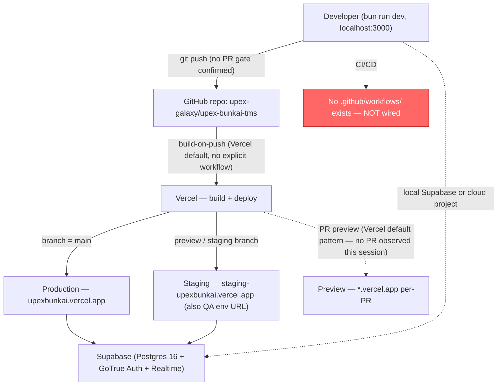
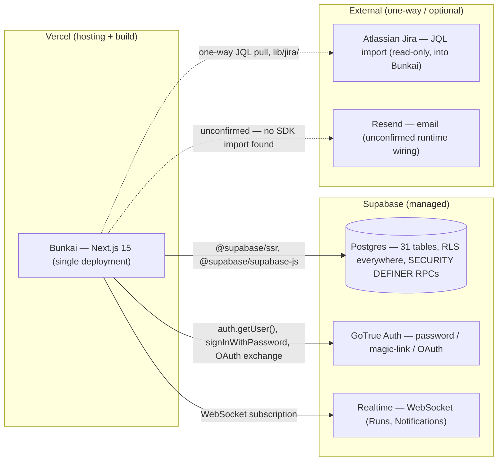

# Infrastructure Mapping — Bunkai

> Generated: 2026-08-12 · Discovery method: read-only reverse-engineering of `upex-bunkai-tms` (repo-root file listing, `.mcp.json`, `dbhub.toml`, `.husky/pre-commit`, absence-checks for `.github/`, `vercel.json`, `supabase/config.toml`) cross-referenced against `.agents/project.yaml` → `environments.*` (this QA-engineering repo's own config, already populated with real URLs — not invented). `upex-bunkai-tms/.context/` was NOT read this session.

---

## Overview Diagram



**No CI/CD node runs anything today** — the red node above is deliberate: `find .github -type f` returns no results (re-confirmed this session), so the only automated gate between a push and a live deploy is whatever Vercel's own build step does (`next build` — which does NOT run `bun run repo:check` or `bun test`).

---

## CI/CD Configuration

**Platform: none.** No `.github/workflows/`, `.gitlab-ci.yml`, `azure-pipelines.yml`, `.circleci/config.yml`, or `Jenkinsfile` exists at the target repo root (confirmed by absence in the root file listing captured this session — `ls -la` output enumerated every root file; none of these signal files appear).

| What exists instead | Detail |
|---|---|
| `.husky/pre-commit` | Local git hook, NOT CI. Runs `bunx lint-staged` (ESLint --fix on staged `.ts`/`.tsx`, Prettier --write on staged JSON/YAML/CSS/HTML), then `bun run types:check`, `bun run vars:check`, `bun run skills:check`. Conditionally runs `bun run skills:registry:check` only if staged files touch skill definitions. **Does not run `bun test`, `bun run lint:check` (full-repo), or `bun run format:check`.** |
| Vercel build-on-push | Inferred from the platform (Vercel auto-builds on push to any connected branch by default) — runs `next build` only. Does not run `bun run repo:check` or `bun test`. Not independently confirmed via a `vercel.json` build-hook override (none exists) — this is standard Vercel behavior, flagged as inferred-from-platform rather than confirmed-from-config. |

**What a minimal CI workflow would need** (illustrative — not a recommendation to author one without being asked, just the concrete command set it would chain, all verified to exist in `backend.md` §Package Scripts and §Test Execution):

```yaml
# illustrative only — no such file exists in the target repo
name: ci
on: [push, pull_request]
jobs:
  check:
    runs-on: ubuntu-latest
    steps:
      - uses: actions/checkout@v4
      - uses: oven-sh/setup-bun@v2
      - run: bun install
      - run: bun run repo:check   # format:check, lint:check, types:check, vars:check, vars:env:check, skills:check, skills:registry:check
      - run: bun test             # NOT part of repo:check today — must be added explicitly
```

---

## Deployment Configuration

| Property | Value | Source |
|---|---|---|
| Hosting platform | Vercel | `.agents/project.yaml` (`webapp_domain: upexbunkai.vercel.app`), `.env.example` (`NEXT_PUBLIC_APP_URL` comment references "your deployed URL"), production and staging URLs both resolve to `*.vercel.app` |
| `vercel.json` | **Not present** in the target repo | Root file listing (this session) — confirmed absent |
| Deployment method | Platform-native build (`next build` via Vercel's Next.js framework preset) — no Docker image, no static export | No `Dockerfile`/`docker-compose.yml` found in the root listing |
| Environment detection at runtime | `VERCEL_ENV` (`production` \| `preview` \| unset-locally) — read by `lib/urls.ts` `getEnvironment()`, mapped to the app's own `local`/`staging`/`production` naming | `lib/urls.ts` (full file read in `backend.md`/`frontend.md` discovery) |
| Preview environments per PR | Vercel's platform default (every PR gets a preview deployment at an auto-generated `*.vercel.app` URL) — **not independently confirmed this session**, no live PR was inspected, and no `vercel.json` exists to override or disable this default | Inferred from platform + absence of any override config |

---

## Environments Matrix

Populated directly from `.agents/project.yaml` → `environments.*` (this QA-engineering repo's own already-filled config) — **no URL below was invented; all four are the real, pre-configured values**. None were probed with a live HTTP request this session (carried forward from `project-config.md`'s Access Checklist).

| Environment | URL | Branch | Auto Deploy | Approval |
|---|---|---|---|---|
| Local | `http://localhost:3000` | — | — | — |
| QA | `https://staging-upexbunkai.vercel.app` | Not confirmed — shares the Staging URL, so likely the same Vercel branch/deployment target as Staging | Not confirmed | Not confirmed |
| Staging | `https://staging-upexbunkai.vercel.app` | Not confirmed — no `vercel.json`/branch-mapping config found; Vercel's own dashboard (not inspected this session) is the actual source of truth for which git branch maps to this URL | Presumed Yes (Vercel platform default for any connected branch), not confirmed | Not confirmed |
| Production | `https://upexbunkai.vercel.app` | `main` (per `.agents/project.yaml` `git_strategy.branches.production: main`, this QA repo's own config — the target repo's own branch-to-env mapping was not independently opened) | Presumed Yes (Vercel default), not confirmed | Not confirmed |

**Notable**: QA and Staging share the exact same URL (`staging-upexbunkai.vercel.app`) in `.agents/project.yaml` — this is not a typo introduced by this discovery, it is the pre-existing config value, reproduced verbatim. If QA and Staging are meant to be genuinely separate environments, this is worth confirming with the team; as configured, "QA testing" and "staging testing" hit the identical deployment.

---

## Environment Variables by Environment

No per-environment `.env.production`/`.env.staging` files exist in the target repo (confirmed: root listing shows only `.env.example`, no other `.env.*` variants tracked — and per `.gitignore`, real `.env` files are git-ignored everywhere, so none would be visible in this read-only session regardless). Per-environment values are expected to live in **Vercel's own environment-variable dashboard** (Development / Preview / Production scopes), not in any file this session could read.

| Environment | Where variables live | Confirmed this session? |
|---|---|---|
| Local | `.env` (git-ignored, developer-local, copied from `.env.example`) | Confirmed pattern exists; no `.env` file present at discovery time (`ls -la .env` → no such file) |
| Preview / Staging / Production | Vercel project environment-variable dashboard (standard platform mechanism) | **Not confirmed** — this session has no Vercel dashboard access; inferred from `.env.example`'s own header comment ("`.mcp.json` ... reference env vars via expansion") and `cli/lib/variables-manifest.ts`'s `destinations: ['local', 'vercel']` field on every variable entry (confirms the setup CLI itself targets both `.env` and Vercel as write destinations) |

---

## Secrets Management

| Secret family | Storage mechanism | Access scope | Rotation cadence |
|---|---|---|---|
| Supabase keys (anon/publishable, service-role/secret, JWT secret) | Local `.env` (dev) + presumably Vercel env vars (deployed) — see table above | Server-only (`SUPABASE_SERVICE_ROLE_KEY`) vs. browser-safe (`NEXT_PUBLIC_SUPABASE_ANON_KEY`/`SUPABASE_PUBLISHABLE_KEY`) split enforced by `lib/env.ts`'s `server-only` import guard | **Not confirmed** — no rotation policy found in code or config |
| Atlassian API token | Local `.env` only (optional — Jira import degrades gracefully without it, per `backend.md`) | Server-only (`lib/jira/`) | Not confirmed |
| Personal Access Tokens (`bk_pat_*`, app-issued, not an infra secret) | Application-owned, stored as `SHA-256(secret)` in `access_tokens.hash` (`supabase/migrations/0008_access_tokens.sql`) | Scoped per-token (`atc:read`/`atc:write`/`run:execute`/`workspace:admin`) | User-controlled (issued/revoked via app UI), not an infra rotation concern |
| MCP-tooling secrets (`SUPABASE_ACCESS_TOKEN`, `TAVILY_API_KEY`, etc.) | Local `.env` only — expanded into `.mcp.json`/`opencode.jsonc` via `${VAR}` substitution at MCP-spawn time | Dev/AI-agent tooling only, no application runtime exposure | Not applicable (dev-tooling credentials) |

**Rotation cadence for any of the above**: **Discovery Gap** — no rotation policy, expiry config, or secret-scanning tooling (e.g., no `gitleaks`/`trufflehog` config found) was found in the target repo.

---

## Cloud Services

| Service | Provider | Purpose |
|---|---|---|
| Hosting / build | Vercel | Next.js app hosting, build pipeline, (presumed) preview deployments |
| Database + Auth + Realtime | Supabase | Postgres 16, GoTrue Auth (password/magic-link/OAuth), Realtime (WebSocket subscriptions for Runs/Notifications) |
| Issue tracker (one-way import source) | Atlassian Jira | `lib/jira/`, `import_jobs` table — read-only JQL import into Bunkai, not a two-way sync |
| Web search (dev/AI tooling only) | Tavily | `.mcp.json` `tavily` server |
| Email (unconfirmed runtime use) | Resend (declared) | `RESEND_API_KEY` in `.env.example`; no `resend` SDK import found in `app/`/`lib/` — may be dev-tooling-only or GoTrue's own SMTP config, per `architecture.md` §7 |
| Workflow automation (dev/AI tooling only, unconfirmed) | n8n (declared) | `N8N_API_URL`/`N8N_API_KEY` in `.env.example`; no runtime call site found |

---

## Database Infrastructure

| Property | Value | Source |
|---|---|---|
| Provider | Supabase (managed Postgres) | `.env.example`, `dbhub.toml` |
| Region | **Not confirmed** — no region identifier found in any readable config (Supabase project refs don't encode region in the URL format used here) | Discovery Gap |
| Backups | **Not confirmed** — Supabase's managed-Postgres tier typically includes automated daily backups + PITR on paid plans, but this repo has no config asserting which tier/plan is active | Discovery Gap |
| Connection (application) | Exclusively via `@supabase/supabase-js`/`@supabase/ssr` client libraries — no raw `pg`/`postgres` driver dependency in `package.json` | `backend.md` §Core Dependencies |
| Connection (QA/tooling) | DBHub MCP via the **session pooler, port 5432**, read-only role `qa_inspector_ro.<project-ref>` — `dbhub.toml`'s own comment explicitly warns against the transaction pooler (port 6543) because it "disallows prepared statements" | `dbhub.toml` (full file read this session) |
| Schema authority | 68 sequential `.sql` migration files under `supabase/migrations/` (`0001_tenancy.sql` … `0068_story_traceability_report.sql`, plus a non-migration `README.md` in the same directory — 69 filesystem entries total, 68 real migrations) | Re-counted this session; matches `architecture.md`'s 68-migration figure |

---

## Infrastructure Resources



No CDN, queue, or object-storage service was found referenced in the target repo (no S3/R2/Cloudflare bindings, no `@aws-sdk/*` or storage-client dependency in `package.json`). Vercel's own edge network is the only CDN layer, implicit to the hosting platform.

---

## IaC (Infrastructure as Code)

**Not present.** No `*.tf` (Terraform), `Pulumi.yaml`, `cdk.json`, `serverless.yml`, or `infra`/`terraform`/`cdk` directory found anywhere in the target repo root listing. `supabase/config.toml` — which would normally hold local-stack IaC-adjacent settings for the Supabase CLI — is also **not present** (confirmed: `cat supabase/config.toml` → no output). Infrastructure provisioning (the Supabase project itself, the Vercel project, DNS) is presumed to be manual/dashboard-driven — not independently confirmed, since no session touched either platform's dashboard.

---

## Monitoring & Observability

**Not present.** No error-tracking (Sentry, Rollbar, Bugsnag), uptime-monitoring (UptimeRobot, Pingdom, BetterStack), or APM/metrics (Datadog, New Relic, Grafana Cloud) dependency exists in `package.json`. No `web-vitals` package either (carried forward from `frontend.md` §Performance Configuration and `architecture.md` §10 — independently re-confirmed this session by re-reading the full `dependencies`/`devDependencies` block in `package.json`).

**Log shipping**: no destination configured. Vercel's own build/runtime logs (accessible via its dashboard/CLI, not inspected this session) are presumably the only log surface that exists today.

---

## Rollback

**Mechanism**: standard Vercel rollback — redeploy a prior successful build/Git SHA via the Vercel dashboard or `vercel rollback` CLI. **This is inferred from the hosting platform's default capability, not confirmed from any target-repo config** (no `vercel.json` with rollback-specific settings exists, and no rollback runbook/doc was found in the target repo). Flagging explicitly per this discovery's own doctrine: platform-default ≠ confirmed-from-config.

No application-level rollback concern beyond the deploy itself was found — migrations are forward-only `.sql` files (no `down` migrations observed in a sample of filenames; not exhaustively verified), so a Vercel code-rollback would not automatically reverse a schema migration that shipped alongside the rolled-back code. This is a **notable operational risk** worth surfacing to the team even though it wasn't asked about directly: a rollback that doesn't also revert the DB schema could leave a rolled-back frontend talking to a schema it doesn't expect.

---

## Deployment Checklist

> Compiled from what this discovery could verify — not a prescriptive process, since no deployment runbook exists in the target repo to compare against.

**Pre-deploy** (none of these are enforced today — see CI/CD section):

- [ ] `bun run repo:check` (format, lint, types, vars, skills registry — does NOT include tests)
- [ ] `bun test` (132 files, 34 self-skip without live Supabase credentials — see `backend.md` §Test Execution)
- [ ] Confirm any new `supabase/migrations/*.sql` has been applied to the target Supabase project before/alongside the code deploy (no automated linkage between "migration file committed" and "migration applied" was found)

**Post-deploy**:

- [ ] `curl <env-url>/api/v1/health` → expect `{"ok":true,...}` (see `backend.md` §Health Check Endpoints)
- [ ] No automated smoke-test or synthetic-monitoring check found to run automatically — manual verification only, today

**Rollback**:

- [ ] Vercel dashboard/CLI redeploy of prior SHA (platform default, not confirmed from target-repo config)
- [ ] **Manually verify** whether any migration shipped in the rolled-back deploy needs a corresponding manual DB reversal — no automated safeguard exists

---

## Discovery Gaps

- [ ] No `.github/workflows/` — CI/CD does not exist. Vercel's build-on-push is the only automated gate, and it only runs `next build` (not `repo:check`, not `bun test`).
- [ ] No monitoring/observability tooling (error tracking, uptime, APM) — production has no automated visibility into failures beyond Vercel's own build/runtime logs.
- [ ] Staging/QA/Production reachability and auth requirements (VPN, IP-allowlist, SSO) were not tested — first live QA session against these URLs should confirm, and should also confirm whether QA and Staging are genuinely meant to be the same deployment (`.agents/project.yaml` has them pointing at the identical URL).
- [ ] Branch-to-environment mapping (which git branch triggers which Vercel deployment target) is not confirmed from any target-repo file — no `vercel.json` exists to assert it, and the Vercel dashboard itself was not inspected this session.
- [ ] Database region, backup policy, and PITR configuration for the Supabase project — not discoverable from source code alone.
- [ ] Rollback mechanism is inferred from Vercel's platform default, not confirmed from any target-repo config or runbook. The DB-schema-vs-code-rollback mismatch risk noted above has not been validated against a real incident or documented policy.
- [ ] Secret rotation cadence for Supabase/Atlassian/MCP-tooling credentials — no policy found in code or config.
- [ ] IaC / infrastructure provisioning process (how the Supabase project and Vercel project were originally created, and how DNS is managed) — presumed manual/dashboard-driven, not confirmed.

---

## QA Relevance

- **Test environment access**: `staging` (`https://staging-upexbunkai.vercel.app`) is the default testing environment per `.agents/project.yaml` (`testing.default_env: staging`) — and per the Environments Matrix above, it is the *same URL* as the `qa` environment entry. Any QA session targeting "QA" and any session targeting "Staging" are, as configured today, hitting the identical deployment and (presumably) the identical Supabase project — a real risk of test-data collision between what the team might conceptually treat as two separate tiers.
- **CI integration points for test jobs**: none exist yet. The moment a workflow is added, `bun run repo:check` and `bun test` (see `backend.md` §Test Execution) are the two concrete, already-working commands to chain — no new test-discovery config is needed since Bun's zero-config default already finds all 132 `*.test.ts` files.
- **DB access for QA**: DBHub MCP, session pooler (port 5432), read-only role — already correctly scoped in `dbhub.toml` to prevent QA from needing (or accidentally using) write access or the prepared-statement-incompatible transaction pooler.
- **Health check for smoke tests**: `GET /api/v1/health` (public, no auth) is the one ready-made endpoint any smoke test or synthetic monitor could hit today — nothing else exists for that purpose.
